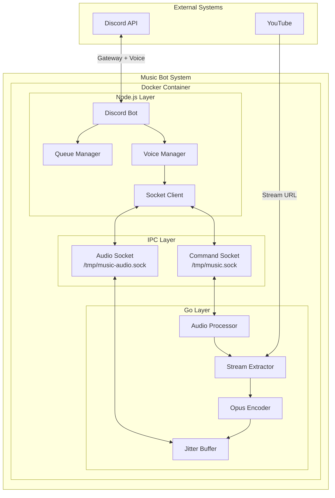

# Music Bot - C3 Architecture Documentation

## System Overview

Discord Music Bot with Lavalink-quality audio streaming. Hybrid architecture using Node.js for Discord integration and Go for high-performance audio processing.

## Key Characteristics

| Aspect | Description |
|--------|-------------|
| **Architecture** | Hybrid Node.js + Go in single container |
| **Audio Quality** | 48kHz stereo, 20ms Opus frames, 128kbps |
| **Latency** | <20ms Discord transfer |
| **Concurrency** | Worker pool supporting 60 channels |
| **IPC** | Unix sockets for minimal latency |

## Technology Stack

| Layer | Technology |
|-------|------------|
| Discord Integration | Node.js + discord.js v14 |
| Voice Handling | @discordjs/voice + @discordjs/opus |
| Audio Processing | Go 1.21+ |
| Stream Extraction | yt-dlp |
| Audio Encoding | FFmpeg + libopus |
| Container | Docker (Alpine base) |

## C3 Levels

| Level | Name | Description |
|-------|------|-------------|
| C3-0 | Context | System context and external actors |
| C3-1 | Container | Single Docker container with Node.js + Go |
| C3-1XX | Components | Individual components within the container |

## Quick Links

- [Context (C3-0)](./c3-0-context/README.md)
- [Container (C3-1)](./c3-1-container/README.md)
- [Architecture Decisions](./adr/)
