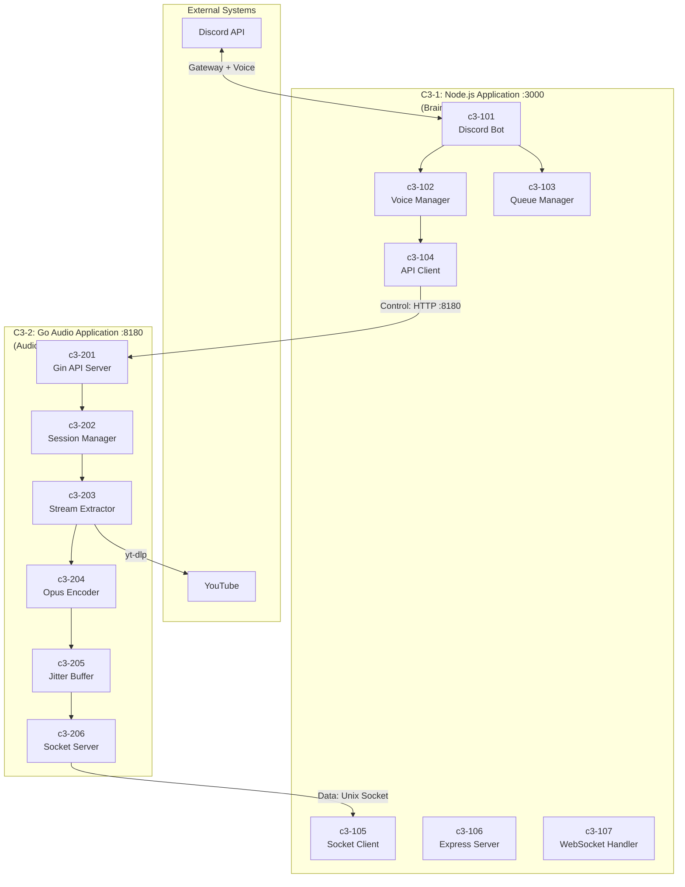
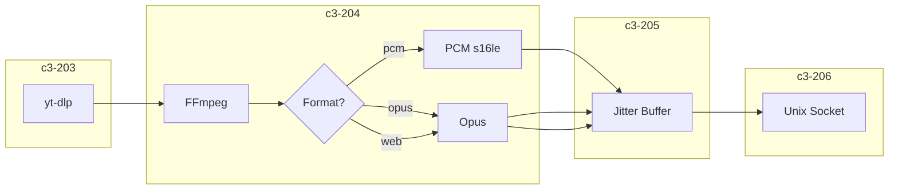
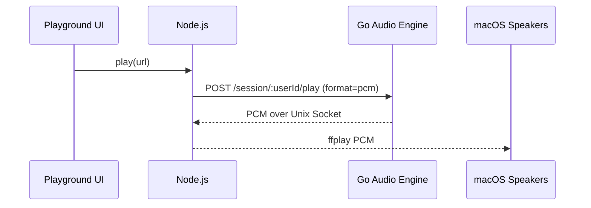
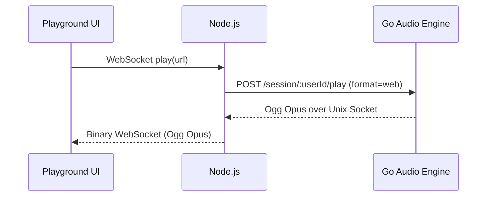

# Music Bot - C3 Architecture Documentation

> Based on the [C4 Model](https://c4model.com/) by Simon Brown

## What is C3?

C3 (Context-Container-Component) is a subset of the C4 model focused on the first three levels of abstraction. We use "C3" to indicate we're documenting down to the component level, not the code level.

| Level | C4 Name | Description | In This Project |
|-------|---------|-------------|-----------------|
| **C3-0** | System Context | The system and its relationships with users/external systems | Music Bot System |
| **C3-1** | Container | A separately runnable/deployable unit (NOT Docker) | Node.js Application |
| **C3-2** | Container | A separately runnable/deployable unit (NOT Docker) | Go Audio Application |
| **C3-1XX** | Component | A grouping of related functionality within a container | Node.js modules |
| **C3-2XX** | Component | A grouping of related functionality within a container | Go packages |

> **Important:** In C4, "Container" means a running application or data store, NOT a Docker container.

## System Overview

Discord Music Bot with **Lavalink-quality audio streaming**. Hybrid architecture using Node.js for Discord integration and Go for high-performance audio processing.

**Goal**: No lagging, smooth transmission, Opus encoding, 48kHz stereo.

**Delivery targets**:
- Discord voice channels (Opus)
- macOS speakers (PCM debug)
- Browser playback (Ogg Opus)

## Container Diagram (C3-1 & C3-2)



## Communication Pattern

| Channel | Direction | What | Protocol |
|---------|-----------|------|----------|
| **Control Plane** | Node.js → Go | Commands (play, stop, pause, resume) | HTTP REST :8180 |
| **Data Plane** | Go → Node.js | Audio chunks + events (ready, progress, finished) | Unix Socket |

> **Node.js is the brain**: It tells Go what to do. Go processes audio and streams it back.

## Audio Pipeline



| Format | Use Case | Output |
|--------|----------|--------|
| `pcm` | Playground debug | macOS speakers |
| `opus` | Discord production | Voice channel UDP |
| `web` | Browser playback | Ogg Opus over WebSocket |

## Control Flow

```mermaid
sequenceDiagram
    participant Client as Browser/Discord
    participant Node as Node.js
    participant Gin as Gin :8180
    participant Session as Session Manager
    participant Socket as Unix Socket

    Client->>Node: play(url, format)
    Node->>Gin: POST /session/:id/play (session_id)
    Gin->>Session: StartPlayback()
    Session-->>Socket: Audio (pcm/opus)
    Socket-->>Node: Stream
    Node-->>Client: Audio output

## Core Flows

### Discord Bot (Opus)

```mermaid
sequenceDiagram
    participant User as Discord User
    participant Bot as Node.js Discord Bot
    participant Go as Go Audio Engine
    participant Discord as Discord Voice

    User->>Bot: /play url
    Bot->>Go: POST /session/:guildId/play (format=opus)
    Go-->>Bot: Opus over Unix Socket
    Bot-->>Discord: Ogg Opus stream (Voice UDP)
```

### Debug Playback (PCM to macOS)



### Browser Playback (Ogg Opus)



## Session Identity

- Discord bot sessions use `guildId` as the `session_id`.
- Browser sessions use Discord OAuth JWT `sub` (user ID) as the `session_id`.
- Current Go implementation stops all existing sessions on every `StartPlayback`, so the system is effectively single-active-session across all sources.
```

## Components

### C3-1: Node.js Application

| ID | Component | Responsibility | Code Location |
|----|-----------|----------------|---------------|
| c3-101 | Discord Bot | Slash commands, Discord.js client | `app/src/commands/` |
| c3-102 | Voice Manager | Voice connections, @discordjs/voice | `app/src/voice/` |
| c3-103 | Queue Manager | Playlist state, track navigation | `app/src/queue-manager.ts` |
| c3-104 | API Client | HTTP client to Go API :8180 | `app/src/api-client.ts` |
| c3-105 | Socket Client | Unix socket audio receiver | `app/src/socket-client.ts` |
| c3-106 | Express Server | HTTP API for browser | `app/src/server.ts` |
| c3-107 | WebSocket Handler | Real-time events, queue sync | `app/src/websocket.ts` |

### C3-2: Go Audio Application

| ID | Component | Responsibility | Code Location |
|----|-----------|----------------|---------------|
| c3-201 | Gin API Server | HTTP control endpoints | `internal/server/api.go`, `router.go` |
| c3-202 | Session Manager | Session lifecycle, pause/resume | `internal/server/session.go` |
| c3-203 | Stream Extractor | yt-dlp integration | `internal/platform/youtube/` |
| c3-204 | Opus Encoder | FFmpeg + libopus pipeline | `internal/encoder/ffmpeg.go` |
| c3-205 | Jitter Buffer | Smooth frame delivery (3-5 frames) | `internal/buffer/` (TODO) |
| c3-206 | Socket Server | Audio output to Node.js | `internal/server/socket.go` |

## API Endpoints (Gin :8180)

| Endpoint | Method | Description |
|----------|--------|-------------|
| `/session/:id/play` | POST | Start `{url, format}` |
| `/session/:id/stop` | POST | Stop session |
| `/session/:id/pause` | POST | Pause (keep FFmpeg) |
| `/session/:id/resume` | POST | Resume |
| `/session/:id/status` | GET | Get state |
| `/health` | GET | Health check |

## Audio Quality (Lavalink Target)

| Spec | Value |
|------|-------|
| Sample Rate | 48000 Hz |
| Channels | 2 (stereo) |
| Frame Size | 20ms (960 samples) |
| Bitrate | 128 kbps VBR |
| Jitter Buffer | 3-5 frames (60-100ms) |

## Technology Stack

| Container | Technology |
|-----------|------------|
| C3-1 Node.js | Node.js 20, TypeScript, discord.js v14, @discordjs/voice, Express, ws |
| C3-2 Go | Go 1.21+, Gin, FFmpeg, libopus, yt-dlp |

## Quick Links

- [C3-0: System Context](./c3-0-context/README.md) - Users, external systems, boundaries
- [C3-1: Node.js Application](./c3-1-nodejs/README.md) - Gateway container
- [C3-2: Go Audio Application](./c3-2-go-audio/README.md) - Audio processing container
- [ADR-001: C3 Adoption](./adr/adr-001-c3-adoption.md) - Architecture decision record
