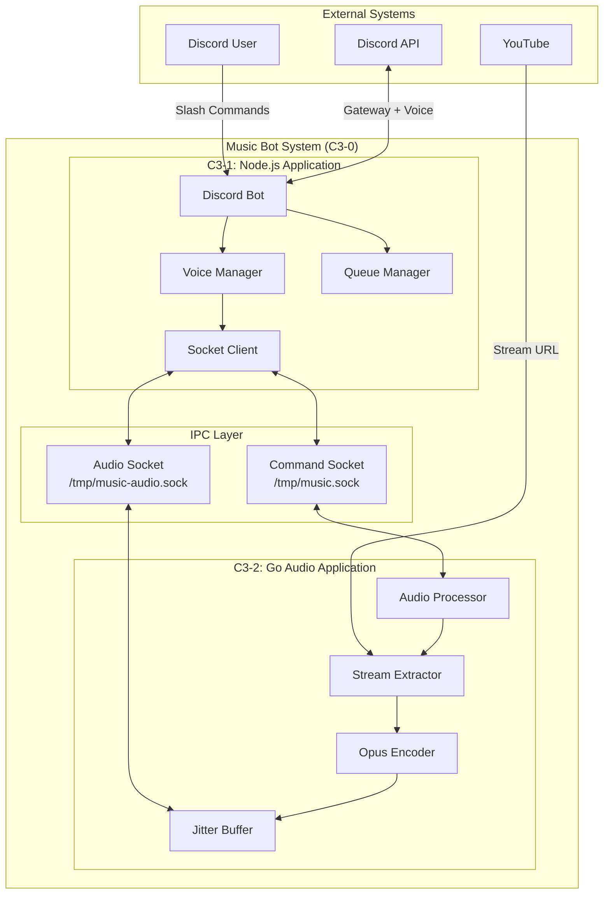

# Music Bot - C3 Architecture Documentation

## System Overview

Discord Music Bot with Lavalink-quality audio streaming. Hybrid architecture using Node.js for Discord integration and Go for high-performance audio processing.



## C3 Architecture (Based on C4 Model)

C3 (Context → Container → Component) adapts the C4 model, excluding the Code level:

| Level | C4 Name | What It Represents | In This System |
|-------|---------|-------------------|----------------|
| **C3-0** | Software System | The whole system delivering value | Music Bot |
| **C3-1, C3-2** | Container | Running application/process | Node.js App, Go App |
| **C3-1XX, C3-2XX** | Component | Logical grouping within container | Discord Bot, Encoder, etc. |

> **Important:** Container ≠ Docker container. A C4 Container is a **running application** (Node.js process, Go process). Docker is deployment infrastructure.

```
C3-0: Context (Software System)
 ├── C3-1: Node.js Application (Container)
 │    ├── c3-101 Discord Bot (Component)
 │    ├── c3-102 Voice Manager (Component)
 │    ├── c3-103 Queue Manager (Component)
 │    └── c3-104 Socket Client (Component)
 │
 └── C3-2: Go Audio Application (Container)
      ├── c3-201 Audio Processor (Component)
      ├── c3-202 Stream Extractor (Component)
      ├── c3-203 Opus Encoder (Component)
      └── c3-204 Jitter Buffer (Component)
```

## Key Characteristics

| Aspect | Description |
|--------|-------------|
| **Architecture** | Hybrid Node.js + Go, two runtime processes |
| **Audio Quality** | 48kHz stereo, 20ms Opus frames, 128kbps |
| **Latency** | <20ms Discord transfer |
| **Concurrency** | Worker pool supporting 60 channels |
| **IPC** | Unix sockets for minimal latency |

## Technology Stack

| Container | Technology | Purpose |
|-----------|------------|---------|
| C3-1 Node.js | Node.js 20 + discord.js v14 | Discord integration |
| C3-2 Go | Go 1.21+ + FFmpeg + yt-dlp | Audio processing |
| Deployment | Docker (Alpine base) | Container runtime |

## Quick Links

### Architecture Levels
- [C3-0: Context](./c3-0-context/README.md) - System boundaries and external actors
- [C3-1: Node.js Application](./c3-1-nodejs/README.md) - Discord integration container
- [C3-2: Go Audio Application](./c3-2-go-audio/README.md) - Audio processing container

### Component Documentation
- [Node.js Components (c3-1XX)](./c3-1-nodejs/COMPONENTS.md)
- [Go Components (c3-2XX)](./c3-2-go-audio/COMPONENTS.md)

### Reference
- [Table of Contents](./TOC.md) - Complete documentation index
- [Architecture Decisions](./adr/) - ADRs for key decisions
