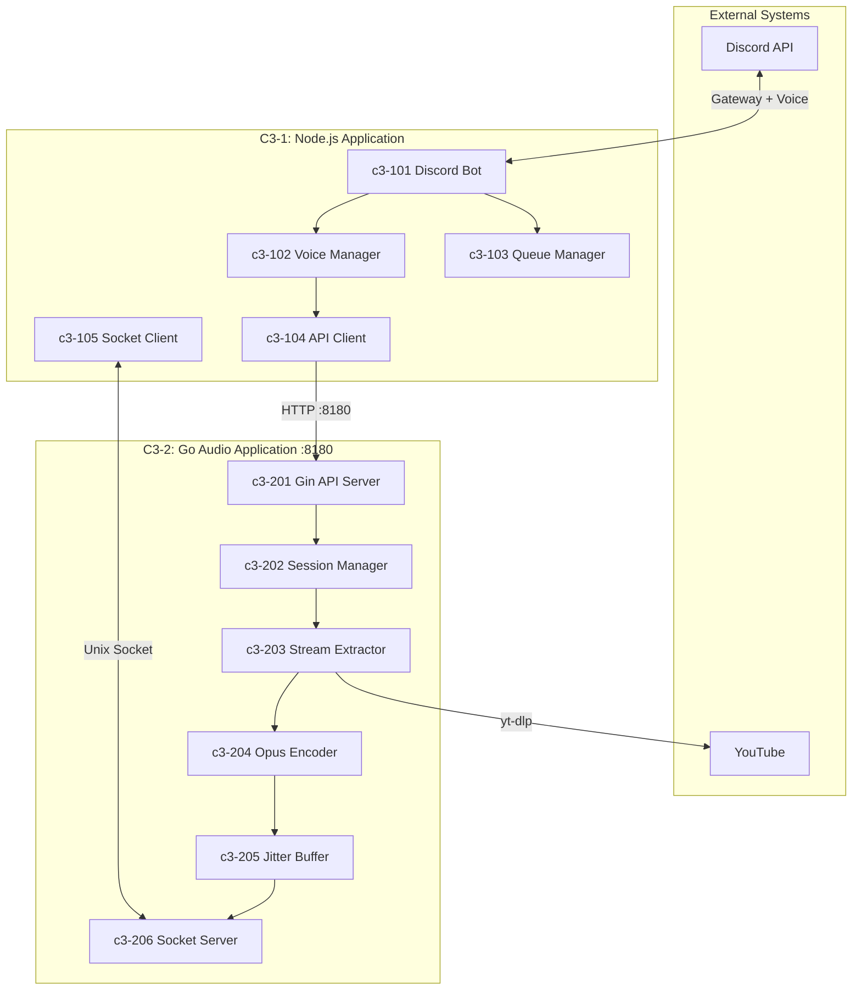
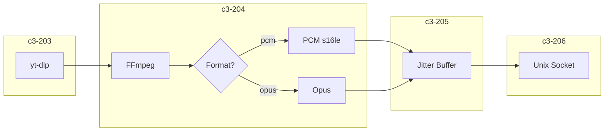
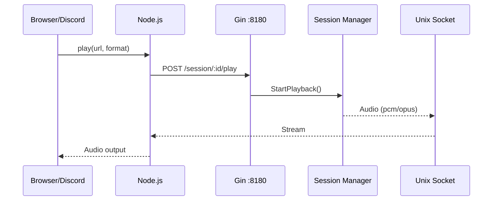

# Music Bot - C3 Architecture Documentation

## System Overview

Discord Music Bot with **Lavalink-quality audio streaming**. Hybrid architecture using Node.js for Discord integration and Go for high-performance audio processing.

**Goal**: No lagging, smooth transmission, Opus encoding, 48kHz stereo.

## C3 Architecture (Based on C4 Model)

| Level | C4 Name | What It Represents | In This System |
|-------|---------|-------------------|----------------|
| **C3-0** | Software System | The whole system | Music Bot |
| **C3-1, C3-2** | Container | Running process | Node.js, Go |
| **C3-1XX, C3-2XX** | Component | Logical grouping | Discord Bot, Opus Encoder, etc. |

> **Container ≠ Docker**. A C4 Container is a **running application**.

## Container Diagram

## Audio Pipeline (Format Option)

| Format | Use Case | Output |
|--------|----------|--------|
| `pcm` | Playground debug | macOS speakers |
| `opus` | Discord production | Voice channel UDP |

## Control Flow

## Components

### C3-1: Node.js Application

| ID | Component | Responsibility |
|----|-----------|----------------|
| c3-101 | Discord Bot | Slash commands, events |
| c3-102 | Voice Manager | @discordjs/voice, UDP |
| c3-103 | Queue Manager | Playlist state |
| c3-104 | API Client | HTTP to Gin :8180 |
| c3-105 | Socket Client | Audio stream receiver |

### C3-2: Go Audio Application

| ID | Component | Responsibility |
|----|-----------|----------------|
| c3-201 | Gin API Server | HTTP control endpoints |
| c3-202 | Session Manager | Lifecycle, pause/resume, worker pool |
| c3-203 | Stream Extractor | yt-dlp integration |
| c3-204 | Opus Encoder | FFmpeg + libopus, format options |
| c3-205 | Jitter Buffer | Smooth frame delivery (3-5 frames) |
| c3-206 | Socket Server | Audio output to Node.js |

## API Endpoints (Gin :8180)

| Endpoint | Method | Description |
|----------|--------|-------------|
| `/session/:id/play` | POST | Start `{url, format}` |
| `/session/:id/stop` | POST | Stop session |
| `/session/:id/pause` | POST | Pause (keep FFmpeg) |
| `/session/:id/resume` | POST | Resume |
| `/session/:id/status` | GET | Get state |
| `/health` | GET | Health check |

## Audio Quality (Lavalink Target)

| Spec | Value |
|------|-------|
| Sample Rate | 48000 Hz |
| Channels | 2 (stereo) |
| Frame Size | 20ms (960 samples) |
| Bitrate | 128 kbps VBR |
| Jitter Buffer | 3-5 frames (60-100ms) |

## Technology Stack

| Container | Technology |
|-----------|------------|
| C3-1 Node.js | Node.js 20, discord.js v14, @discordjs/voice |
| C3-2 Go | Go 1.21+, Gin, FFmpeg, libopus, yt-dlp |

## Quick Links

- [C3-0: Context](./c3-0-context/README.md)
- [C3-1: Node.js Application](./c3-1-nodejs/README.md)
- [C3-2: Go Audio Application](./c3-2-go-audio/README.md)
