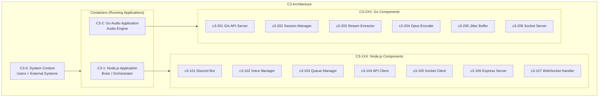

# ADR-001: Adopt C3 Architecture for Music Bot

**Status:** Accepted
**Date:** 2026-02-02

## Context

The Music Bot project requires a hybrid architecture combining:
- Node.js for Discord integration (discord.js)
- Go for high-performance audio processing

Key requirements:
- Lavalink-quality audio (48kHz, 20ms frames, <20ms latency)
- Support for 60 concurrent voice channels
- Clean separation between Discord logic and audio processing

## Decision

Adopt C3 (Context-Container-Component) documentation based on the [C4 Model](https://c4model.com/) with the following structure:

### Component Mapping

#### C3-1: Node.js Application (Brain)

| ID | Component | Responsibility |
|----|-----------|----------------|
| c3-101 | Discord Bot | Slash commands, Discord.js client |
| c3-102 | Voice Manager | @discordjs/voice connections |
| c3-103 | Queue Manager | Playlist state |
| c3-104 | API Client | HTTP client to Go API |
| c3-105 | Socket Client | Unix socket audio receiver |
| c3-106 | Express Server | HTTP API for playground |
| c3-107 | WebSocket Handler | Real-time browser events |

#### C3-2: Go Audio Application (Audio Engine)

| ID | Component | Responsibility |
|----|-----------|----------------|
| c3-201 | Gin API Server | HTTP control endpoints |
| c3-202 | Session Manager | Session lifecycle, pause/resume |
| c3-203 | Stream Extractor | yt-dlp integration |
| c3-204 | Opus Encoder | FFmpeg + libopus pipeline |
| c3-205 | Jitter Buffer | Smooth frame delivery |
| c3-206 | Socket Server | Audio streaming to Node.js |

### Key Architecture Decisions

1. **Two-Container Architecture**
   - C3-1 Node.js: Discord ecosystem, state management, orchestration
   - C3-2 Go: High-performance audio processing

2. **Communication Pattern**
   - Control Plane: HTTP REST (Node.js → Go :8180)
   - Data Plane: Unix Socket (Go → Node.js)

3. **Node.js as "Brain"**
   - All state management in Node.js
   - Go is stateless audio processor
   - Node.js tells Go what to do

4. **Session-based Concurrency in Go**
   - One goroutine per active session
   - Bounded by resource limits
   - Clean lifecycle management

## Consequences

### Positive
- Clear separation of concerns
- Each container uses optimal technology
- Scalable architecture (can scale containers independently)
- Living documentation with C4 model

### Negative
- Two languages to maintain
- IPC complexity between containers
- Documentation maintenance overhead

### Risks
- Documentation drift (mitigated by CI checks)
- IPC protocol changes need coordination

## References

- [C4 Model](https://c4model.com/)
- [C3-1: Node.js Application](../c3-1-nodejs/README.md)
- [C3-2: Go Audio Application](../c3-2-go-audio/README.md)
- [Discord.js Voice Guide](https://discordjs.guide/voice/)
- [Lavalink Protocol](https://github.com/lavalink-devs/Lavalink)
