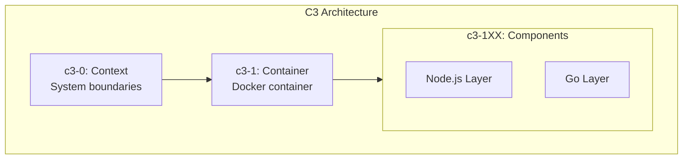

# ADR-001: Adopt C3 Architecture for Music Bot

**Status:** Accepted
**Date:** 2026-02-02

## Context

The Music Bot project requires a hybrid architecture combining:
- Node.js for Discord integration (discord.js)
- Go for high-performance audio processing

Key requirements:
- Lavalink-quality audio (48kHz, 20ms frames, <20ms latency)
- Support for 60 concurrent voice channels
- Clean separation between Discord logic and audio processing

## Decision

Adopt C3 (Context-Container-Component) documentation with the following structure:

### Component Mapping

| ID | Component | Layer | Responsibility |
|----|-----------|-------|----------------|
| c3-101 | Discord Bot | Node.js | Slash commands, Discord.js |
| c3-102 | Voice Manager | Node.js | Voice connections |
| c3-103 | Queue Manager | Node.js | Playlist state |
| c3-104 | Socket Client | Node.js | IPC to Go |
| c3-105 | Audio Processor | Go | Worker pool |
| c3-106 | Stream Extractor | Go | yt-dlp integration |
| c3-107 | Opus Encoder | Go | FFmpeg + Opus |
| c3-108 | Jitter Buffer | Go | Frame smoothing |

### Key Architecture Decisions

1. **Hybrid Node.js + Go**
   - Node.js: Better Discord ecosystem support
   - Go: Better performance for audio processing

2. **Unix Socket IPC**
   - Fastest IPC for single-container deployment
   - Separate sockets for commands (JSON) and audio (binary)

3. **Node.js as "Brain"**
   - All state management in Node.js
   - Go is stateless audio processor

4. **Worker Pool in Go**
   - Bounded concurrency (60 workers max)
   - One worker per voice channel

## Consequences

### Positive
- Clear separation of concerns
- Each layer uses optimal technology
- Scalable architecture
- Living documentation

### Negative
- Two languages to maintain
- IPC complexity
- Documentation maintenance overhead

### Risks
- Documentation drift
- IPC protocol changes need coordination

## References

- [Container Overview](../c3-1-container/README.md)
- [Discord.js Voice Guide](https://discordjs.guide/voice/)
- [Lavalink Protocol](https://github.com/lavalink-devs/Lavalink)
