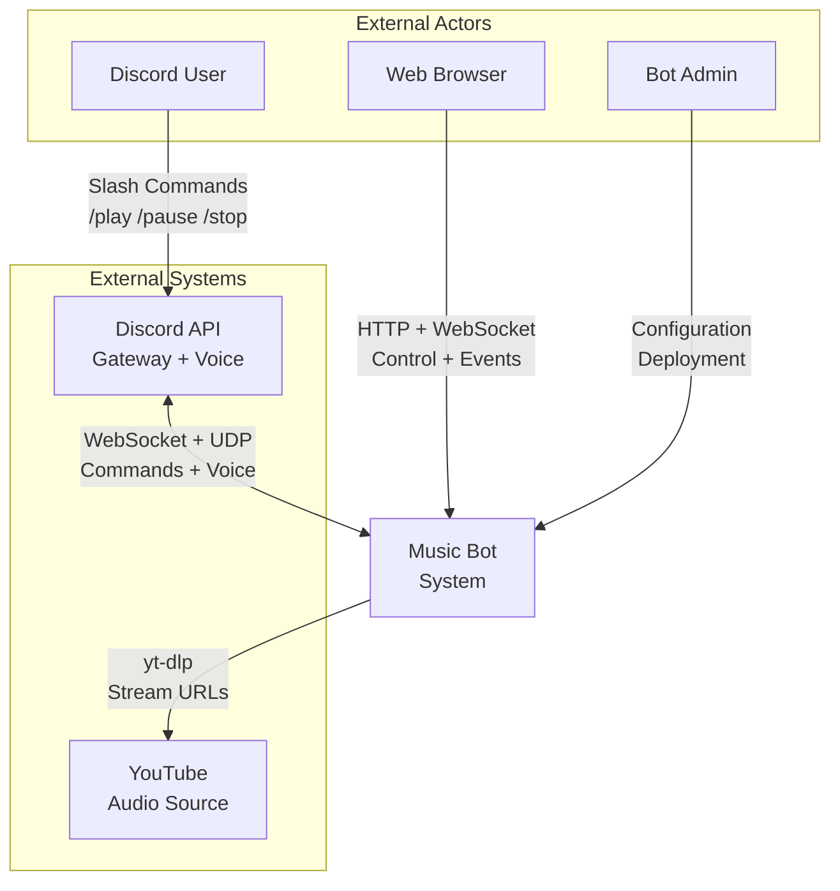
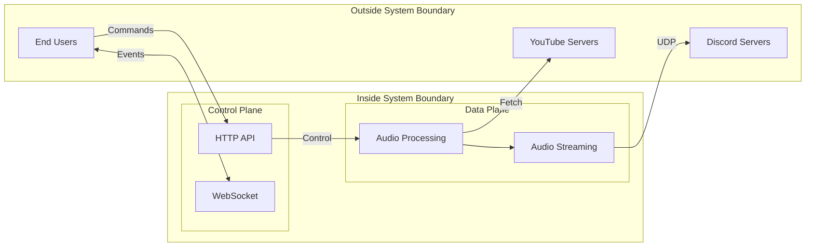
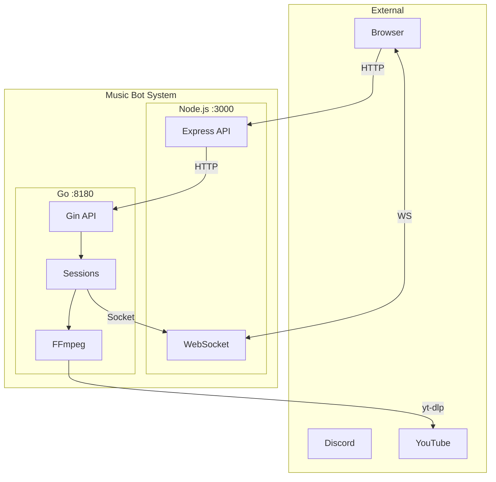
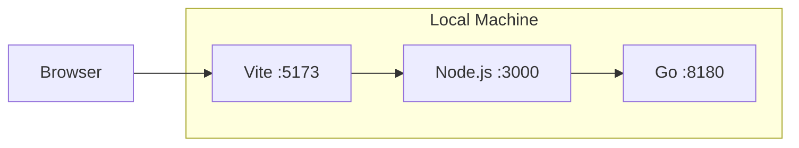
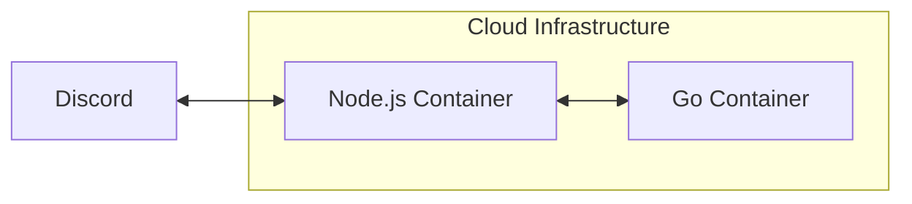

# C3-0: System Context

## Overview

The Music Bot system provides high-quality audio streaming to Discord voice channels, macOS speakers (debug), and web browsers, with Lavalink-equivalent audio quality.

## Context Diagram

## Actors

### Discord User
- Interacts via slash commands in Discord
- Commands: `/play`, `/pause`, `/resume`, `/stop`, `/skip`, `/list`
- Receives audio playback in voice channel
- Gets feedback via Discord embeds

### Web Browser (Playground)
- Interacts via React UI
- HTTP API for control commands
- WebSocket for real-time events
- Audio playback via Web Audio API (Ogg Opus) or local speakers (debug PCM)

### Bot Admin
- Deploys and configures the bot
- Manages bot token and permissions
- Monitors performance and logs

## External Systems

### Discord API

| Interface | Protocol | Purpose |
|-----------|----------|---------|
| Gateway | WebSocket | Commands, events, presence |
| Voice Gateway | WebSocket | Voice state, session setup |
| Voice Server | UDP | Opus audio packets |

### YouTube

| Interface | Protocol | Purpose |
|-----------|----------|---------|
| Video Page | HTTPS | Metadata extraction |
| Audio Stream | HTTPS | Raw audio data |

## System Boundaries

## Communication Overview

## Quality Requirements

| Requirement | Target | Rationale |
|-------------|--------|-----------|
| Audio Latency | <20ms | Discord voice packet timing |
| Sample Rate | 48kHz | Discord native rate |
| Frame Size | 20ms | Discord Opus frame requirement |
| Jitter | <5ms | Smooth playback |
| Concurrent Sessions | 60 | Medium-scale deployment |

## Authentication + Sessions

- Discord OAuth2 runs in Node.js and issues a signed JWT in the `auth` cookie.
- WebSocket connections require a valid JWT and map to a user session (`session_id = Discord user ID`).
- Discord bot playback uses `guildId` as the `session_id`.

## Deployment Contexts

### Playground (Current)

### Production (Future)

## See Also

- [C3-1: Node.js Application](../c3-1-nodejs/README.md) - Gateway container
- [C3-2: Go Audio Application](../c3-2-go-audio/README.md) - Audio processing container
