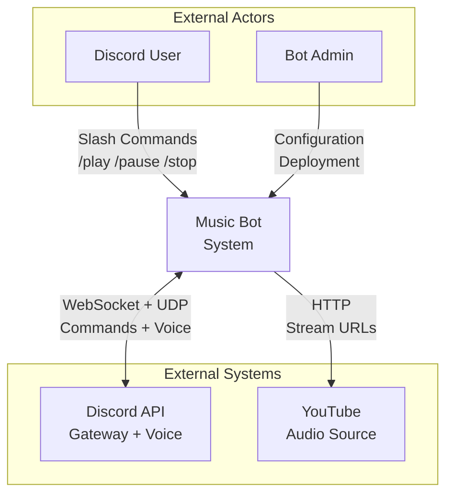
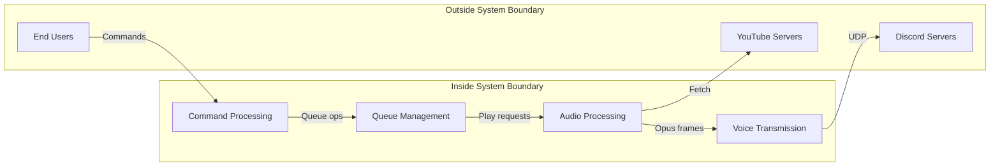

# C3-0: System Context

## Overview

The Music Bot system provides high-quality audio streaming to Discord voice channels, with Lavalink-equivalent audio quality.

## Context Diagram

## Actors

### Discord User
- Interacts via slash commands in Discord
- Commands: `/play`, `/pause`, `/resume`, `/stop`, `/skip`, `/list`
- Receives audio playback in voice channel
- Gets feedback via Discord embeds

### Bot Admin
- Deploys and configures the bot
- Manages bot token and permissions
- Monitors performance and logs

## External Systems

### Discord API

| Interface | Protocol | Purpose |
|-----------|----------|---------|
| Gateway | WebSocket | Commands, events, presence |
| Voice Gateway | WebSocket | Voice state, session setup |
| Voice Server | UDP | Opus audio packets |

### YouTube

| Interface | Protocol | Purpose |
|-----------|----------|---------|
| Video Page | HTTPS | Metadata extraction |
| Audio Stream | HTTPS | Raw audio data |

## System Boundaries

## Quality Requirements

| Requirement | Target | Rationale |
|-------------|--------|-----------|
| Audio Latency | <20ms | Discord voice packet timing |
| Sample Rate | 48kHz | Discord native rate |
| Frame Size | 20ms | Discord Opus frame requirement |
| Jitter | <5ms | Smooth playback |
| Concurrent Channels | 60 | Medium-scale deployment |
