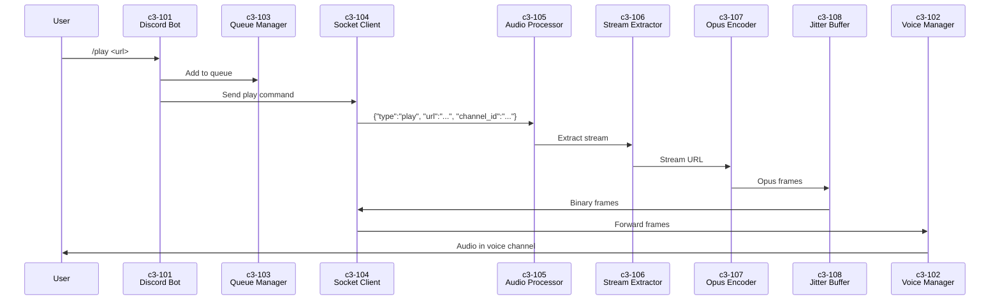

# C3-1: Container - Docker Container

## Overview

Single Docker container housing both Node.js (Discord integration) and Go (audio processing) runtimes, communicating via Unix sockets.

## Container Diagram

```mermaid
flowchart TB
    subgraph Container["Docker Container"]
        subgraph NodeJS["Node.js Runtime"]
            C101[c3-101<br/>Discord Bot]
            C102[c3-102<br/>Voice Manager]
            C103[c3-103<br/>Queue Manager]
            C104[c3-104<br/>Socket Client]
        end

        subgraph Sockets["Unix Sockets"]
            CMD[/tmp/music.sock<br/>Commands JSON]
            AUDIO[/tmp/music-audio.sock<br/>Opus Binary]
        end

        subgraph Go["Go Runtime"]
            C105[c3-105<br/>Audio Processor]
            C106[c3-106<br/>Stream Extractor]
            C107[c3-107<br/>Opus Encoder]
            C108[c3-108<br/>Jitter Buffer]
        end
    end

    C101 --> C102
    C101 --> C103
    C102 --> C104

    C104 <--> CMD
    C104 <--> AUDIO

    CMD <--> C105
    AUDIO <--> C108

    C105 --> C106
    C106 --> C107
    C107 --> C108
```

## Component Summary

### Node.js Components

| ID | Component | Responsibility |
|----|-----------|----------------|
| c3-101 | Discord Bot | Slash commands, Discord.js client |
| c3-102 | Voice Manager | Voice connections, @discordjs/voice |
| c3-103 | Queue Manager | Playlist state, track queue |
| c3-104 | Socket Client | Unix socket IPC to Go |

### Go Components

| ID | Component | Responsibility |
|----|-----------|----------------|
| c3-105 | Audio Processor | Worker pool, session management |
| c3-106 | Stream Extractor | yt-dlp integration |
| c3-107 | Opus Encoder | FFmpeg + libopus encoding |
| c3-108 | Jitter Buffer | Frame buffering, smoothing |

## Data Flow



## Communication Protocol

### Command Socket (`/tmp/music.sock`)

**Node.js → Go:**
```json
{"type": "play", "channel_id": "123", "url": "https://..."}
{"type": "pause", "channel_id": "123"}
{"type": "resume", "channel_id": "123"}
{"type": "stop", "channel_id": "123"}
{"type": "volume", "channel_id": "123", "level": 0.8}
```

**Go → Node.js:**
```json
{"type": "ready", "channel_id": "123", "duration": 240}
{"type": "finished", "channel_id": "123"}
{"type": "error", "channel_id": "123", "message": "..."}
```

### Audio Socket (`/tmp/music-audio.sock`)

Binary frame format:
```
┌──────────────┬──────────────┬─────────────────┐
│ channel_id   │ sequence     │ opus_data       │
│ (8 bytes)    │ (4 bytes)    │ (variable)      │
└──────────────┴──────────────┴─────────────────┘
```

## Directory Structure

```
project/
├── node/                    # Node.js layer
│   ├── src/
│   │   ├── index.ts
│   │   ├── commands/        # c3-101
│   │   ├── voice/           # c3-102
│   │   ├── queue/           # c3-103
│   │   └── socket/          # c3-104
│   └── package.json
│
├── go/                      # Go layer
│   ├── cmd/
│   │   └── main.go
│   └── internal/
│       ├── server/          # c3-105 (socket handling)
│       ├── worker/          # c3-105 (worker pool)
│       ├── extractor/       # c3-106
│       ├── encoder/         # c3-107
│       └── buffer/          # c3-108
│
├── Dockerfile
└── docker-compose.yml
```

## Technology Stack

| Layer | Technology | Version |
|-------|------------|---------|
| Node.js Runtime | Node.js | 20 LTS |
| Discord Library | discord.js | v14 |
| Voice Library | @discordjs/voice | latest |
| Go Runtime | Go | 1.21+ |
| Stream Extraction | yt-dlp | latest |
| Audio Processing | FFmpeg | latest |
| Container | Docker | Alpine base |
