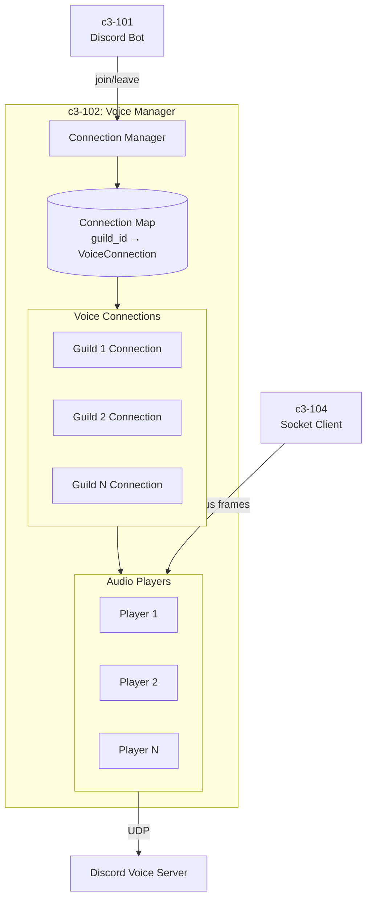
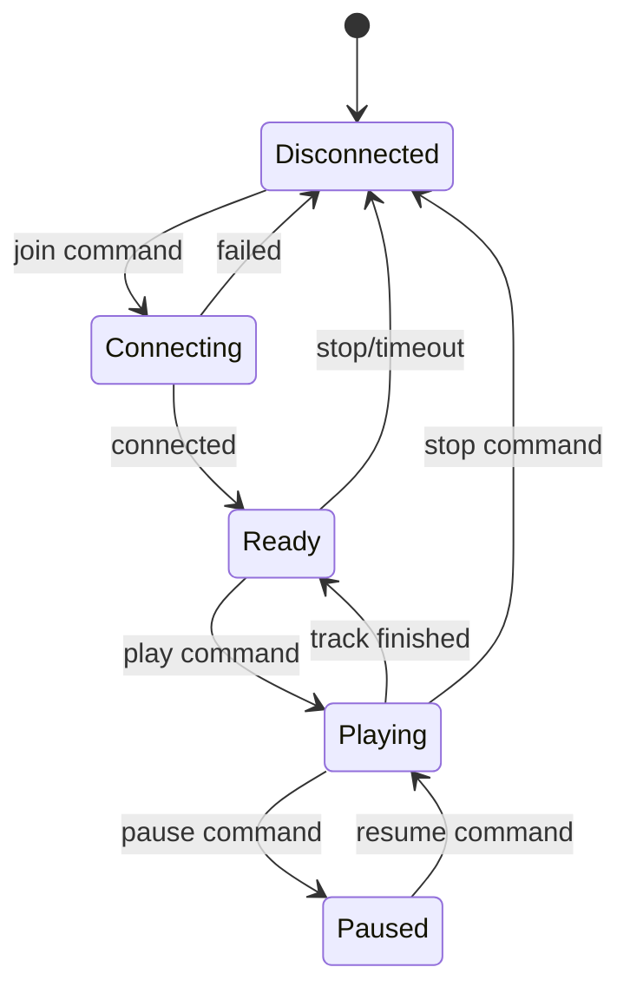
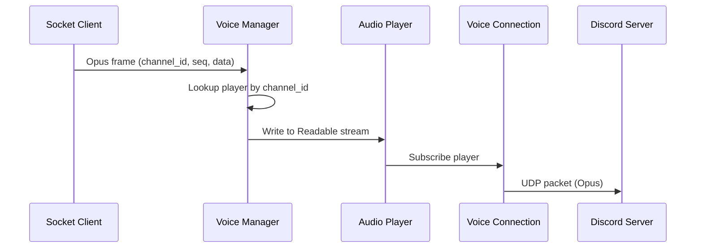

# c3-102: Voice Manager

## Overview

The Voice Manager component handles Discord voice connections, audio player lifecycle, and Opus packet transmission using @discordjs/voice.

## Component Diagram



## Responsibilities

| Responsibility | Description |
|---------------|-------------|
| Connection Lifecycle | Join, leave, reconnect voice channels |
| Audio Players | Create and manage audio players per guild |
| Frame Forwarding | Receive Opus from Socket Client, send to Discord |
| State Tracking | Track connection states per guild |
| Error Recovery | Handle disconnects and reconnection |

## Connection Lifecycle



## Directory Structure

```
node/src/voice/
├── connection.ts     # VoiceConnection wrapper
├── player.ts         # AudioPlayer wrapper
└── index.ts          # Voice manager exports
```

## Dependencies

| Depends On | Purpose |
|------------|---------|
| c3-104 Socket Client | Receive Opus frames from Go |

| Depended By | Purpose |
|-------------|---------|
| c3-101 Discord Bot | Join/leave commands |

## Interfaces

### Voice Manager Interface

```typescript
interface VoiceManager {
  join(guildId: string, channelId: string): Promise<VoiceConnection>;
  leave(guildId: string): void;
  getConnection(guildId: string): VoiceConnection | undefined;
  playOpusStream(guildId: string, stream: Readable): void;
}
```

### Connection Map

```typescript
// Map of guild_id to active voice connection
const connections = new Map<string, VoiceConnection>();

// Map of guild_id to audio player
const players = new Map<string, AudioPlayer>();
```

## Audio Flow



## Configuration

| Setting | Value | Purpose |
|---------|-------|---------|
| Adapter | @discordjs/voice | Voice library |
| Self Deaf | true | Bot doesn't receive audio |
| Self Mute | false | Bot can transmit |

## Error Handling

| Error | Action |
|-------|--------|
| Connection lost | Attempt reconnect 3 times |
| Channel deleted | Clean up connection |
| Permissions revoked | Notify and disconnect |
| Player error | Log and continue with next track |
