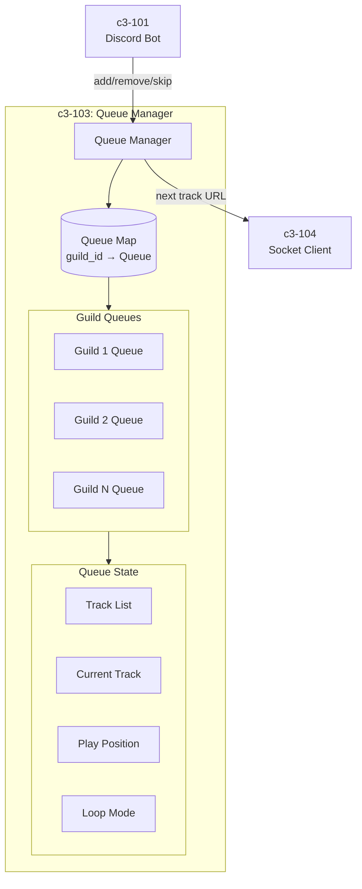
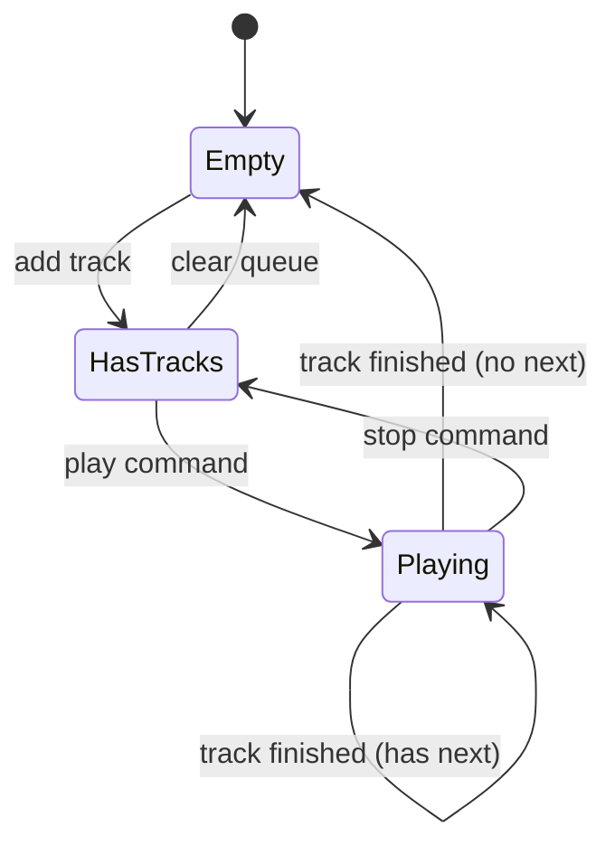
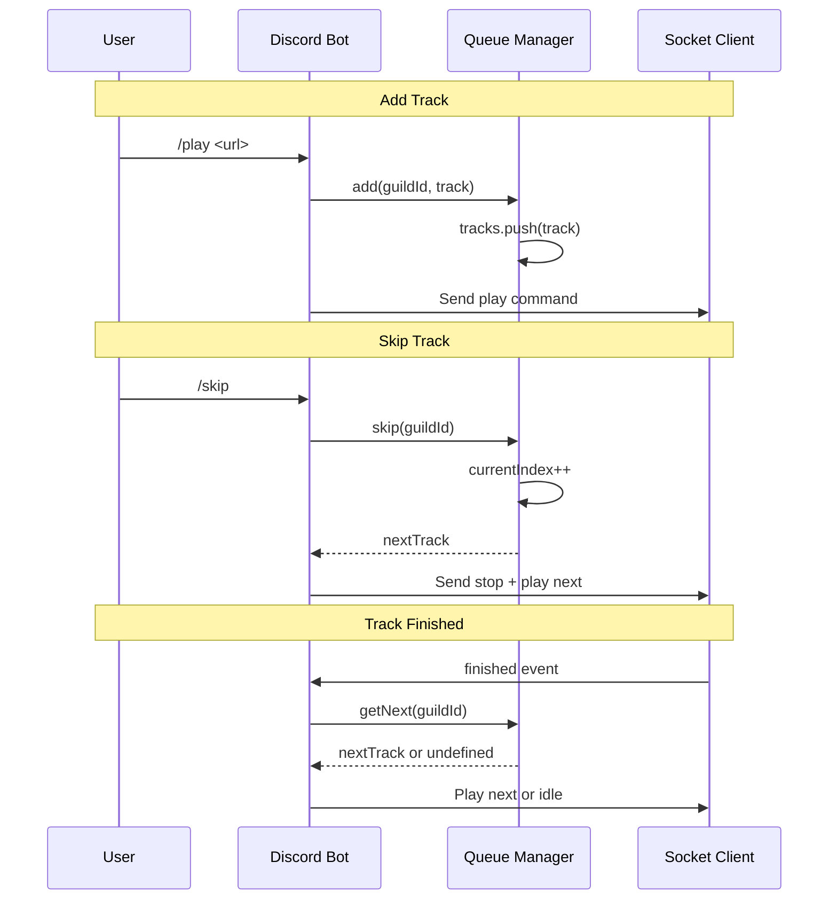

# c3-103: Queue Manager

## Overview

The Queue Manager component maintains playlist state and track queues per guild. All queue logic lives in Node.js (the "brain").

## Component Diagram



## Responsibilities

| Responsibility | Description |
|---------------|-------------|
| Queue State | Maintain track queue per guild |
| Add/Remove | Add tracks, remove tracks, clear queue |
| Current Track | Track what's currently playing |
| Skip Logic | Handle skip, go to next track |
| Loop Modes | Support no-loop, loop-track, loop-queue |

## Queue State Machine



## Directory Structure

```
node/src/queue/
├── manager.ts        # Queue manager class
├── track.ts          # Track interface
└── index.ts          # Queue exports
```

## Dependencies

| Depended By | Purpose |
|-------------|---------|
| c3-101 Discord Bot | Queue operations from commands |
| c3-104 Socket Client | Get next track when finished |

## Interfaces

### Track Interface

```typescript
interface Track {
  url: string;
  title: string;
  duration: number;      // seconds
  requestedBy: string;   // user ID
  addedAt: Date;
}
```

### Queue Interface

```typescript
interface Queue {
  guildId: string;
  tracks: Track[];
  currentIndex: number;
  loopMode: LoopMode;
}

enum LoopMode {
  None = 'none',
  Track = 'track',
  Queue = 'queue'
}
```

### Queue Manager Interface

```typescript
interface QueueManager {
  // Queue operations
  add(guildId: string, track: Track): void;
  remove(guildId: string, index: number): Track | undefined;
  clear(guildId: string): void;

  // Playback control
  getCurrent(guildId: string): Track | undefined;
  getNext(guildId: string): Track | undefined;
  skip(guildId: string): Track | undefined;

  // State
  getQueue(guildId: string): Track[];
  setLoopMode(guildId: string, mode: LoopMode): void;
}
```

## Queue Operations



## Loop Mode Behavior

| Mode | Behavior |
|------|----------|
| None | Play queue once, stop at end |
| Track | Repeat current track indefinitely |
| Queue | Loop entire queue when finished |

## Data Storage

- **In-Memory**: Queue state is ephemeral
- **No Persistence**: Queues reset on bot restart
- **Per-Guild**: Each guild has independent queue
