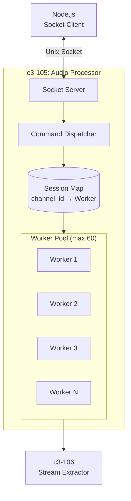
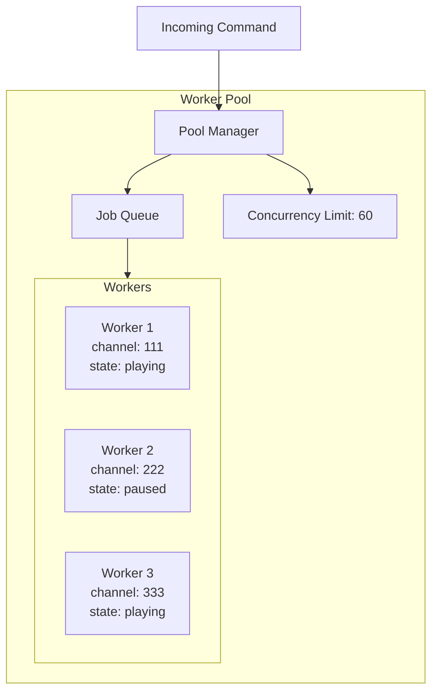
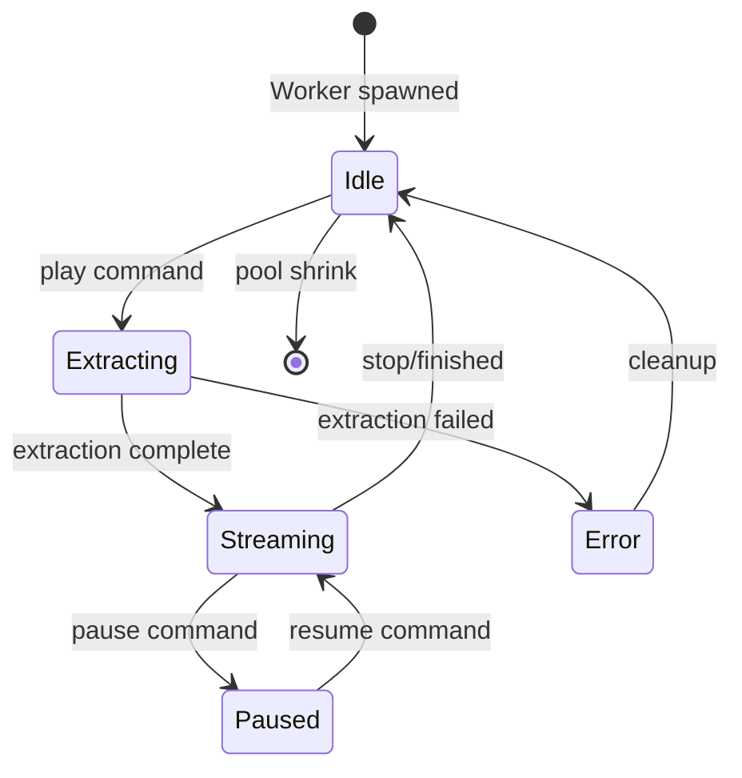
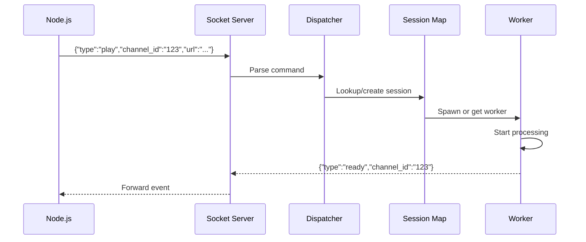
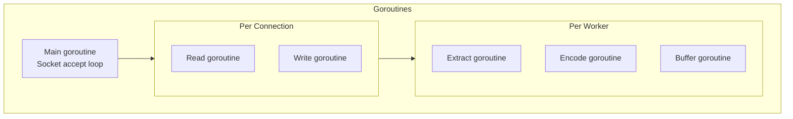

# c3-105: Audio Processor

## Overview

The Audio Processor is the core Go component that manages the worker pool, session map, and coordinates audio processing for multiple Discord channels concurrently.

## Component Diagram



## Responsibilities

| Responsibility | Description |
|---------------|-------------|
| Socket Server | Listen on Unix sockets for commands/audio |
| Worker Pool | Manage pool of audio processing workers |
| Session Map | Route commands to correct worker by channel_id |
| Command Dispatch | Handle play/pause/resume/stop/volume |
| Resource Management | Limit concurrent workers, cleanup idle |

## Worker Pool Architecture



## Worker Lifecycle



## Directory Structure

```
go/internal/
├── server/
│   ├── socket.go       # Unix socket server
│   └── handler.go      # Command handler
└── worker/
    ├── pool.go         # Worker pool management
    └── session.go      # Individual worker session
```

## Dependencies

| Depends On | Purpose |
|------------|---------|
| c3-106 Stream Extractor | Extract audio URLs |
| c3-107 Opus Encoder | Encode audio to Opus |
| c3-108 Jitter Buffer | Buffer output frames |

## Interfaces

### Session Interface

```go
type Session struct {
    ChannelID string
    State     SessionState
    Worker    *Worker
    Cancel    context.CancelFunc
}

type SessionState int

const (
    StateIdle SessionState = iota
    StateExtracting
    StateStreaming
    StatePaused
    StateError
)
```

### Worker Pool Interface

```go
type WorkerPool interface {
    // Spawn or get existing worker for channel
    GetWorker(channelID string) (*Worker, error)

    // Release worker back to pool
    ReleaseWorker(channelID string)

    // Get current worker count
    ActiveCount() int

    // Shutdown all workers
    Shutdown()
}
```

### Command Handler Interface

```go
type CommandHandler interface {
    HandlePlay(channelID, url string, volume float64) error
    HandlePause(channelID string) error
    HandleResume(channelID string) error
    HandleStop(channelID string) error
    HandleVolume(channelID string, level float64) error
}
```

## Command Flow



## Concurrency Model



## Resource Limits

| Resource | Limit | Rationale |
|----------|-------|-----------|
| Max Workers | 60 | Target concurrent channels |
| Worker Timeout | 5 minutes | Cleanup idle workers |
| Socket Buffer | 64KB | Balance memory/performance |

## Error Handling

| Error | Action |
|-------|--------|
| Pool exhausted | Return error, Node notifies user |
| Worker crash | Cleanup, send error event |
| Invalid command | Log, ignore |
| Socket error | Attempt reconnect |
