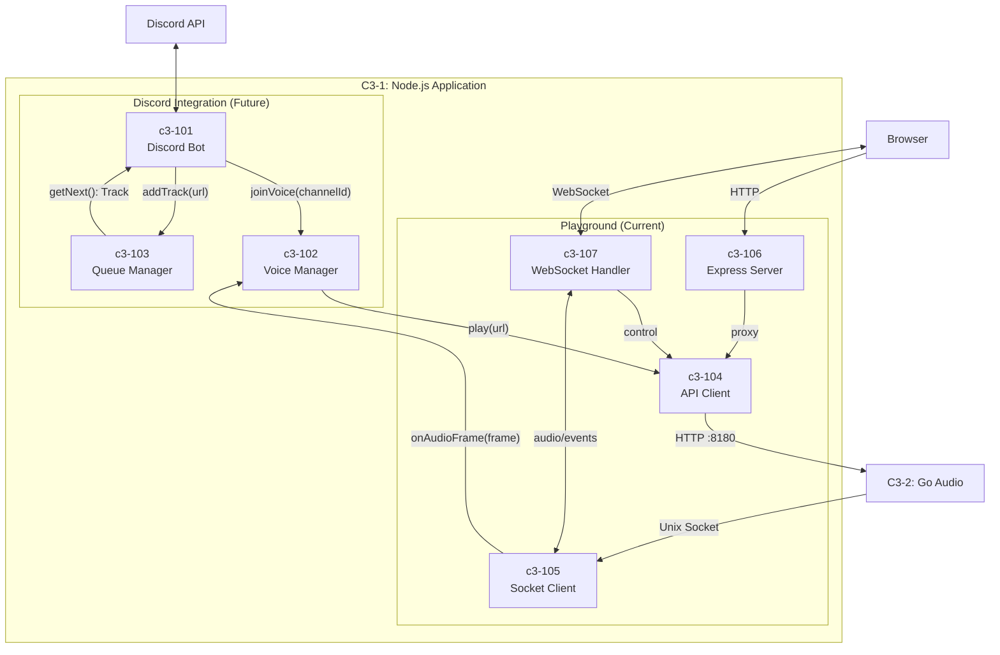

# C3-1XX: Node.js Components

> Part of [C3-1: Node.js Application](./README.md) | [C4 Model](https://c4model.com/)

## What is a Component? (C4 Definition)

A **Component** is a grouping of related functionality encapsulated behind a well-defined interface.

- **NOT separately deployable** - all components run in the same Node.js process
- **Grouping of related code** - TypeScript modules that work together
- **Well-defined interface** - clear contracts for interaction

## Components in this Container

| ID | Component | Responsibility | Status |
|----|-----------|----------------|--------|
| [c3-101](./c3-101-discord-bot/README.md) | Discord Bot | Slash commands, Discord.js client | Future |
| [c3-102](./c3-102-voice-manager/README.md) | Voice Manager | Voice connections, @discordjs/voice | Future |
| [c3-103](./c3-103-queue-manager/README.md) | Queue Manager | Playlist state, track queue | Future |
| c3-104 | API Client | HTTP client to Go API :8180 | Done |
| c3-105 | Socket Client | Unix socket audio receiver | Done |
| c3-106 | Express Server | HTTP API for playground | Done |
| c3-107 | WebSocket Handler | Real-time browser events | Done |

## Component Relationships



## Interface Contracts

### c3-101 (Discord Bot) → c3-102 (Voice Manager)

```typescript
interface IVoiceManager {
  join(guildId: string, channelId: string): Promise<VoiceConnection>
  leave(guildId: string): void
  getConnection(guildId: string): VoiceConnection | undefined
}
```

### c3-101 (Discord Bot) → c3-103 (Queue Manager)

```typescript
interface IQueueManager {
  add(guildId: string, track: Track): void
  next(guildId: string): Track | undefined
  list(guildId: string): Track[]
  clear(guildId: string): void
  current(guildId: string): Track | undefined
}

interface Track {
  url: string
  title: string
  duration: number
  requestedBy: string
}
```

### c3-104 (API Client) → Go API

```typescript
interface IApiClient {
  play(sessionId: string, url: string, format?: string): Promise<PlayResponse>
  stop(sessionId: string): Promise<void>
  pause(sessionId: string): Promise<void>
  resume(sessionId: string): Promise<void>
  status(sessionId: string): Promise<SessionStatus>
  health(): Promise<boolean>
}
```

### c3-105 (Socket Client) Events

```typescript
interface ISocketClient {
  connect(): Promise<void>
  disconnect(): void
  on(event: 'ready', handler: (sessionId: string) => void): void
  on(event: 'progress', handler: (bytes: number, secs: number) => void): void
  on(event: 'finished', handler: (sessionId: string) => void): void
  on(event: 'error', handler: (message: string) => void): void
  on(event: 'audio', handler: (chunk: Buffer) => void): void
}
```

### c3-106 (Express Server) Routes

```typescript
// All routes proxy to Go API via c3-104
POST /api/session/:id/play   → apiClient.play()
POST /api/session/:id/stop   → apiClient.stop()
POST /api/session/:id/pause  → apiClient.pause()
POST /api/session/:id/resume → apiClient.resume()
GET  /api/session/:id/status → apiClient.status()
GET  /api/go/health          → apiClient.health()
```

### c3-107 (WebSocket Handler) Protocol

```typescript
// Inbound (Browser → Node.js)
type InboundMessage =
  | { action: 'play'; url: string }
  | { action: 'stop' }
  | { action: 'pause' }
  | { action: 'resume' }

// Outbound (Node.js → Browser)
type OutboundMessage =
  | { type: 'state'; debugMode: boolean; isPlaying: boolean }
  | { type: 'session'; session_id: string }
  | { type: 'ready'; session_id: string }
  | { type: 'progress'; bytes: number; playback_secs: number }
  | { type: 'finished'; session_id: string }
  | { type: 'paused' }
  | { type: 'resumed' }
  | { type: 'stopped' }
  | { type: 'error'; message: string }
  | { type: 'log'; source: 'go' | 'nodejs'; message: string }
```

## Dependency Matrix

| Component | Depends On | Depended By |
|-----------|------------|-------------|
| c3-101 Discord Bot | c3-102, c3-103, c3-104 | - |
| c3-102 Voice Manager | c3-104, c3-105 | c3-101 |
| c3-103 Queue Manager | - | c3-101 |
| c3-104 API Client | - | c3-101, c3-102, c3-106, c3-107 |
| c3-105 Socket Client | - | c3-102, c3-107 |
| c3-106 Express Server | c3-104 | - |
| c3-107 WebSocket Handler | c3-104, c3-105 | - |

## Code Mapping

| Component | Code Location | Status |
|-----------|---------------|--------|
| c3-101 | `node/src/commands/` | Future |
| c3-102 | `node/src/voice/` | Future |
| c3-103 | `node/src/queue/` | Future |
| c3-104 | `playground/src/api-client.ts` | Done |
| c3-105 | `playground/src/socket-client.ts` | Done |
| c3-106 | `playground/src/server.ts` | Done |
| c3-107 | `playground/src/websocket.ts` | Done |
