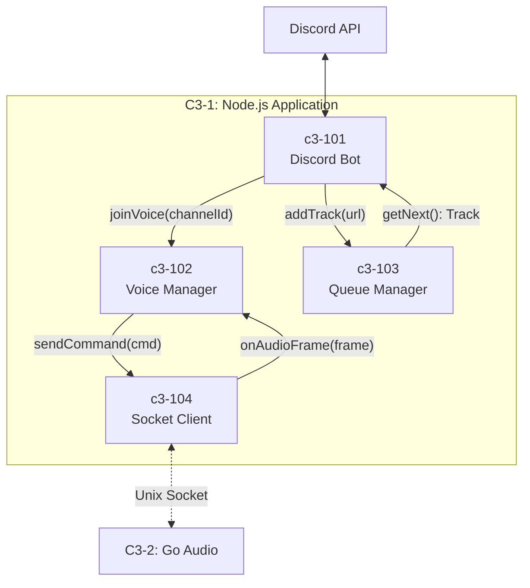

# C3-1XX: Node.js Components

## What is a Component? (C4 Definition)

A **Component** is a grouping of related functionality encapsulated behind a well-defined interface.

- **NOT separately deployable** - all components run in the same Node.js process
- **Grouping of related code** - TypeScript modules that work together
- **Well-defined interface** - clear contracts for interaction

## Components in this Container

| ID | Component | Responsibility |
|----|-----------|----------------|
| [c3-101](./c3-101-discord-bot/README.md) | Discord Bot | Slash commands, Discord.js client |
| [c3-102](./c3-102-voice-manager/README.md) | Voice Manager | Voice connections, @discordjs/voice |
| [c3-103](./c3-103-queue-manager/README.md) | Queue Manager | Playlist state, track queue |
| [c3-104](./c3-104-socket-client/README.md) | Socket Client | Unix socket IPC to Go |

## Component Relationships



## Interface Contracts

### c3-101 (Discord Bot) → c3-102 (Voice Manager)

```typescript
interface IVoiceManager {
  join(guildId: string, channelId: string): Promise<VoiceConnection>
  leave(guildId: string): void
  getConnection(guildId: string): VoiceConnection | undefined
}
```

### c3-101 (Discord Bot) → c3-103 (Queue Manager)

```typescript
interface IQueueManager {
  add(guildId: string, track: Track): void
  next(guildId: string): Track | undefined
  list(guildId: string): Track[]
  clear(guildId: string): void
  current(guildId: string): Track | undefined
}

interface Track {
  url: string
  title: string
  duration: number
  requestedBy: string
}
```

### c3-102 (Voice Manager) ↔ c3-104 (Socket Client)

```typescript
interface ISocketClient {
  sendCommand(cmd: PlayCommand | PauseCommand | StopCommand): void
  onAudioFrame(callback: (frame: AudioFrame) => void): void
}

type PlayCommand = { type: 'play'; channelId: string; url: string }
type PauseCommand = { type: 'pause'; channelId: string }
type StopCommand = { type: 'stop'; channelId: string }

interface AudioFrame {
  channelId: string
  sequence: number
  opusData: Buffer
}
```

## Dependency Matrix

| Component | Depends On | Depended By |
|-----------|------------|-------------|
| c3-101 Discord Bot | c3-102, c3-103 | - |
| c3-102 Voice Manager | c3-104 | c3-101 |
| c3-103 Queue Manager | - | c3-101 |
| c3-104 Socket Client | - | c3-102 |

## Code Mapping

| Component | Code Location |
|-----------|---------------|
| c3-101 | `node/src/commands/` |
| c3-102 | `node/src/voice/` |
| c3-103 | `node/src/queue/` |
| c3-104 | `node/src/socket/` |
