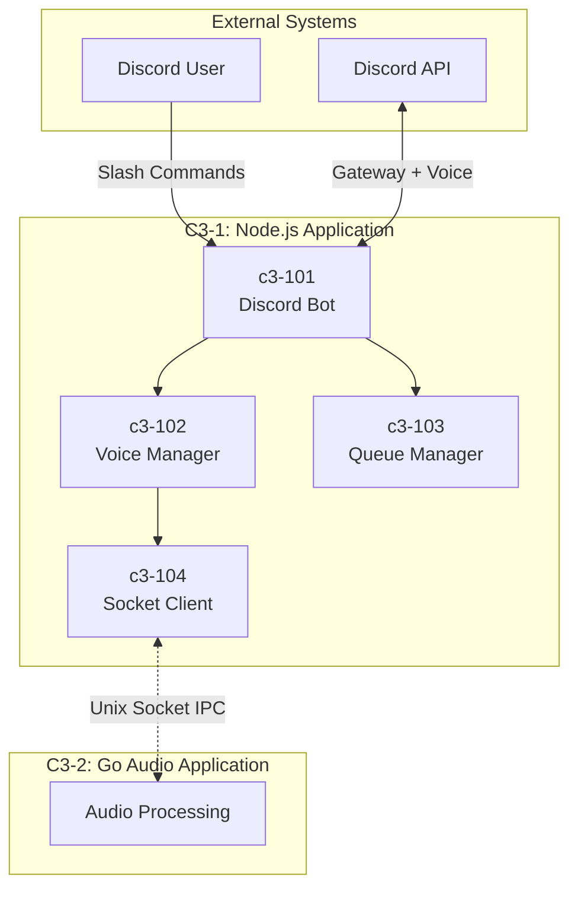
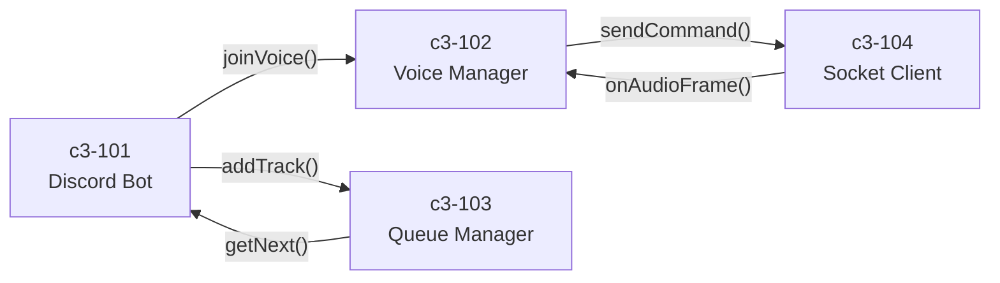
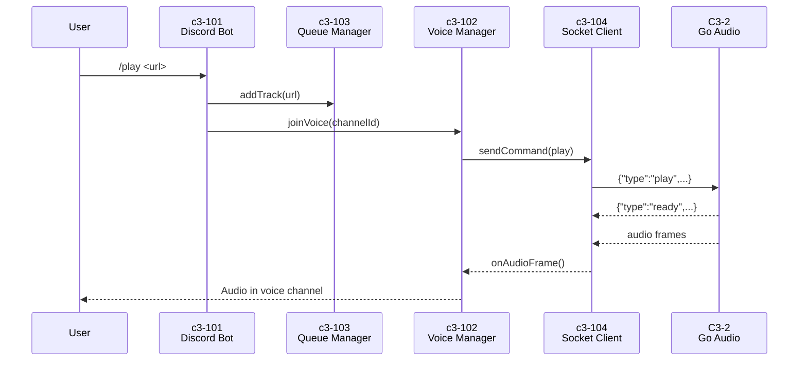

# C3-1: Node.js Application (Container)

## What is a Container? (C4 Definition)

A **Container** is an application or data store - something that needs to be **running** for the system to work. It represents a runtime boundary around code being executed.

> **Note:** This is NOT a Docker container. Docker is deployment infrastructure. This C4 Container is the Node.js runtime process.

## Overview

The Node.js Application is the **brain** of the Music Bot system. It handles all Discord interactions, user commands, state management, and coordinates with the Go Audio Application via IPC.

| Aspect | Value |
|--------|-------|
| **Runtime** | Node.js 20 LTS |
| **Role** | Discord integration, state management, IPC client |
| **Process** | Single Node.js process |
| **Code Location** | `node/src/` |

## Container Diagram



## Responsibilities

| Responsibility | Description |
|----------------|-------------|
| Discord Integration | Handle slash commands, events, voice connections |
| State Management | Manage queue state, user sessions |
| IPC Client | Communicate with Go via Unix sockets |
| User Feedback | Send embeds, messages back to Discord |

## Components

| ID | Component | Responsibility | Code Location |
|----|-----------|----------------|---------------|
| [c3-101](./c3-101-discord-bot/README.md) | Discord Bot | Slash commands, Discord.js client | `node/src/commands/` |
| [c3-102](./c3-102-voice-manager/README.md) | Voice Manager | Voice connections, @discordjs/voice | `node/src/voice/` |
| [c3-103](./c3-103-queue-manager/README.md) | Queue Manager | Playlist state, track queue | `node/src/queue/` |
| [c3-104](./c3-104-socket-client/README.md) | Socket Client | Unix socket IPC to Go | `node/src/socket/` |

## Component Interactions



## Technology Stack

| Technology | Version | Purpose |
|------------|---------|---------|
| Node.js | 20 LTS | Runtime |
| TypeScript | 5.x | Language |
| discord.js | v14 | Discord API |
| @discordjs/voice | latest | Voice connections |
| @discordjs/opus | latest | Opus encoding |

## Directory Structure

```
node/
├── src/
│   ├── index.ts          # Entry point
│   ├── commands/         # c3-101: Slash commands
│   │   ├── play.ts
│   │   ├── pause.ts
│   │   ├── stop.ts
│   │   └── ...
│   ├── voice/            # c3-102: Voice management
│   │   ├── connection.ts
│   │   └── player.ts
│   ├── queue/            # c3-103: Queue management
│   │   └── manager.ts
│   └── socket/           # c3-104: IPC client
│       ├── client.ts
│       ├── commands.ts
│       └── audio.ts
├── package.json
└── tsconfig.json
```

## Communication with Go Application

### IPC Protocol

This container communicates with [C3-2: Go Audio Application](../c3-2-go-audio/README.md) via Unix sockets:

| Socket | Direction | Format | Purpose |
|--------|-----------|--------|---------|
| `/tmp/music.sock` | Bidirectional | JSON | Commands and events |
| `/tmp/music-audio.sock` | Go → Node | Binary | Audio frames |

### Commands Sent (Node → Go)

```json
{"type": "play", "channel_id": "123", "url": "https://..."}
{"type": "pause", "channel_id": "123"}
{"type": "resume", "channel_id": "123"}
{"type": "stop", "channel_id": "123"}
{"type": "volume", "channel_id": "123", "level": 0.8}
```

### Events Received (Go → Node)

```json
{"type": "ready", "channel_id": "123", "duration": 240}
{"type": "finished", "channel_id": "123"}
{"type": "error", "channel_id": "123", "message": "..."}
```

## Data Flow



## See Also

- [C3-2: Go Audio Application](../c3-2-go-audio/README.md) - The other container
- [C3-0: Context](../c3-0-context/README.md) - System context
- [Components Overview](./COMPONENTS.md) - Detailed component documentation
