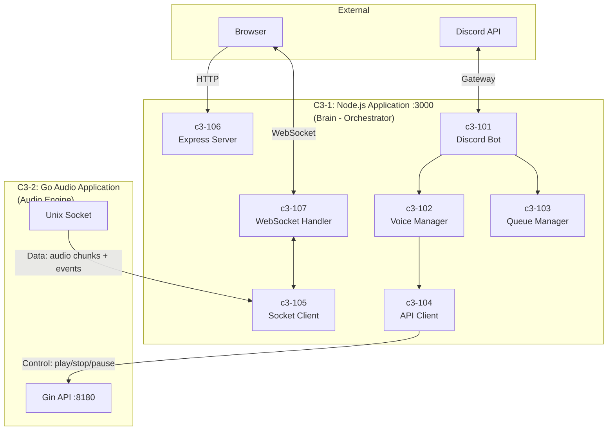
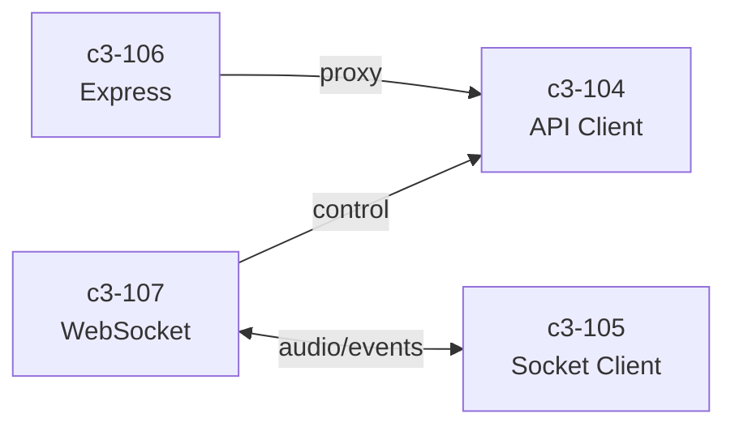
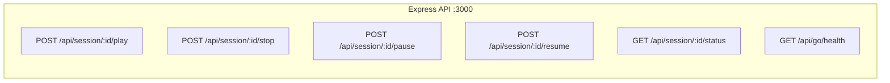
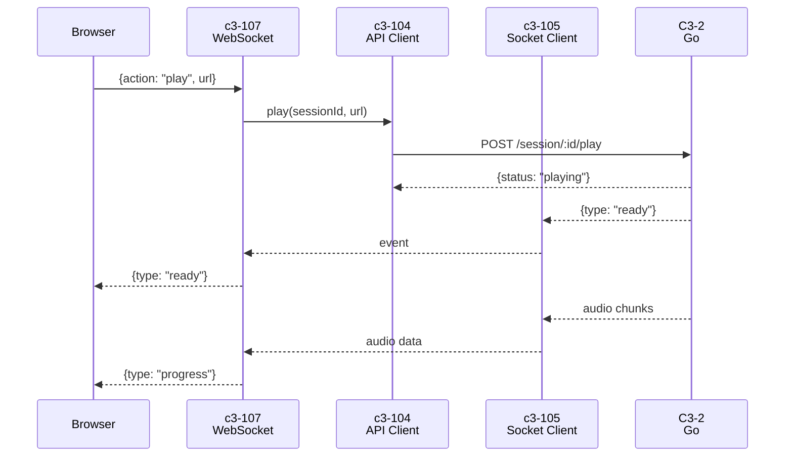
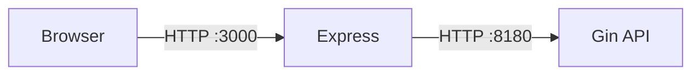
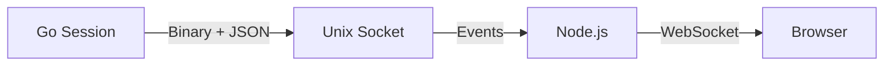

# C3-1: Node.js Application (Container)

> Part of the [C3 Architecture](./../README.md) based on the [C4 Model](https://c4model.com/)

## What is a Container? (C4 Definition)

A **Container** is an application or data store - something that needs to be **running** for the system to work. It represents a runtime boundary around code being executed.

> **Note:** This is NOT a Docker container. Docker is deployment infrastructure. This C4 Container is the Node.js runtime process.

## Overview

The Node.js Application is the **brain/orchestrator** of the Music Bot system. It handles browser/Discord interactions, sends control commands to Go, and relays audio events back to clients.

| Aspect | Value |
|--------|-------|
| **Runtime** | Node.js 20 LTS |
| **Role** | Gateway, Discord integration, state management |
| **HTTP Server** | Express on port 3000 |
| **Code Location** | `playground/src/` (current), `node/src/` (Discord - future) |

## Container Diagram



## Communication Pattern

| Channel | Direction | What | Protocol |
|---------|-----------|------|----------|
| **Control Plane** | Node.js → Go | Commands (play, stop, pause, resume) | HTTP REST :8180 |
| **Data Plane** | Go → Node.js | Audio chunks + events (ready, progress, finished) | Unix Socket |

> **Node.js is the brain**: It tells Go what to do. Go processes audio and streams it back.

## Components

| ID | Component | Responsibility | Code Location |
|----|-----------|----------------|---------------|
| c3-101 | Discord Bot | Slash commands, Discord.js | `node/src/commands/` (future) |
| c3-102 | Voice Manager | Voice connections | `node/src/voice/` (future) |
| c3-103 | Queue Manager | Playlist state | `node/src/queue/` (future) |
| c3-104 | API Client | HTTP client to Go API | `playground/src/api-client.ts` |
| c3-105 | Socket Client | Audio stream receiver | `playground/src/socket-client.ts` |
| c3-106 | Express Server | HTTP API for browser | `playground/src/server.ts` |
| c3-107 | WebSocket Handler | Real-time browser events | `playground/src/websocket.ts` |

## Component Interactions



## HTTP Endpoints (c3-106)



| Endpoint | Method | Description |
|----------|--------|-------------|
| `/api/session/:id/play` | POST | Proxy to Go - start playback |
| `/api/session/:id/stop` | POST | Proxy to Go - stop playback |
| `/api/session/:id/pause` | POST | Proxy to Go - pause |
| `/api/session/:id/resume` | POST | Proxy to Go - resume |
| `/api/session/:id/status` | GET | Proxy to Go - get status |
| `/api/go/health` | GET | Check Go API health |

## WebSocket Protocol (c3-107)

### Messages from Browser

```json
{"action": "play", "url": "https://youtube.com/..."}
{"action": "stop"}
{"action": "pause"}
{"action": "resume"}
```

### Messages to Browser

```json
{"type": "state", "debugMode": true, "isPlaying": false}
{"type": "session", "session_id": "abc123"}
{"type": "ready", "session_id": "abc123"}
{"type": "progress", "bytes": 12345, "playback_secs": 10.5}
{"type": "finished", "session_id": "abc123", "bytes": 54321}
{"type": "paused"}
{"type": "resumed"}
{"type": "stopped"}
{"type": "error", "message": "..."}
{"type": "log", "source": "go|nodejs", "message": "..."}
```

## Data Flow (Playground)



## Technology Stack

| Technology | Version | Purpose |
|------------|---------|---------|
| Node.js | 20 LTS | Runtime |
| TypeScript | 5.x | Language |
| Express | 4.x | HTTP server |
| ws | 8.x | WebSocket |
| discord.js | v14 | Discord API (future) |
| @discordjs/voice | latest | Voice connections (future) |

## Directory Structure

```
playground/src/
├── index.ts           # Entry point
├── server.ts          # c3-106: Express server
├── websocket.ts       # c3-107: WebSocket handler
├── api-client.ts      # c3-104: Go API client
├── socket-client.ts   # c3-105: Socket client
└── audio-player.ts    # Debug audio output

playground/client/src/
├── App.tsx            # React main component
└── hooks/
    └── useWebSocket.ts  # React WebSocket hook
```

## Communication with Go Application

### Control Plane (HTTP)

Node.js sends control commands to Go API:



### Data Plane (Socket)

Node.js receives audio/events from Go:



## Environment Variables

| Variable | Default | Description |
|----------|---------|-------------|
| `GO_API_PORT` | `8180` | Go API port to connect to |
| `DEBUG_AUDIO` | `0` | Enable audio playback to speakers |

## See Also

- [C3-2: Go Audio Application](../c3-2-go-audio/README.md) - Audio processing container
- [C3-0: System Context](../c3-0-context/README.md) - System context
- [Components Overview](./COMPONENTS.md) - Detailed component documentation
