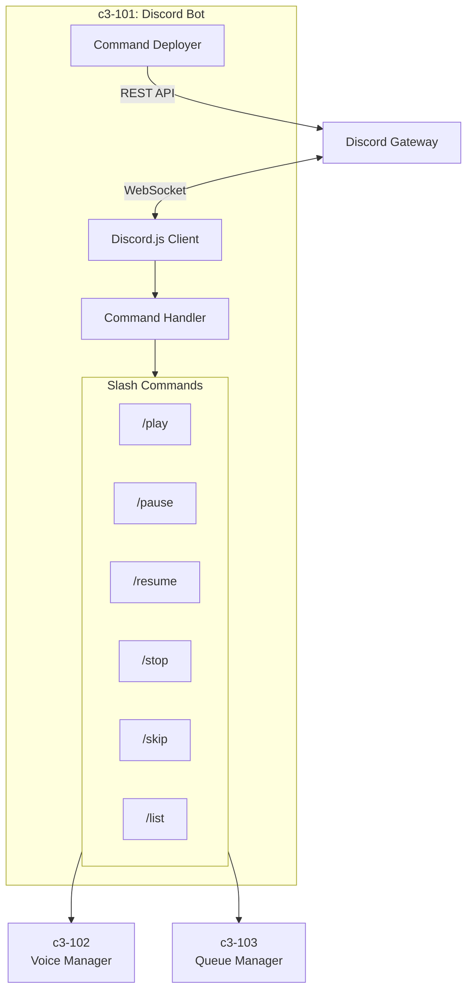
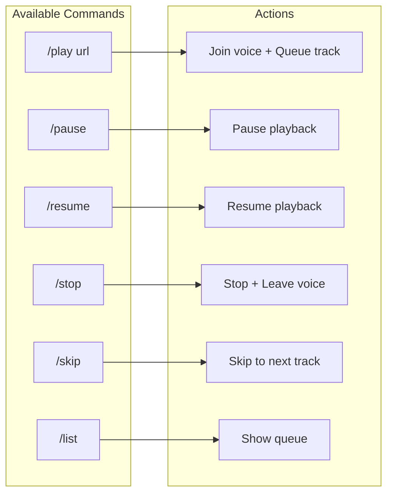

# c3-101: Discord Bot

## Overview

The Discord Bot component handles all Discord interactions including slash commands, events, and client lifecycle management.

## Component Diagram



## Responsibilities

| Responsibility | Description |
|---------------|-------------|
| Client Management | Initialize and maintain Discord.js client connection |
| Command Registration | Deploy slash commands to Discord API |
| Command Handling | Route commands to appropriate handlers |
| Event Processing | Handle Discord events (ready, error, etc.) |
| User Feedback | Send embeds and messages back to users |

## Slash Commands



## Directory Structure

```
node/src/commands/
├── index.ts          # Command registration
├── play.ts           # /play command handler
├── pause.ts          # /pause command handler
├── resume.ts         # /resume command handler
├── stop.ts           # /stop command handler
├── skip.ts           # /skip command handler
└── list.ts           # /list command handler
```

## Dependencies

| Depends On | Purpose |
|------------|---------|
| c3-102 Voice Manager | Join/leave voice channels |
| c3-103 Queue Manager | Manage track queue |
| c3-104 Socket Client | Send commands to Go |

## Interfaces

### Command Handler Interface

```typescript
interface CommandHandler {
  data: SlashCommandBuilder;
  execute(interaction: ChatInputCommandInteraction): Promise<void>;
}
```

### Play Command Example

```typescript
// /play <url>
{
  data: new SlashCommandBuilder()
    .setName('play')
    .setDescription('Play audio from URL')
    .addStringOption(opt =>
      opt.setName('url')
        .setDescription('YouTube URL')
        .setRequired(true)
    ),

  async execute(interaction) {
    const url = interaction.options.getString('url', true);
    const voiceChannel = interaction.member.voice.channel;

    // Validate user is in voice channel
    // Add to queue via c3-103
    // Send play command via c3-104
    // Reply with embed
  }
}
```

## Error Handling

| Error | Response |
|-------|----------|
| User not in voice | "You must be in a voice channel" |
| Invalid URL | "Invalid YouTube URL" |
| Bot lacks permissions | "Missing voice permissions" |
| Playback error | "Error playing track: {message}" |
