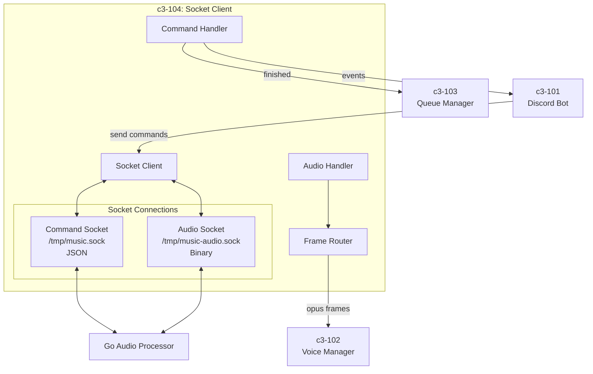
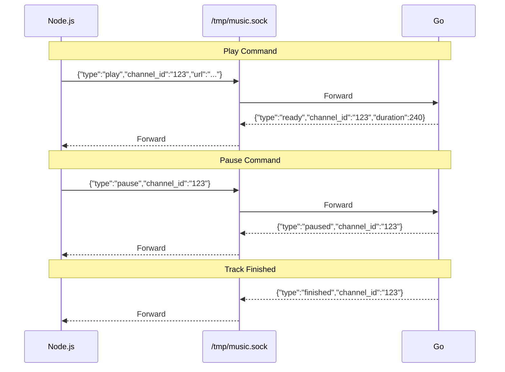
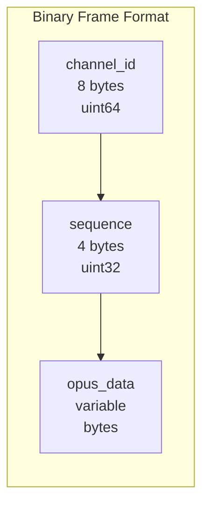
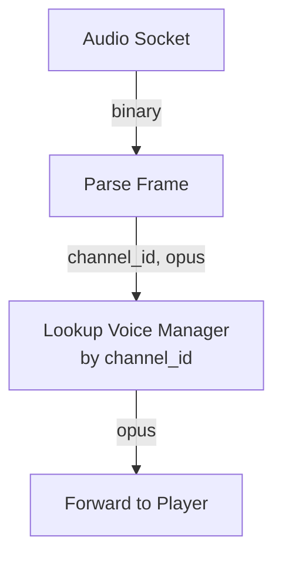
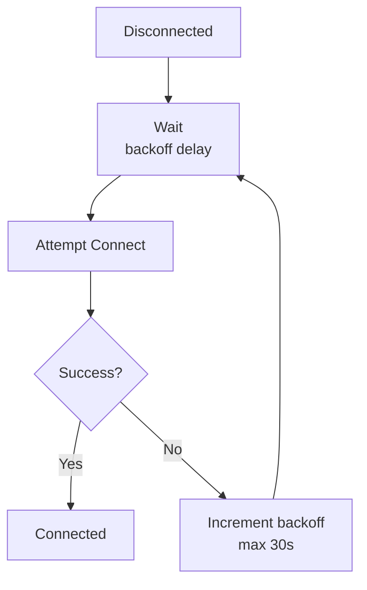

# c3-104: Socket Client

## Overview

The Socket Client component handles Unix socket IPC between Node.js and Go layers. It manages two sockets: one for JSON commands and one for binary Opus frames.

## Component Diagram



## Responsibilities

| Responsibility | Description |
|---------------|-------------|
| Command Transport | Send play/pause/stop/etc to Go |
| Event Handling | Receive ready/finished/error from Go |
| Audio Routing | Route Opus frames to correct Voice Manager |
| Connection Management | Connect, reconnect, handle errors |
| Frame Parsing | Parse binary frame format (channel_id + seq + opus) |

## Socket Protocol

### Command Socket (JSON)



### Audio Socket (Binary)



## Directory Structure

```
app/src/
└── socket-client.ts  # Socket client
```

## Dependencies

| Depends On | Purpose |
|------------|---------|
| c3-102 Voice Manager | Send Opus frames for playback |
| c3-103 Queue Manager | Notify track finished |

| Depended By | Purpose |
|-------------|---------|
| c3-101 Discord Bot | Send playback commands |

## Interfaces

### Command Types

```typescript
// Node.js → Go
type OutgoingCommand =
  | { type: 'play'; channel_id: string; url: string; volume?: number }
  | { type: 'pause'; channel_id: string }
  | { type: 'resume'; channel_id: string }
  | { type: 'stop'; channel_id: string }
  | { type: 'volume'; channel_id: string; level: number };

// Go → Node.js
type IncomingEvent =
  | { type: 'ready'; channel_id: string; duration: number }
  | { type: 'paused'; channel_id: string }
  | { type: 'resumed'; channel_id: string }
  | { type: 'stopped'; channel_id: string }
  | { type: 'finished'; channel_id: string }
  | { type: 'error'; channel_id: string; message: string };
```

### Socket Client Interface

```typescript
interface SocketClient {
  connect(): Promise<void>;
  disconnect(): void;

  // Commands
  play(channelId: string, url: string, volume?: number): void;
  pause(channelId: string): void;
  resume(channelId: string): void;
  stop(channelId: string): void;
  setVolume(channelId: string, level: number): void;

  // Events
  on(event: 'ready', handler: (channelId: string, duration: number) => void): void;
  on(event: 'finished', handler: (channelId: string) => void): void;
  on(event: 'error', handler: (channelId: string, message: string) => void): void;
  on(event: 'audio', handler: (channelId: string, opus: Buffer) => void): void;
}
```

## Frame Routing



## Error Handling

| Error | Action |
|-------|--------|
| Socket disconnect | Attempt reconnect with backoff |
| Parse error | Log and skip frame |
| Unknown channel_id | Log warning, discard frame |
| Go process crash | Emit error event, attempt reconnect |

## Reconnection Strategy


