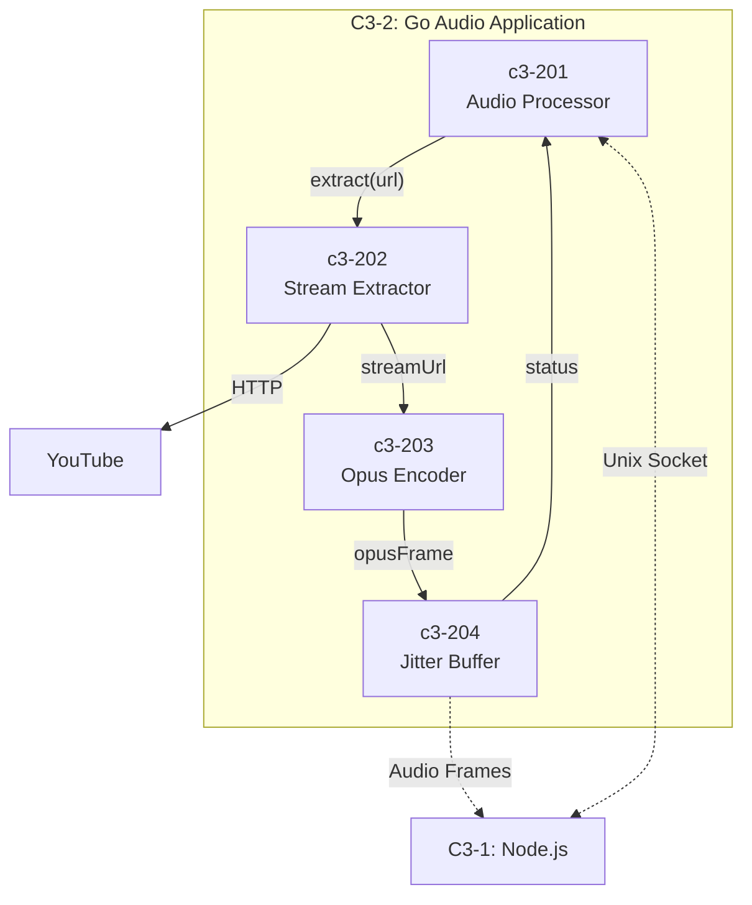

# C3-2XX: Go Audio Components

## What is a Component? (C4 Definition)

A **Component** is a grouping of related functionality encapsulated behind a well-defined interface.

- **NOT separately deployable** - all components run in the same Go process
- **Grouping of related code** - Go packages that work together
- **Well-defined interface** - clear contracts for interaction

## Components in this Container

| ID | Component | Responsibility |
|----|-----------|----------------|
| [c3-201](./c3-201-audio-processor/README.md) | Audio Processor | Worker pool, session management |
| [c3-202](./c3-202-stream-extractor/README.md) | Stream Extractor | yt-dlp integration |
| [c3-203](./c3-203-opus-encoder/README.md) | Opus Encoder | FFmpeg + libopus encoding |
| [c3-204](./c3-204-jitter-buffer/README.md) | Jitter Buffer | Frame buffering, smoothing |

## Component Relationships



## Interface Contracts

### c3-201 (Audio Processor) → c3-202 (Stream Extractor)

```go
type Extractor interface {
    Extract(ctx context.Context, url string) (*StreamInfo, error)
    IsSupported(url string) bool
}

type StreamInfo struct {
    URL       string
    Title     string
    Duration  time.Duration
    Thumbnail string
    Format    string
}
```

### c3-202 (Stream Extractor) → c3-203 (Opus Encoder)

```go
type Encoder interface {
    Start(ctx context.Context, url string, volume float64) error
    Frames() <-chan OpusFrame
    SetVolume(level float64)
    Stop()
}

type OpusFrame struct {
    Data      []byte
    Timestamp uint32
    Sequence  uint16
}
```

### c3-203 (Opus Encoder) → c3-204 (Jitter Buffer)

```go
type JitterBuffer interface {
    Push(frame OpusFrame) error
    Start(ctx context.Context, output chan<- OutputFrame)
    Stats() BufferStats
    Reset()
}

type OutputFrame struct {
    ChannelID uint64
    Sequence  uint32
    OpusData  []byte
}
```

## Dependency Matrix

| Component | Depends On | Depended By |
|-----------|------------|-------------|
| c3-201 Audio Processor | c3-202, c3-204 | - |
| c3-202 Stream Extractor | c3-203 | c3-201 |
| c3-203 Opus Encoder | c3-204 | c3-202 |
| c3-204 Jitter Buffer | - | c3-201, c3-203 |

## Code Mapping

| Component | Code Location |
|-----------|---------------|
| c3-201 | `go/internal/server/`, `go/internal/worker/` |
| c3-202 | `go/internal/extractor/` |
| c3-203 | `go/internal/encoder/` |
| c3-204 | `go/internal/buffer/` |

## Audio Quality Settings

When modifying c3-203 or c3-204, maintain these settings:

| Setting | Value | Rationale |
|---------|-------|-----------|
| Sample Rate | 48000 Hz | Discord native rate |
| Channels | 2 (stereo) | Full quality |
| Frame Size | 960 samples (20ms) | Discord requirement |
| Bitrate | 128 kbps VBR | Good quality |
| Jitter Buffer | 3-5 frames | Smooth delivery |
