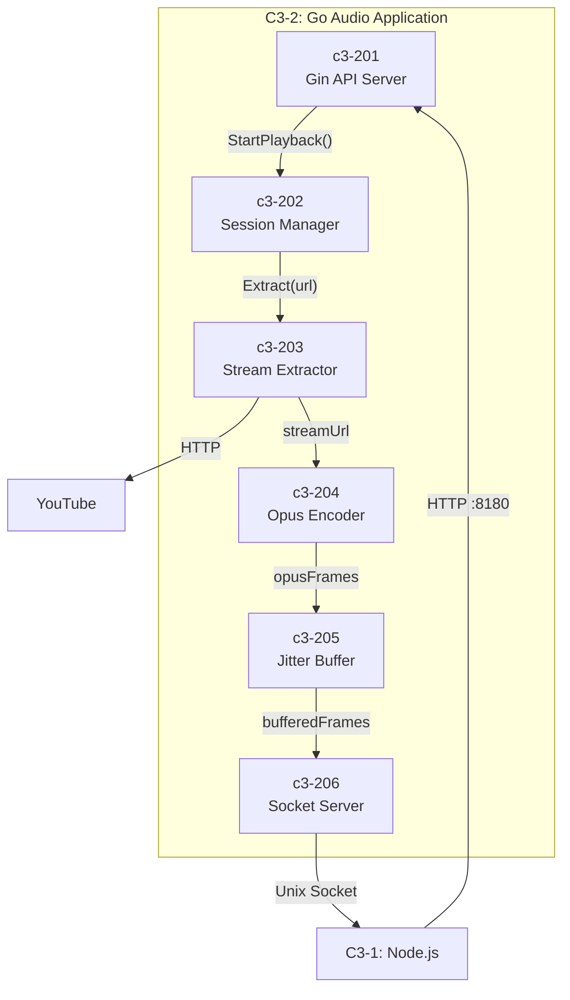
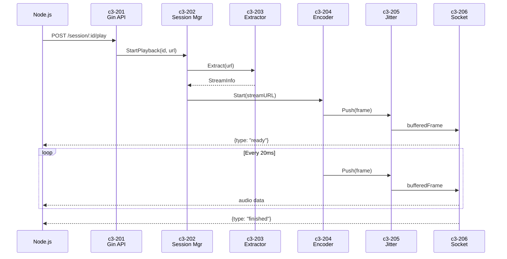

# C3-2XX: Go Audio Components

> Part of [C3-2: Go Audio Application](./README.md) | [C4 Model](https://c4model.com/)

## What is a Component? (C4 Definition)

A **Component** is a grouping of related functionality encapsulated behind a well-defined interface.

- **NOT separately deployable** - all components run in the same Go process
- **Grouping of related code** - Go packages that work together
- **Well-defined interface** - clear contracts for interaction

## Components in this Container

| ID | Component | Responsibility | Status |
|----|-----------|----------------|--------|
| c3-201 | Gin API Server | HTTP control endpoints | Done |
| c3-202 | Session Manager | Session lifecycle, pause/resume | Done |
| c3-203 | Stream Extractor | yt-dlp integration | Done |
| c3-204 | Opus Encoder | FFmpeg + libopus encoding | Done |
| c3-205 | Jitter Buffer | Frame buffering, smoothing | TODO |
| c3-206 | Socket Server | Audio streaming to Node.js | Done |

## Component Relationships



## Interface Contracts

### c3-201 (Gin API Server)

```go
// HTTP Handlers
func PlayHandler(c *gin.Context)    // POST /session/:id/play
func StopHandler(c *gin.Context)    // POST /session/:id/stop
func PauseHandler(c *gin.Context)   // POST /session/:id/pause
func ResumeHandler(c *gin.Context)  // POST /session/:id/resume
func StatusHandler(c *gin.Context)  // GET /session/:id/status
func HealthHandler(c *gin.Context)  // GET /health
```

### c3-201 → c3-202 (Session Manager)

```go
type SessionManager interface {
    StartPlayback(sessionID string, url string, format string) error
    Stop(sessionID string) error
    Pause(sessionID string) error
    Resume(sessionID string) error
    GetStatus(sessionID string) (*SessionStatus, error)
}

type SessionStatus struct {
    SessionID  string
    State      SessionState
    BytesSent  int64
    PlaybackMs int64
}

type SessionState int
const (
    StateIdle SessionState = iota
    StateExtracting
    StateStreaming
    StatePaused
    StateStopped
    StateError
)
```

### c3-202 → c3-203 (Stream Extractor)

```go
type Extractor interface {
    Extract(ctx context.Context, url string) (*StreamInfo, error)
    IsSupported(url string) bool
}

type StreamInfo struct {
    URL       string
    Title     string
    Duration  time.Duration
    Thumbnail string
    Format    string
}
```

### c3-203 → c3-204 (Opus Encoder)

```go
type Encoder interface {
    Start(ctx context.Context, streamURL string, format string) error
    Frames() <-chan []byte
    Stop()
}

// Output format options
const (
    FormatPCM  = "pcm"   // Raw PCM s16le for debugging
    FormatOpus = "opus"  // Opus for Discord
)
```

### c3-204 → c3-205 (Jitter Buffer)

```go
type JitterBuffer interface {
    Push(frame []byte) error
    Start(ctx context.Context, output chan<- []byte)
    Stats() BufferStats
    Reset()
}

type BufferStats struct {
    CurrentSize  int
    TotalFrames  uint64
    Underruns    uint64
    Overruns     uint64
}
```

### c3-205 → c3-206 (Socket Server)

```go
type SocketServer interface {
    SendAudio(sessionID string, data []byte) error
    SendEvent(sessionID string, event Event) error
    OnConnect(handler func(sessionID string))
    OnDisconnect(handler func(sessionID string))
}

type Event struct {
    Type      string `json:"type"`
    SessionID string `json:"session_id"`
    Message   string `json:"message,omitempty"`
    Bytes     int64  `json:"bytes,omitempty"`
    PlaybackS float64 `json:"playback_secs,omitempty"`
}
```

## Dependency Matrix

| Component | Depends On | Depended By |
|-----------|------------|-------------|
| c3-201 Gin API Server | c3-202 | - |
| c3-202 Session Manager | c3-203, c3-206 | c3-201 |
| c3-203 Stream Extractor | c3-204 | c3-202 |
| c3-204 Opus Encoder | c3-205 | c3-203 |
| c3-205 Jitter Buffer | c3-206 | c3-204 |
| c3-206 Socket Server | - | c3-202, c3-205 |

## Code Mapping

| Component | Code Location | Status |
|-----------|---------------|--------|
| c3-201 | `internal/server/api.go`, `router.go` | Done |
| c3-202 | `internal/server/session.go` | Done |
| c3-203 | `internal/platform/youtube/` | Done |
| c3-204 | `internal/encoder/ffmpeg.go` | Done |
| c3-205 | `internal/buffer/` | TODO |
| c3-206 | `internal/server/socket.go` | Done |

## Audio Quality Settings

When modifying c3-204 or c3-205, maintain these settings:

| Setting | Value | Rationale |
|---------|-------|-----------|
| Sample Rate | 48000 Hz | Discord native rate |
| Channels | 2 (stereo) | Full quality |
| Frame Size | 960 samples (20ms) | Discord requirement |
| Bitrate | 128 kbps VBR | Good quality |
| Jitter Buffer | 3-5 frames (60-100ms) | Smooth delivery |

## Data Flow


