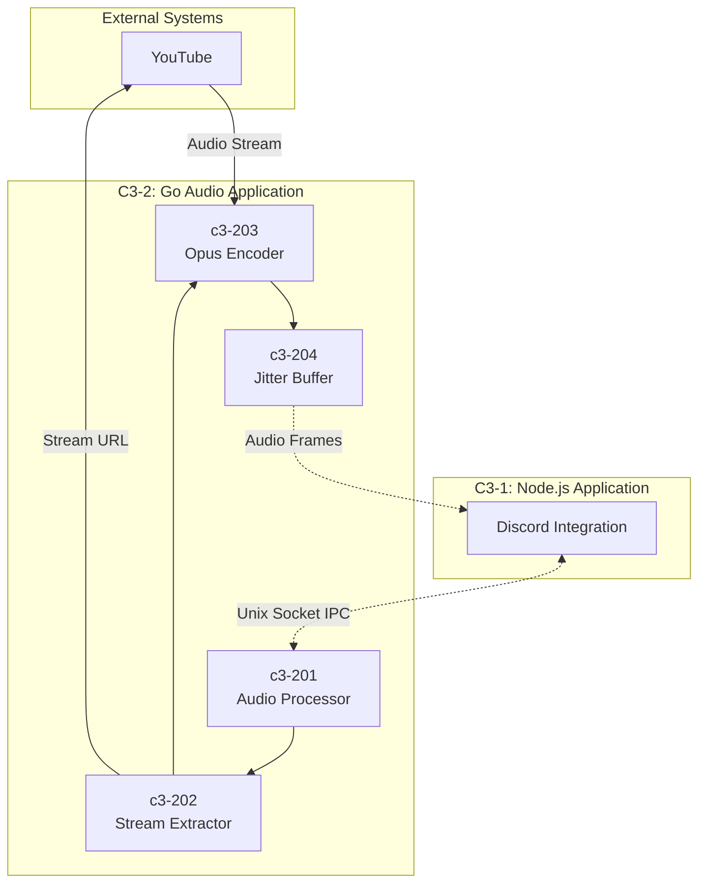
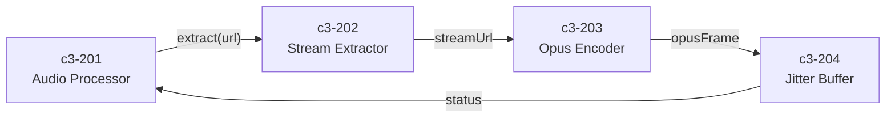
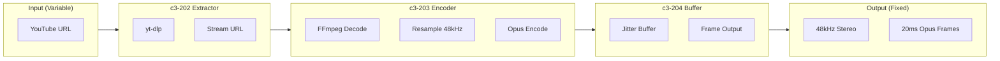
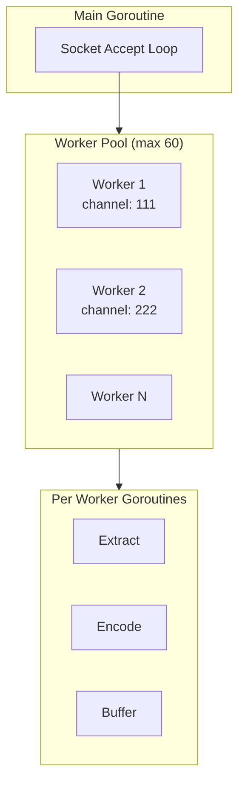

# C3-2: Go Audio Application (Container)

## What is a Container? (C4 Definition)

A **Container** is an application or data store - something that needs to be **running** for the system to work. It represents a runtime boundary around code being executed.

> **Note:** This is NOT a Docker container. Docker is deployment infrastructure. This C4 Container is the Go runtime process.

## Overview

The Go Audio Application is the **audio processor** of the Music Bot system. It handles stream extraction, audio encoding, and frame buffering with high performance and low latency.

| Aspect | Value |
|--------|-------|
| **Runtime** | Go 1.21+ |
| **Role** | Audio processing, stream extraction, Opus encoding |
| **Process** | Single Go process with worker pool |
| **Code Location** | `go/` |

## Container Diagram



## Responsibilities

| Responsibility | Description |
|----------------|-------------|
| Stream Extraction | Use yt-dlp to get audio stream URLs |
| Audio Decoding | Decode audio via FFmpeg |
| Opus Encoding | Encode to Discord-compatible Opus format |
| Frame Buffering | Buffer frames for smooth delivery |
| Worker Management | Pool of workers for concurrent channels |

## Components

| ID | Component | Responsibility | Code Location |
|----|-----------|----------------|---------------|
| [c3-201](./c3-201-audio-processor/README.md) | Audio Processor | Worker pool, session management | `go/internal/server/`, `go/internal/worker/` |
| [c3-202](./c3-202-stream-extractor/README.md) | Stream Extractor | yt-dlp integration | `go/internal/extractor/` |
| [c3-203](./c3-203-opus-encoder/README.md) | Opus Encoder | FFmpeg + libopus encoding | `go/internal/encoder/` |
| [c3-204](./c3-204-jitter-buffer/README.md) | Jitter Buffer | Frame buffering, smoothing | `go/internal/buffer/` |

## Component Interactions



## Technology Stack

| Technology | Version | Purpose |
|------------|---------|---------|
| Go | 1.21+ | Runtime |
| yt-dlp | latest | Stream extraction |
| FFmpeg | latest | Audio decoding |
| libopus | latest | Opus encoding |

## Directory Structure

```
go/
├── cmd/
│   └── main.go              # Entry point
└── internal/
    ├── server/              # c3-201: Socket server
    │   ├── socket.go
    │   └── handler.go
    ├── worker/              # c3-201: Worker pool
    │   ├── pool.go
    │   └── session.go
    ├── extractor/           # c3-202: yt-dlp wrapper
    │   ├── ytdlp.go
    │   └── cache.go
    ├── encoder/             # c3-203: FFmpeg + Opus
    │   ├── ffmpeg.go
    │   └── opus.go
    └── buffer/              # c3-204: Jitter buffer
        └── jitter.go
```

## Communication with Node.js Application

### IPC Protocol

This container communicates with [C3-1: Node.js Application](../c3-1-nodejs/README.md) via Unix sockets:

| Socket | Direction | Format | Purpose |
|--------|-----------|--------|---------|
| `/tmp/music.sock` | Bidirectional | JSON | Commands and events |
| `/tmp/music-audio.sock` | Go → Node | Binary | Audio frames |

### Commands Received (Node → Go)

```json
{"type": "play", "channel_id": "123", "url": "https://..."}
{"type": "pause", "channel_id": "123"}
{"type": "resume", "channel_id": "123"}
{"type": "stop", "channel_id": "123"}
{"type": "volume", "channel_id": "123", "level": 0.8}
```

### Events Sent (Go → Node)

```json
{"type": "ready", "channel_id": "123", "duration": 240}
{"type": "finished", "channel_id": "123"}
{"type": "error", "channel_id": "123", "message": "..."}
```

### Audio Frame Format

```
┌──────────────┬──────────────┬─────────────────┐
│ channel_id   │ sequence     │ opus_data       │
│ (8 bytes)    │ (4 bytes)    │ (variable)      │
└──────────────┴──────────────┴─────────────────┘
```

## Audio Pipeline



## Audio Quality Requirements

| Setting | Value | Rationale |
|---------|-------|-----------|
| Sample Rate | 48000 Hz | Discord native rate |
| Channels | 2 (stereo) | Full quality |
| Frame Size | 960 samples (20ms) | Discord requirement |
| Bitrate | 128 kbps VBR | Good quality |
| Jitter Buffer | 3-5 frames | Smooth delivery |

## Concurrency Model



## See Also

- [C3-1: Node.js Application](../c3-1-nodejs/README.md) - The other container
- [C3-0: Context](../c3-0-context/README.md) - System context
- [Components Overview](./COMPONENTS.md) - Detailed component documentation
