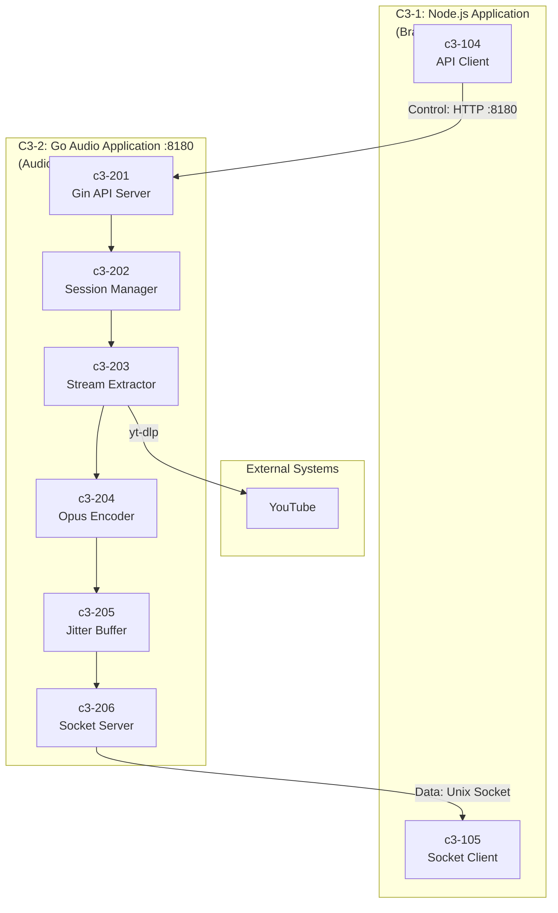
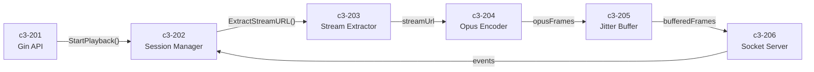
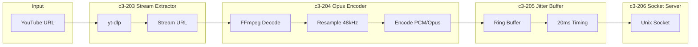

# C3-2: Go Audio Application (Container)

> Part of the [C3 Architecture](./../README.md) based on the [C4 Model](https://c4model.com/)

## What is a Container? (C4 Definition)

A **Container** is an application or data store - something that needs to be **running** for the system to work. It represents a runtime boundary around code being executed.

> **Note:** This is NOT a Docker container. Docker is deployment infrastructure. This C4 Container is the Go runtime process.

## Overview

The Go Audio Application is the **audio engine** of the Music Bot system. It handles stream extraction, audio encoding, and session management with high performance and low latency.

| Aspect | Value |
|--------|-------|
| **Runtime** | Go 1.21+ |
| **Role** | Audio processing, stream extraction, session management |
| **HTTP API** | Gin framework on port 8180 |
| **Audio Output** | Unix socket `/tmp/music-playground.sock` |
| **Code Location** | `internal/`, `cmd/playground/` |

## Container Diagram



## Communication Pattern

| Channel | Direction | What | Protocol |
|---------|-----------|------|----------|
| **Control Plane** | Node.js → Go | Commands (play, stop, pause, resume) | HTTP REST :8180 |
| **Data Plane** | Go → Node.js | Audio chunks + events (ready, progress, finished) | Unix Socket |

> **Go is the audio engine**: Node.js tells Go what to do. Go processes audio and streams it back.

## Components

| ID | Component | Responsibility | Code Location |
|----|-----------|----------------|---------------|
| c3-201 | Gin API Server | HTTP control endpoints | `internal/server/api.go`, `router.go` |
| c3-202 | Session Manager | Session lifecycle, pause/resume | `internal/server/session.go` |
| c3-203 | Stream Extractor | yt-dlp integration | `internal/platform/youtube/` |
| c3-204 | Opus Encoder | FFmpeg + libopus pipeline | `internal/encoder/ffmpeg.go` |
| c3-205 | Jitter Buffer | Smooth frame delivery (3-5 frames) | `internal/buffer/` (TODO) |
| c3-206 | Socket Server | Audio streaming to Node.js | `internal/server/socket.go` |

## Component Interactions



## API Endpoints (c3-201)


| Endpoint | Method | Request | Response |
|----------|--------|---------|----------|
| `/session/:id/play` | POST | `{url, format}` | `{status, session_id}` |
| `/session/:id/stop` | POST | - | `{status, session_id}` |
| `/session/:id/pause` | POST | - | `{status, session_id}` |
| `/session/:id/resume` | POST | - | `{status, session_id}` |
| `/session/:id/status` | GET | - | `{session_id, status, bytes_sent}` |
| `/health` | GET | - | `{status: "ok"}` |

## Session State Machine (c3-202)


## Audio Pipeline (c3-203, c3-204, c3-205)



## Socket Protocol (c3-206)

### Events (JSON, newline-delimited)

```json
{"type": "ready", "session_id": "abc123"}
{"type": "progress", "session_id": "abc123", "bytes": 12345, "playback_secs": 10.5}
{"type": "finished", "session_id": "abc123"}
{"type": "error", "session_id": "abc123", "message": "..."}
```

### Audio Data (Binary)

```
┌─────────────────────┬─────────────────────┐
│ Length (4 bytes)    │ Audio Data          │
│ Big-endian uint32   │ Variable length     │
└─────────────────────┴─────────────────────┘
```

## Concurrency Model


## Technology Stack

| Technology | Version | Purpose |
|------------|---------|---------|
| Go | 1.21+ | Runtime |
| Gin | latest | HTTP framework |
| yt-dlp | latest | Stream extraction |
| FFmpeg | latest | Audio processing |
| libopus | latest | Opus encoding |

## Directory Structure

```
internal/
├── server/
│   ├── api.go           # c3-201: Gin handlers
│   ├── router.go        # c3-201: Gin routes
│   ├── session.go       # c3-202: Session manager
│   ├── socket.go        # c3-206: Socket server
│   └── types.go         # Protocol types
├── encoder/
│   ├── ffmpeg.go        # c3-204: FFmpeg pipeline
│   └── types.go         # Format definitions
├── buffer/              # c3-205: Jitter buffer (TODO)
│   └── jitter.go
└── platform/
    ├── platform.go      # c3-203: Platform registry
    └── youtube/
        └── youtube.go   # c3-203: yt-dlp wrapper

cmd/playground/
└── main.go              # Entry point
```

## Audio Quality Settings

| Setting | Value | Rationale |
|---------|-------|-----------|
| Sample Rate | 48000 Hz | Discord native rate |
| Channels | 2 (stereo) | Full quality |
| Frame Size | 960 samples (20ms) | Discord requirement |
| Bitrate | 128 kbps VBR | Good quality |
| Jitter Buffer | 3-5 frames (60-100ms) | Smooth delivery |

## Environment Variables

| Variable | Default | Description |
|----------|---------|-------------|
| `GO_API_PORT` | `8180` | Gin HTTP port |

## See Also

- [C3-1: Node.js Application](../c3-1-nodejs/README.md) - Gateway container
- [C3-0: System Context](../c3-0-context/README.md) - System context
- [Components Overview](./COMPONENTS.md) - Detailed component documentation
