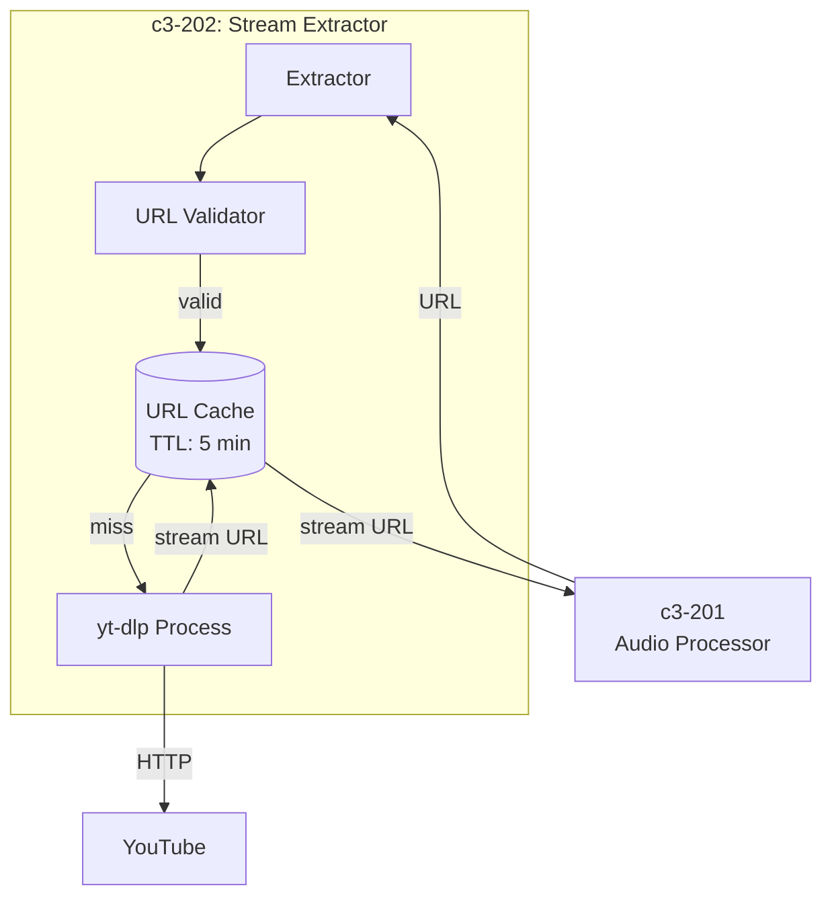
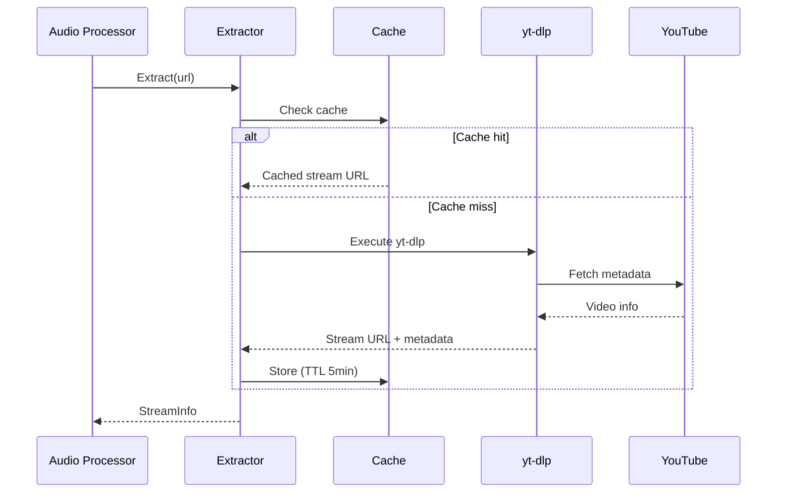
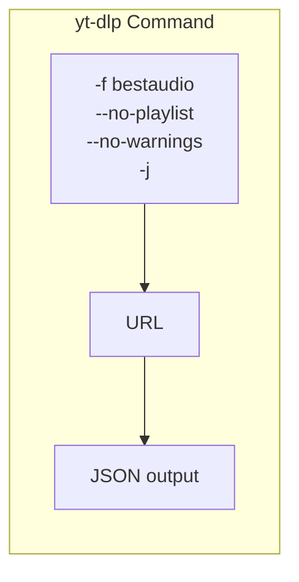
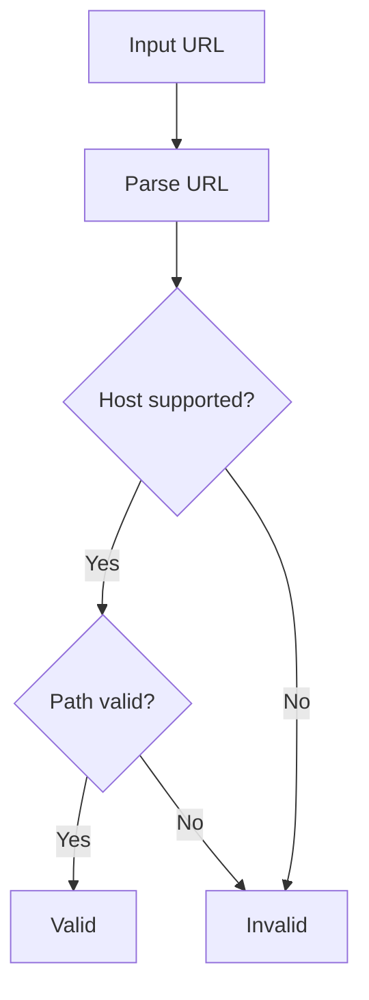

# c3-202: Stream Extractor

## Overview

The Stream Extractor component uses yt-dlp to extract direct audio stream URLs from YouTube and other supported platforms.

## Component Diagram



## Responsibilities

| Responsibility | Description |
|---------------|-------------|
| URL Validation | Validate supported URLs (YouTube, etc.) |
| Stream Extraction | Use yt-dlp to get direct stream URL |
| Metadata Extraction | Get title, duration, thumbnail |
| Caching | Cache extracted URLs (short TTL) |
| Format Selection | Select best audio quality |

## Extraction Flow



## Directory Structure

```
go/internal/extractor/
├── ytdlp.go          # yt-dlp wrapper
├── validator.go      # URL validation
├── cache.go          # URL cache
└── types.go          # Stream info types
```

## Dependencies

| Depends On | External |
|------------|----------|
| yt-dlp | CLI tool for extraction |

| Depended By | Purpose |
|-------------|---------|
| c3-201 Audio Processor | Get stream URLs |

## Interfaces

### Stream Info

```go
type StreamInfo struct {
    URL       string        // Direct stream URL
    Title     string        // Track title
    Duration  time.Duration // Track duration
    Thumbnail string        // Thumbnail URL
    Format    string        // Audio format (opus, m4a, etc.)
}
```

### Extractor Interface

```go
type Extractor interface {
    // Extract stream info from URL
    Extract(ctx context.Context, url string) (*StreamInfo, error)

    // Check if URL is supported
    IsSupported(url string) bool
}
```

## yt-dlp Command



**Full command:**
```bash
yt-dlp -f bestaudio --no-playlist --no-warnings -j "URL"
```

## Supported Platforms

| Platform | URL Pattern | Status |
|----------|-------------|--------|
| YouTube | youtube.com, youtu.be | Supported |
| YouTube Music | music.youtube.com | Supported |
| SoundCloud | soundcloud.com | Planned |
| Spotify | spotify.com | Planned (via spotdl) |

## URL Validation



## Cache Strategy

| Setting | Value | Rationale |
|---------|-------|-----------|
| TTL | 5 minutes | Stream URLs expire |
| Max Size | 1000 entries | Memory limit |
| Eviction | LRU | Keep recent extractions |

## Error Handling

| Error | Action |
|-------|--------|
| Invalid URL | Return validation error |
| yt-dlp not found | Fatal error on startup |
| Network error | Retry with backoff |
| Age-restricted | Return error to user |
| Private video | Return error to user |
| Extraction timeout | Cancel and return error |

## Performance

| Metric | Target |
|--------|--------|
| Extraction time | <3 seconds |
| Cache hit rate | >50% |
| Memory per entry | ~1KB |
