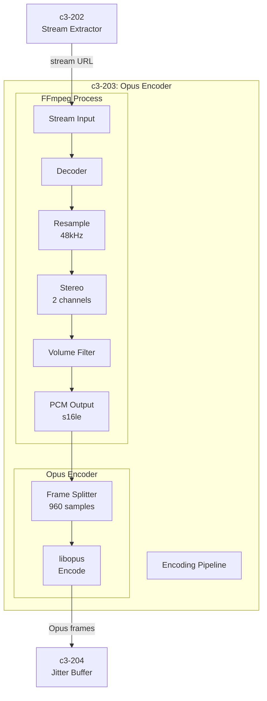
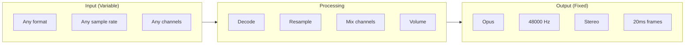
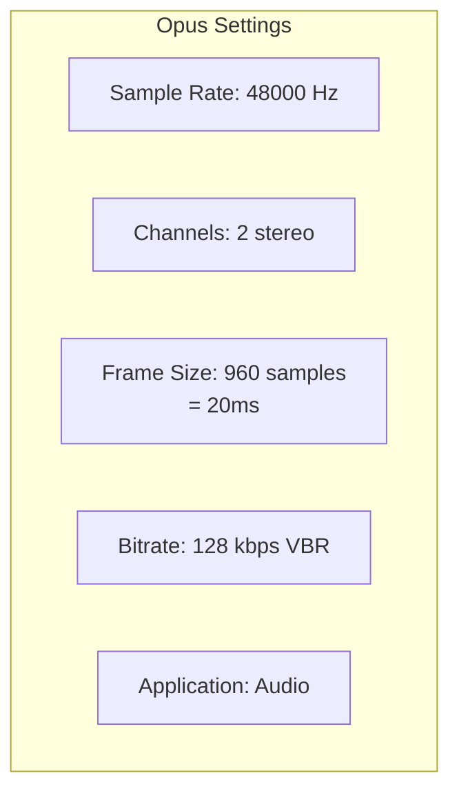
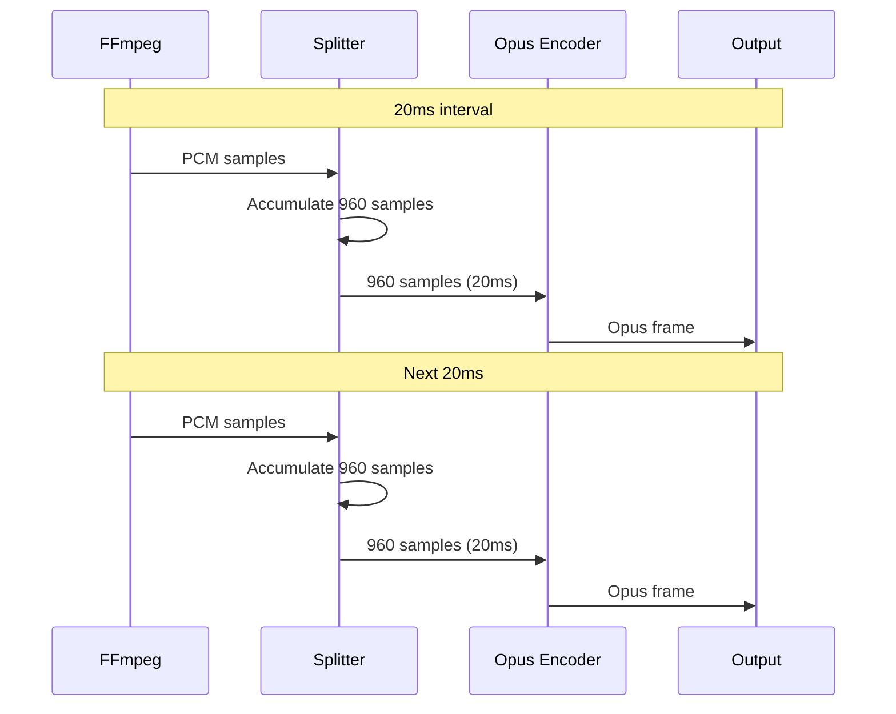

# c3-203: Opus Encoder

## Overview

The Opus Encoder component uses FFmpeg to decode audio streams and encode them to Opus format optimized for Discord voice (48kHz stereo, 20ms frames).

## Component Diagram



## Responsibilities

| Responsibility | Description |
|---------------|-------------|
| Stream Decoding | Decode any audio format via FFmpeg |
| Resampling | Convert to 48kHz sample rate |
| Channel Mixing | Convert to stereo |
| Volume Control | Apply volume adjustment |
| Opus Encoding | Encode to Opus 20ms frames |
| Frame Timing | Produce frames at correct rate |

## Audio Pipeline



## Directory Structure

```
go/internal/encoder/
├── ffmpeg.go         # FFmpeg process wrapper
├── opus.go           # Opus encoder wrapper
├── pipeline.go       # Full encoding pipeline
└── config.go         # Encoding configuration
```

## Dependencies

| Depends On | External |
|------------|----------|
| FFmpeg | Audio decoding/processing |
| libopus | Opus encoding |

| Depended By | Purpose |
|-------------|---------|
| c3-201 Audio Processor | Encode audio streams |

## FFmpeg Command

```bash
ffmpeg \
  -reconnect 1 \
  -reconnect_streamed 1 \
  -reconnect_delay_max 5 \
  -i <stream_url> \
  -af "volume=0.8" \
  -f s16le \
  -ar 48000 \
  -ac 2 \
  -loglevel warning \
  pipe:1
```

### Flag Explanation

| Flag | Purpose |
|------|---------|
| `-reconnect 1` | Auto-reconnect on connection loss |
| `-reconnect_streamed 1` | Reconnect for streaming protocols |
| `-reconnect_delay_max 5` | Max 5 second reconnect delay |
| `-af "volume=0.8"` | Apply volume filter |
| `-f s16le` | Output signed 16-bit little-endian |
| `-ar 48000` | Resample to 48kHz |
| `-ac 2` | Convert to stereo |
| `-loglevel warning` | Suppress verbose output |
| `pipe:1` | Output to stdout |

## Opus Encoding Settings



| Setting | Value | Rationale |
|---------|-------|-----------|
| Sample Rate | 48000 Hz | Discord native rate |
| Channels | 2 (stereo) | Full audio quality |
| Frame Size | 960 samples | 20ms at 48kHz |
| Bitrate | 128 kbps VBR | Good quality, efficient |
| Complexity | 10 | Max quality |
| Application | Audio | Optimized for music |

## Interfaces

### Pipeline Interface

```go
type Pipeline interface {
    // Start encoding pipeline
    Start(ctx context.Context, url string, volume float64) error

    // Get output channel for Opus frames
    Frames() <-chan []byte

    // Set volume (0.0 - 2.0)
    SetVolume(level float64)

    // Stop pipeline
    Stop()
}
```

### Opus Frame

```go
// Each frame is 20ms of audio
type OpusFrame struct {
    Data      []byte    // Opus encoded data
    Timestamp uint32    // RTP timestamp
    Sequence  uint16    // Sequence number
}
```

## Frame Timing



## Volume Control

| Level | dB | Description |
|-------|-----|-------------|
| 0.0 | -∞ | Muted |
| 0.5 | -6 | Half volume |
| 1.0 | 0 | Normal |
| 1.5 | +3.5 | Boosted |
| 2.0 | +6 | Max boost |

## Error Handling

| Error | Action |
|-------|--------|
| FFmpeg crash | Restart pipeline, notify |
| Stream disconnect | Reconnect (FFmpeg flags) |
| Encoding error | Log, skip frame |
| Invalid input | Return error |

## Performance

| Metric | Target |
|--------|--------|
| CPU per stream | <5% single core |
| Memory per stream | <50MB |
| Latency | <100ms |
| Frame jitter | <5ms |
