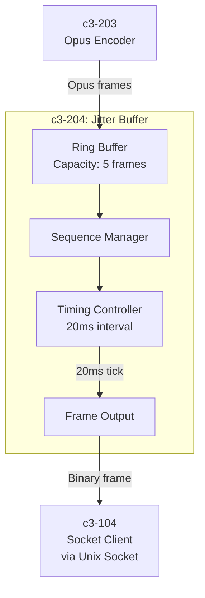
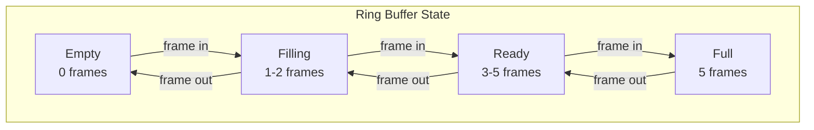
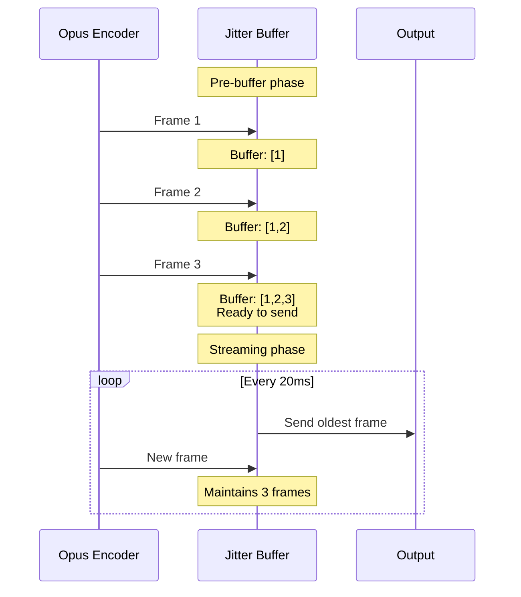
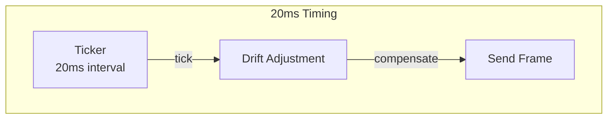
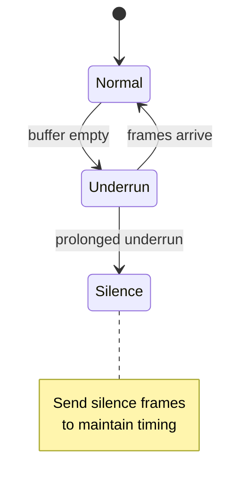
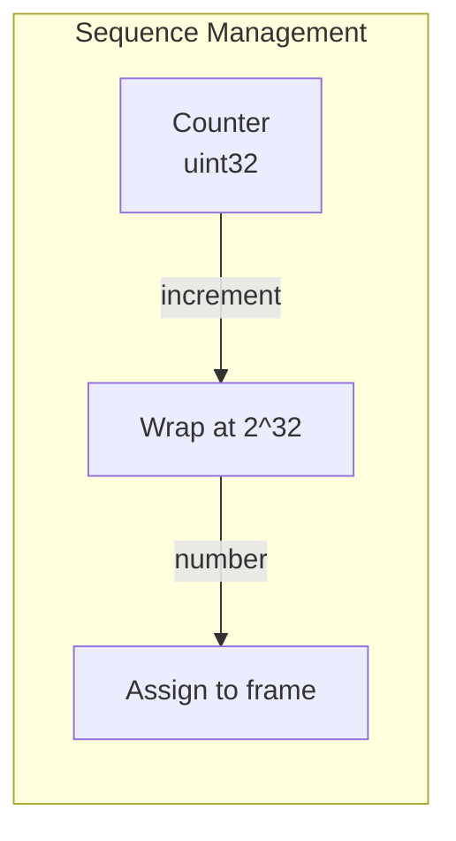

# c3-204: Jitter Buffer

## Overview

The Jitter Buffer component smooths audio delivery by buffering Opus frames before transmission to Node.js, absorbing timing variations from encoding.

## Component Diagram



## Responsibilities

| Responsibility | Description |
|---------------|-------------|
| Frame Buffering | Buffer 3-5 frames before transmission |
| Sequence Numbering | Add sequence numbers for ordering |
| Timing Control | Send frames at precise 20ms intervals |
| Jitter Absorption | Smooth out encoder timing variations |
| Underrun Handling | Handle buffer underruns gracefully |

## Buffer Strategy



## Pre-buffering



## Directory Structure

```
go/internal/buffer/
├── jitter.go         # Jitter buffer implementation
├── ring.go           # Ring buffer data structure
└── timing.go         # Timing controller
```

## Dependencies

| Depended By | Purpose |
|-------------|---------|
| c3-201 Audio Processor | Buffer before transmission |
| c3-203 Opus Encoder | Provides frames to buffer |

## Interfaces

### Jitter Buffer Interface

```go
type JitterBuffer interface {
    // Add frame to buffer
    Push(frame []byte) error

    // Start outputting frames
    Start(ctx context.Context, output chan<- []byte)

    // Get buffer statistics
    Stats() BufferStats

    // Reset buffer
    Reset()
}

type BufferStats struct {
    CurrentSize  int
    TotalFrames  uint64
    Underruns    uint64
    Overruns     uint64
}
```

### Frame Format

```go
// Binary frame sent to Node.js
type OutputFrame struct {
    ChannelID uint64  // 8 bytes - Discord channel ID
    Sequence  uint32  // 4 bytes - Frame sequence number
    OpusData  []byte  // Variable - Opus encoded audio
}

// Wire format: [channel_id:8][sequence:4][opus_data:N]
```

## Buffer Configuration

| Setting | Value | Rationale |
|---------|-------|-----------|
| Capacity | 5 frames | 100ms max buffer |
| Pre-buffer | 3 frames | 60ms before start |
| Frame interval | 20ms | Discord requirement |
| Underrun threshold | 1 frame | Start sending when low |

## Timing Precision



## Underrun Handling



| Condition | Action |
|-----------|--------|
| Buffer empty | Wait, don't send |
| Extended underrun | Send silence frame |
| Encoder catches up | Resume normal |

## Overrun Handling

| Condition | Action |
|-----------|--------|
| Buffer full | Drop oldest frame |
| Consistent overrun | Log warning |
| Encoder too fast | Apply backpressure |

## Sequence Numbering



- Starts at 0
- Increments per frame
- Wraps at 2^32
- Node.js uses for ordering

## Performance

| Metric | Target |
|--------|--------|
| Jitter absorption | ±10ms |
| Output jitter | <2ms |
| Memory per buffer | ~10KB |
| CPU overhead | <1% |

## Error Handling

| Error | Action |
|-------|--------|
| Buffer overflow | Drop oldest, log |
| Buffer underrun | Skip frame, log |
| Timing drift | Auto-correct |
| Memory error | Fatal, restart worker |
