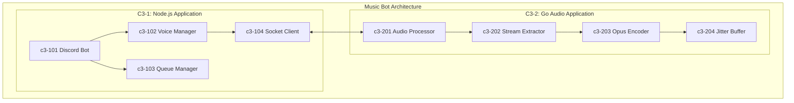
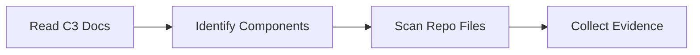
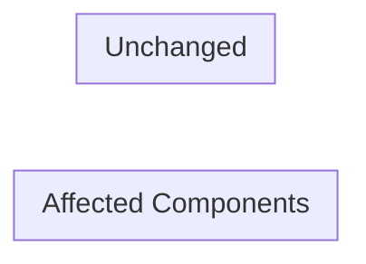
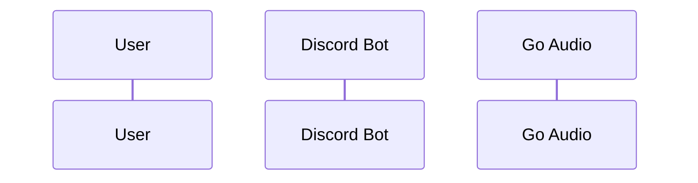

# Topic Creator: Ideas → Dev Story (Small Scope)

## Overview

Turn a vague idea into a **single, small, implementable dev Story** that fits in one agent context.
This is **for developers**, not business stakeholders. Keep it tight, technical, and evidence-based.

**Output:** a markdown Story file that a dev can read and say:
> "Yes, this matches the repo reality, the flow is correct, and the scope is small enough."

---

## System Architecture Reference

**C3 Documentation:** `.c3/` folder contains full architecture details.

---

## Definition: Story (in this skill)

A **Story** is a small scope change that can be completed in one focused work chunk (often ≤ 1 day).
If it's bigger, split into multiple Stories (don't create an Epic here).

**Heuristic:** If you can't explain the Story in < 10 bullet points + a small diff plan, it's too big.

NOT: pass this phase if story too large
MUST: if story too big try recommended user using another skill recommended clear context and do another skill

---

## The Process

### 1) Ground in C3 Architecture & Repo Reality (NO design yet)

**You MUST inspect the current project state first:**

1. **Read C3 architecture:**
   - `.c3/README.md` - System overview
   - `.c3/c3-0-context/README.md` - System context
   - `.c3/c3-1-nodejs/README.md` - Node.js container
   - `.c3/c3-2-go-audio/README.md` - Go container
   - `.c3/c3-1-nodejs/c3-1XX-*/README.md` - Node.js components
   - `.c3/c3-2-go-audio/c3-2XX-*/README.md` - Go components

2. **Identify affected C3 components:**

| If change involves... | C3 Components | Container |
|-----------------------|---------------|-----------|
| Discord commands | c3-101 Discord Bot | C3-1 Node.js |
| Voice connections | c3-102 Voice Manager | C3-1 Node.js |
| Queue/playlist logic | c3-103 Queue Manager | C3-1 Node.js |
| IPC protocol | c3-104 Socket Client + c3-201 Audio Processor | Both |
| Stream extraction | c3-202 Stream Extractor | C3-2 Go |
| Audio encoding | c3-203 Opus Encoder | C3-2 Go |
| Audio buffering | c3-204 Jitter Buffer | C3-2 Go |

3. **Scan repo for existing patterns:**
   - `node/src/` - Node.js layer
   - `go/internal/` - Go layer
   - Find similar implementations

4. **Collect evidence links** (file paths + key snippets or line refs if available)

**Rules:**
- **No guessing.** If you can't find it in repo/docs, mark it as unknown and ask
- Prefer existing conventions over inventing new structures
- Reference C3 component docs for patterns

Output_To_Story_File: Yes

### 2) Clarify with ONE question at a time

Ask **one** question per message. Prefer multiple-choice.

MUST: using recommended for use choosing multiple-choice and why

Focus on dev-relevant clarity:
- What is the user trying to do (precise behavior)?
- Which C3 components are affected?
- Does this touch Node.js, Go, or both?
- Does this change the IPC protocol?
- Constraints (audio quality, latency, backwards compatibility)
- Success criteria (what passes / what fails)
- Out of scope (explicitly)

If unclear, ask the *smallest* question that unlocks progress.

Output_To_Story_File: Yes

### 3) Propose 2–3 approaches (lightweight)

Offer 2–3 implementation approaches with trade-offs:
- **Recommended approach first**
- Explain why it best matches current repo patterns and C3 architecture
- Mention which C3 components are affected
- Mention risk and complexity

Keep this short. This is not an architecture doc.

MUST: short but clean flow easy understand using good practice for option 1

Output_To_Story_File: Yes

### 4) Write the Story doc (the deliverable)

Once you're confident with the use knowledge, create the Story file using the template below.

**Story sections should be concise.**
Aim for dev-readable clarity, not narrative.

MUST: this story about action a user interact with system from e2e how it change how it react to current code base.
NOT: a short walk never help user clear

Output_To_Story_File: Yes

### 5) After the Story

- Save the Story to: `docs/stories/YYYY-MM-DD-<slug>.md`
- If git workflow is available: commit the story doc ask user read and review

---

## Key Principles

- **Small scope** only (split aggressively)
- **C3 aware** (identify affected components)
- **Evidence-based** (repo/docs drive decisions)
- **One question at a time**
- **No hallucinations / no assumptions**
- **Prefer existing patterns**
- When Output_To_Story_File is yes it ALWAYS ALWAYS ALWAYS HAVE IN THE FINAL FILE.
- **Dev language** (routes, modules, types, queries, edge cases)
- Multiple choice preferred - Easier to answer than open-ended when possible
- YAGNI ruthlessly - Remove unnecessary features from all designs
- Explore alternatives - Always propose 2-3 approaches before settling
- Incremental validation - Present design in sections, validate each
- Be flexible - Go back and clarify when something doesn't make sense

---

# Story File Template (MUST follow)

Create a file:
`docs/stories/YYYY-MM-DD-<slug>.md`

Use this exact structure:

---

## Title

Short, specific: "Add X to Y when Z"

## C3 Components Affected

| Component | Layer | Change Type |
|-----------|-------|-------------|
| c3-XXX | Node.js/Go | Create/Modify/None |

## User intent (what user wants)

- **User**: who triggers this (Discord user / admin / bot)
- **Goal**: what they want to do (1 sentence)
- **Why now**: optional, only if relevant to dev constraints

## Support needed (what I, the agent, will provide) (MUST ASK QUESTION!!)

- What I will do: analyze repo, propose solution, produce tasks, list risks
- What I will not do: anything out of scope

## How the user uses this (current flow)

Describe the **current behavior** as it exists now.

- Entry point: Discord command / voice event / etc.
- Steps (bullets)
- Current outputs / side effects

## Repo evidence (NO assumptions)

List concrete references proving the current flow.
Format:
- `path/to/file.ext` — what it shows (1 line)
- `path/to/another.ts` — what it shows (1 line)
- `.c3/c3-1-nodejs/c3-1XX-*/README.md` — Node.js component docs
- `.c3/c3-2-go-audio/c3-2XX-*/README.md` — Go component docs

If you cannot locate evidence, write:
- **Unknown:** <what's unknown>
  **Need:** <what to confirm>

## Problem statement (what's wrong / missing)

- What is missing or broken
- Who it affects
- Repro conditions (if bug)

## Proposed solution (recommended)

- Behavior change (bullets)
- Where changes happen (files/modules/components)
- Protocol changes (if IPC affected)
- Data changes (types/schema) if any
- Error handling & edge cases
- Backwards compatibility notes

## Alternatives considered

1) Approach A — pros/cons
2) Approach B — pros/cons
3) (Optional) Approach C — pros/cons

## Acceptance criteria (must be testable)

Write as checks:
- [ ] When <condition>, system does <expected>
- [ ] When <invalid>, system returns <error/behavior>
- [ ] No regression in <existing flow>
- [ ] Audio quality maintained (48kHz, 20ms frames) if applicable

## Implementation plan (tasks)

Break into small tasks, each should be "done" in one action:

### Node.js Tasks
- Task N1: …
- Task N2: …

### Go Tasks
- Task G1: …
- Task G2: …

### Integration Tasks
- Task I1: …

Include:
- code touch points (paths)
- C3 component affected
- protocol changes (if any)

## Testing plan

- Unit tests: what to cover
- Integration/E2E: what flow
- Audio quality verification (if applicable)
- Manual QA steps: quick checklist

## Risks & open questions

- Risks: performance, edge cases, compatibility, audio quality
- Open questions: things to confirm (keep short)

## Out of scope

Explicitly list what is NOT included.

---

# Output discipline

- Keep the Story doc short: **~1–2 pages max**
- If it grows: split into multiple Stories (link them)
- Always reference C3 components

---

# When to split

Split if any of these are true:
- touches > 3 C3 components
- requires changes to both Node.js and Go layers significantly
- requires a new C3 component
- needs multi-sprint work
- unclear requirements after 2 clarification questions

Create separate story files and link them in "Out of scope" or "Follow-ups".

---
