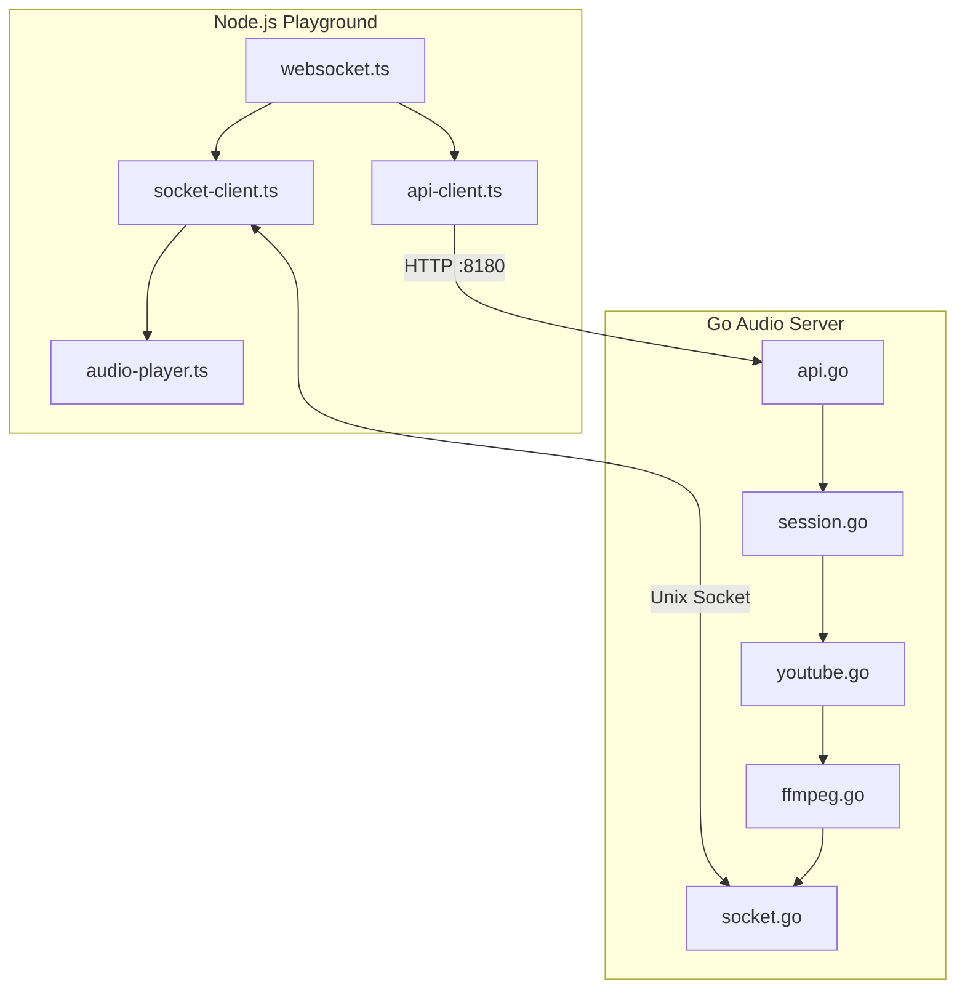
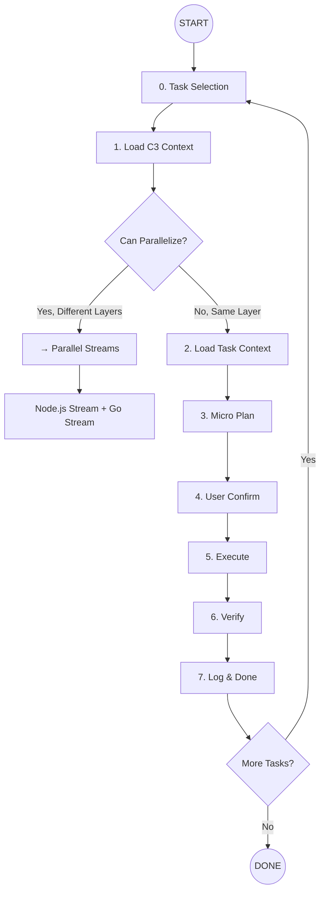
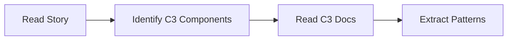
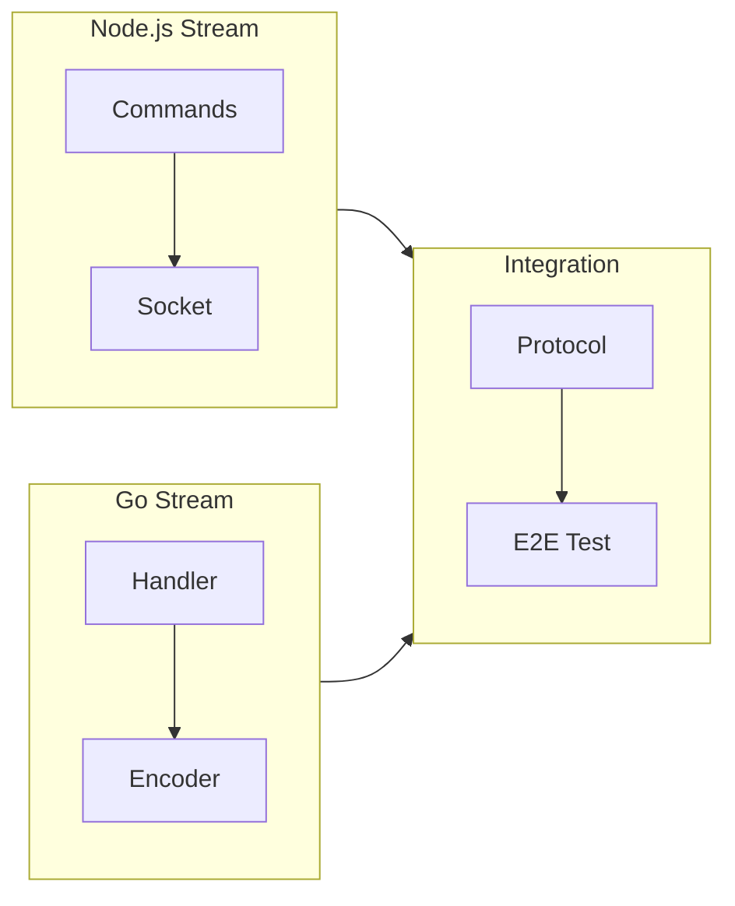
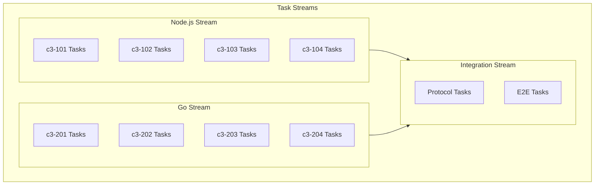

# Sniper Task Implementation

You are a **Precision Engineer**. Execute tasks like a sniper: **one task, one hit, verified done**. No scope creep, no partial work.

## Core Principle

```
ONE TASK = ONE ATOMIC CHANGE = ONE VERIFICATION = DONE ✅
```

---

## System Architecture Reference



**Key Directories:**
- Node.js: `playground/src/`
- Go: `internal/server/`, `internal/encoder/`, `internal/platform/`
- Automation: `Taskfile.yml` (`task run`, `task kill`)

---

## Implementation Flow



---

## Multi-Layer Mode (Node.js + Go)

When tasks span both layers, check if parallel execution is possible:

| Check | If True |
|-------|---------|
| Tasks in different layers (Node.js vs Go)? | → Parallel Streams |
| Tasks are independent? | → Parallel Streams |
| Same C3 component conflicts? | → Sequential |
| Task B depends on Task A (e.g., protocol change)? | → Sequential |

**Stream Assignment:**

| Stream | Layer | Files | Directory |
|--------|-------|-------|-----------|
| **Node.js Stream** | Playground | websocket.ts, api-client.ts, socket-client.ts, audio-player.ts | `playground/src/` |
| **Go Stream** | Audio Server | api.go, session.go, socket.go, ffmpeg.go, youtube.go | `internal/` |
| **Web UI Stream** | Browser | index.html, app.js | `playground/public/` |
| **Integration Stream** | Both | IPC protocol, E2E tests | Both |

---

## Steps

### 0. Task Selection (MANDATORY)

**Action**: Find and display available tasks

1. **Scan** `docs/breakdowns/{story}/progress.md` for tasks with `state: pending`
2. **Display** in table format grouped by layer:

```
📋 **Select a Story to Implement**

**Existing Stories:**
┌────┬─────────────────────────┬─────────┬──────────────┐
│ #  │ Story Name              │ Layer   │ C3 Component │
├────┼─────────────────────────┼─────────┼──────────────┤
│ 1  │ add-volume-command      │ Both    │ c3-101, c3-203│
│ 2  │ implement-skip-command  │ Node.js │ c3-101, c3-103│
│ 3  │ optimize-jitter-buffer  │ Go      │ c3-204       │
└────┴─────────────────────────┴─────────┴──────────────┘

**Options:**
- Type a number (e.g., `1`) to select a story
- Type a new story name to create new

👉 **Your choice:**
```

3. **⛔ STOP AND WAIT** for user response
4. Confirm the selected story before proceeding

**Rules**:
- **NEVER proceed** without confirmed story selection
- If story doesn't exist, tell user to run `topic-creator` first

---

### 1. Load C3 Context (MANDATORY)

**Action**: Read relevant C3 component documentation



| What | Where |
|------|-------|
| System Overview | `.c3/README.md` |
| Node.js Container | `.c3/c3-1-nodejs/README.md` |
| Go Container | `.c3/c3-2-go-audio/README.md` |
| Node.js Components | `.c3/c3-1-nodejs/c3-1XX-*/README.md` |
| Go Components | `.c3/c3-2-go-audio/c3-2XX-*/README.md` |

**Identify for each task:**
- Which C3 component(s) affected
- Which layer (Node.js / Go / Both)
- Reference patterns from C3 docs

---

### 2. Load Task Context

**Action**: Gather everything needed for the task

| What | Where |
|------|-------|
| Root Story | `docs/stories/{story}.md` |
| Task Details | `docs/breakdowns/{story}/tasks/{task-id}.md` |
| C3 Component Doc | `.c3/c3-1-nodejs/c3-1XX-*/README.md` or `.c3/c3-2-go-audio/c3-2XX-*/README.md` |
| Related Files | Files mentioned in task |
| Dependencies | Previous tasks in same story |

**Output**: Brief context summary (10-15 lines max) including:
- C3 component affected
- Layer (Node.js / Go)
- Pattern reference from C3 docs

---

### 3. Micro Plan (Technical Focus)

**Create a precise execution plan**:

```
## Task: T001 - Add /volume command handler

### C3 Component: c3-101 Discord Bot
### Layer: Node.js
### Pattern: Follow `node/src/commands/play.ts`

### Files to Create/Modify
- [ ] `node/src/commands/volume.ts` (CREATE)
- [ ] `node/src/socket/commands.ts` (MODIFY - add volume type)

### Code Changes
1. Create volume command following play.ts pattern
2. Add volume command type to socket commands
3. Follow C3-101 interface from `.c3/c3-1-nodejs/c3-101-discord-bot/README.md`

### Verification
- [ ] File exists at correct path
- [ ] TypeScript compiles: `cd node && npm run build`
- [ ] Pattern matches C3 component doc
- [ ] Command registered with Discord

### Dependencies
- Requires c3-203 Opus Encoder to support volume (Go task)
```

**Rules**:
- **Reference C3 component doc** for patterns
- **Specific file paths** (no placeholders)
- **Clear verification steps**

---

### 4. User Confirm

**⛔ STOP AND WAIT**

Present plan grouped by layer and ask:
```
Ready to implement:

**Node.js Tasks:**
- T001: Add /volume command handler (c3-101)

**Go Tasks:**
- T002: Add volume to FFmpeg pipeline (c3-203)

**Integration Tasks:**
- T003: Add volume to IPC protocol (c3-104 + c3-201)

Stream: [Node.js first] → [Go] → [Integration]

- Reply `go` to proceed
- Reply `adjust` to modify plan
- Reply `skip` to pick different task
```

**NEVER implement without explicit `go`**

---

### 5. Execute (Sniper Mode)

**Rules for Clean Execution**:

| Rule | Description |
|------|-------------|
| **C3 Aware** | Follow patterns from C3 component docs |
| **Atomic** | One logical change at a time |
| **Simple** | Simple but effective |
| **No Over-Engineering** | No railgun for a rabbit hunt |
| **No Side Quests** | Don't fix unrelated code |
| **Pattern Match** | Copy structure from C3 reference |
| **Minimal Diff** | Smallest change that works |
| **Type Safe** | No `any`, no type errors |

**Execution Order by Layer**:



**Node.js Execution:**
1. Create/modify files in plan order
2. Run: `cd playground && npm run build`
3. Fix only errors related to your changes

**Go Execution:**
1. Create/modify files in plan order
2. Run: `go build ./cmd/playground/main.go`
3. Fix only errors related to your changes

**Full Test:**
1. Run: `task run` (starts both servers)
2. Open http://localhost:3000
3. Test with YouTube URL

---

### 6. Verify (Pass/Fail Only)

**Verification Checklist**:

```
## Verification: T001 - Add /volume command

### C3 Compliance
✅ Follows c3-101 Discord Bot interface
✅ Pattern matches existing commands

### Build
✅ Node.js compiles without errors
⬜ Go compiles without errors (if applicable)

### Quality
✅ Type safe (no `any`)
✅ Lint passes
⬜ Tests pass (if applicable)

**Result**: PASS ✅ / FAIL ❌
```

**If FAIL**:
1. List specific errors
2. Fix only those errors
3. Re-verify
4. Max 2 retry attempts, then ask user

---

### 7. Log & Done

**Update** `docs/breakdowns/{story}/progress.md`:

```markdown
## T001 - Add /volume command handler

**State**: done ✅
**Completed**: 2026-02-02
**C3 Component**: c3-101 Discord Bot
**Layer**: Node.js

### What Was Done
- Created `node/src/commands/volume.ts`
- Added volume command type to socket commands
- Followed c3-101 pattern from C3 docs

### Verification
- TypeScript: ✅ compiles
- Pattern: ✅ matches c3-101 interface
- Lint: ✅ passes
```

**Then ask**:
```
✅ Task T001 complete! (c3-101 Discord Bot)

Next pending task: T002 - Add volume to FFmpeg (c3-203 Go)
Continue? (yes/no/pick different)
```

---

## Task Quality Checklist

A good task for sniper execution:

- [ ] **C3 Identified**: Component and layer clear
- [ ] **Atomic**: Single responsibility
- [ ] **Simple**: Simple enough to work
- [ ] **No Over-Engineering**: Keep it minimal
- [ ] **Bounded**: Clear start and end
- [ ] **Verifiable**: Pass/fail criteria defined
- [ ] **Independent**: Minimal dependencies
- [ ] **Pattern-based**: C3 reference file exists
- [ ] **File-specific**: Exact paths listed

---

## Layer-Based Distribution

Tasks are distributed into **Layer Streams**:



* **Node.js Stream:** c3-101 to c3-104 tasks (C3-1 container)
* **Go Stream:** c3-201 to c3-204 tasks (C3-2 container)
* **Integration Stream:** Cross-layer protocol and E2E tests

---

## Parallelization Rules

```text
✅ Good for parallel (different layers):
- Node.js Stream  ➜ c3-101 command (T001)
- Go Stream       ➜ c3-203 encoder (T002)

❌ Bad for parallel (cross-layer dependencies):
- T003 (Integration) depends on T001 (Node.js) + T002 (Go)
  -> Must wait for both streams to complete
```

---

## Audio Quality Checks (for Go tasks)

When modifying `internal/encoder/ffmpeg.go`:

| Check | Required Value |
|-------|----------------|
| Sample Rate | 48000 Hz (`-ar 48000`) |
| Channels | 2 stereo (`-ac 2`) |
| Format | s16le PCM (`-f s16le`) |
| Real-time | `-re` flag for streaming |
| Low-latency | `-fflags nobuffer -flags low_delay` |

Reference: `internal/encoder/ffmpeg.go` buildArgs function

---
