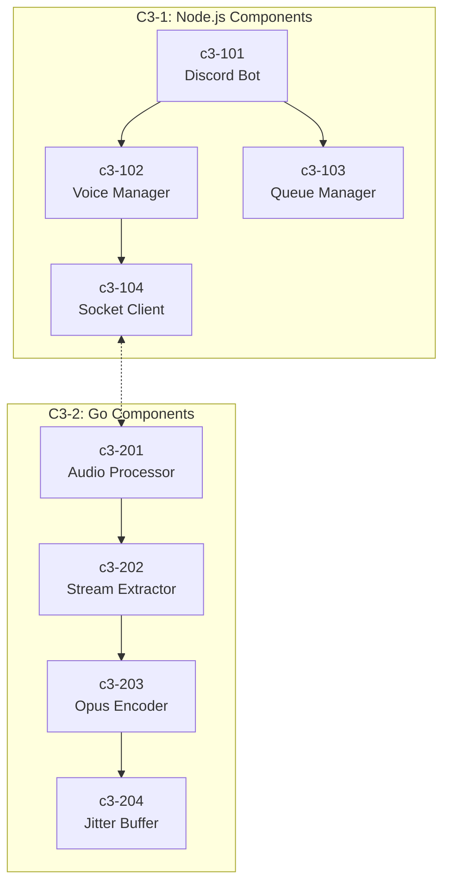
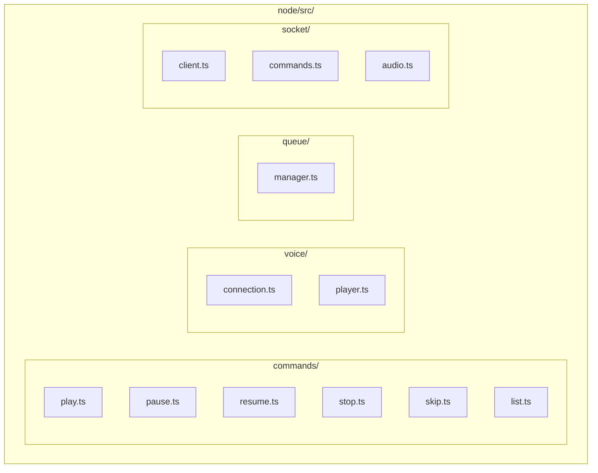
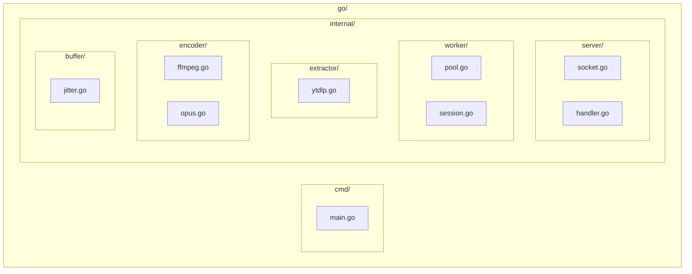

# Feature Implementation Planning

## Overview

This skill guides the **planning phase** before feature implementation for the Discord Music Bot. It produces structured documentation that maps requirements to the hybrid Node.js/Go architecture.

**Output:** `docs/plans/adr-{YYYYMMDD}-{feature-name}/`

**When to use:**
- Before implementing any new feature
- When requirements need architectural analysis
- When impact assessment is required

## System Architecture Reference

```mermaid
flowchart TB
    subgraph Discord
        USER[User]
        VOICE[Voice Channel]
    end

    subgraph C3_1["C3-1: Node.js Application"]
            CMD[Slash Commands]
            QM[Queue Manager]
            VM[Voice Manager]
            SC[Socket Client]
        end

        subgraph IPC["Unix Sockets"]
            SOCK1[/tmp/music.sock]
            SOCK2[/tmp/music-audio.sock]
        end

        subgraph C3_2["C3-2: Go Audio Application"]
            WP[Worker Pool]
            YT[yt-dlp]
            FF[FFmpeg]
            OP[Opus Encoder]
        end

    USER -->|commands| CMD
    CMD --> QM
    CMD --> VM
    SC <--> SOCK1
    SC <--> SOCK2
    SOCK1 <--> WP
    SOCK2 <--> OP
    VM --> VOICE
```

## Planning Flow


## Step 1: Understand Requirements

**Read and confirm understanding of:**

1. **Key questions to answer:**
   - What Discord command triggers this feature?
   - Does this affect Node.js, Go, or both?
   - What audio processing is needed?
   - What state changes are required?
   - What user feedback is needed?

2. **Output:** Clear problem statement and scope definition

## Step 2: Analyze C3 Architecture

**Read and understand current architecture:**

1. **C3 documentation to read:**
   - `.c3/README.md` - System overview
   - `.c3/c3-0-context/README.md` - System context
   - `.c3/c3-1-nodejs/README.md` - Node.js container
   - `.c3/c3-2-go-audio/README.md` - Go container
   - `.c3/c3-1-nodejs/c3-1XX-*/README.md` - Node.js components
   - `.c3/c3-2-go-audio/c3-2XX-*/README.md` - Go components

2. **C3 Components:**



3. **Questions to answer:**
   - Which C3 components will this feature interact with?
   - Does this require a new C3 component?
   - What are the dependency relationships?

**Output:** Architecture context and integration points

## Step 3: Determine Layer Impact

**Identify which layers are affected:**

| Layer | Technology | Affected? |
|-------|------------|-----------|
| Discord Commands | Node.js + discord.js | ? |
| Voice Management | Node.js + @discordjs/voice | ? |
| Queue State | Node.js | ? |
| IPC Protocol | Unix Socket | ? |
| Worker Pool | Go | ? |
| Stream Extraction | Go + yt-dlp | ? |
| Audio Encoding | Go + FFmpeg + Opus | ? |
| Jitter Buffer | Go | ? |

**Output:** Layer impact matrix

## Step 4: Identify File Changes

**Analyze impacts across:**

### Node.js Layer



### Go Layer



**Output:** Complete file inventory (new + modified)

## Step 5: Create Implementation Plan

**Structure the implementation as ordered tasks:**

### Phase 1: Protocol Changes (if any)


### Phase 2: Go Changes

| Order | Task | File | Description |
|-------|------|------|-------------|
| 1 | ... | `go/internal/...` | ... |

### Phase 3: Node.js Changes

| Order | Task | File | Description |
|-------|------|------|-------------|
| 1 | ... | `node/src/...` | ... |

### Phase 4: Integration

| Order | Task | File | Description |
|-------|------|------|-------------|
| 1 | ... | ... | ... |

### Phase 5: Testing

| Order | Task | File | Description |
|-------|------|------|-------------|
| 1 | ... | ... | ... |

**Output:** Ordered task list with dependencies

## Step 6: Design Mermaid Diagrams

**Create diagrams for:**

### 1. Command Flow


### 2. Component Integration


### 3. State Changes


**Output:** Mermaid diagrams for all perspectives

## Step 7: Write Documentation

**Create planning documents:**

### Directory Structure

```bash
mkdir -p docs/plans/adr-{YYYYMMDD}-{feature-name}
```

### 7.1 implementations.md

```markdown
# {Feature Name} Implementation Plan

## Overview
- Goal: {feature goal}
- Scope: {what's included/excluded}
- Affected Layers: {Node.js / Go / Both}

## Command Flow

{Mermaid sequence diagram}

## Implementation Phases

### Phase 1: Protocol Changes
| Task | File | Description |
|------|------|-------------|
| ... | ... | ... |

### Phase 2: Go Changes
| Task | File | Description |
|------|------|-------------|
| ... | ... | ... |

### Phase 3: Node.js Changes
| Task | File | Description |
|------|------|-------------|
| ... | ... | ... |

### Phase 4: Integration
| Task | File | Description |
|------|------|-------------|
| ... | ... | ... |

### Phase 5: Testing
| Task | File | Description |
|------|------|-------------|
| ... | ... | ... |

## Checklist
- [ ] Protocol types updated (if needed)
- [ ] Go worker handles new command
- [ ] Node.js command registered
- [ ] Socket communication tested
- [ ] Audio quality verified (48kHz, 20ms frames)
- [ ] Error handling implemented
- [ ] User feedback provided
```

### 7.2 impacts.md

```markdown
# {Feature Name} Impact Analysis

## Summary
| Category | Count | Risk |
|----------|-------|------|
| New Go Files | {X} | Low |
| New Node.js Files | {Y} | Low |
| Modified Files | {Z} | Medium |

## New Files

### Go Layer
| File | Purpose |
|------|---------|
| `go/internal/...` | ... |

### Node.js Layer
| File | Purpose |
|------|---------|
| `node/src/...` | ... |

## Modified Files

| File | Change | Risk |
|------|--------|------|
| ... | ... | ... |

## C3 Component Dependencies

| This Feature | Depends On | Reason |
|--------------|------------|--------|
| ... | c3-1XX | ... |

## Risk Assessment

| Risk | Likelihood | Impact | Mitigation |
|------|------------|--------|------------|
| ... | ... | ... | ... |
```

### 7.3 diagrams.md

```markdown
# {Feature Name} Diagrams

## Command Flow

{Mermaid sequence diagram}

## Component Integration

{Mermaid flowchart}

## State Machine

{Mermaid state diagram}

## Audio Flow (if applicable)

{Mermaid flowchart showing audio pipeline}
```

## Validation Checklist

Before completing planning:

- [ ] Requirements clearly understood
- [ ] C3 components identified
- [ ] Layer impacts determined
- [ ] All file changes listed
- [ ] Implementation phases ordered
- [ ] Dependencies identified
- [ ] Mermaid diagrams created
- [ ] All three documents written

## Usage

```
User: Plan the implementation of {feature name}

Claude:
1. Reads requirements
2. Analyzes C3 architecture
3. Determines layer impacts
4. Creates docs/plans/adr-{date}-{feature-name}/
   - implementations.md
   - impacts.md
   - diagrams.md
```
