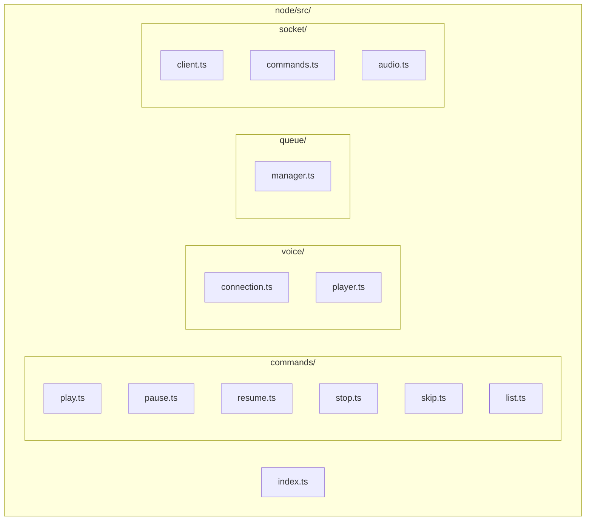
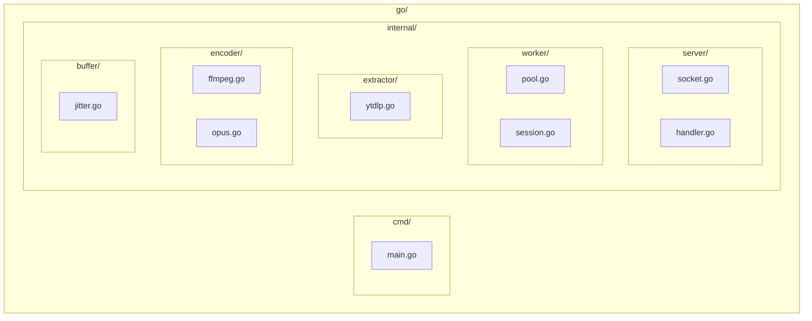
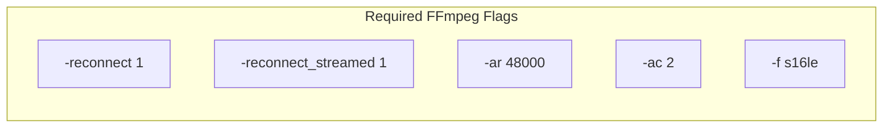

# Feature Implementation Review

## Overview

This skill reviews implemented features by **comparing actual code against planning documents**. It validates that implementation follows the plan and hybrid Node.js/Go architecture, producing a detailed checklist report.

**Prerequisite:**
- Planning documents in `docs/plans/adr-{YYYYMMDD}-{feature-name}/`
- Implementation completed

**Output:** `docs/plans/adr-{YYYYMMDD}-{feature-name}/review-checklist.md`

## System Architecture Reference

```mermaid
flowchart TB
    subgraph Discord
        USER[User]
        VOICE[Voice Channel]
    end

    subgraph C3_1["C3-1: Node.js Application"]
            CMD[Slash Commands]
            QM[Queue Manager]
            VM[Voice Manager]
            SC[Socket Client]
        end

        subgraph IPC["Unix Sockets"]
            SOCK1[/tmp/music.sock]
            SOCK2[/tmp/music-audio.sock]
        end

        subgraph C3_2["C3-2: Go Audio Application"]
            WP[Worker Pool]
            YT[yt-dlp]
            FF[FFmpeg]
            OP[Opus Encoder]
        end

    USER -->|commands| CMD
    CMD --> QM
    CMD --> VM
    SC <--> SOCK1
    SC <--> SOCK2
    SOCK1 <--> WP
    SOCK2 <--> OP
    VM --> VOICE
```

## Review Flow


## Step 1: Read Planning Documents

**Read all planning documents:**

```
docs/plans/adr-{YYYYMMDD}-{feature-name}/
├── implementations.md   # Expected task list
├── impacts.md          # Expected files
└── diagrams.md         # Expected architecture
```

### Extract from each document:

| Document | Extract |
|----------|---------|
| `implementations.md` | Phase tasks, checklist items |
| `impacts.md` | New files list, modified files list |
| `diagrams.md` | Component relationships, data flows |

**If planning documents don't exist:**
> Stop and report: "Planning documents not found. Cannot review without baseline."

## Step 2: Scan Actual Code Changes

**Scan the project directories:**

### Node.js Structure



### Go Structure



## Step 3: Compare Files vs impacts.md

### For New Files:


### For Modified Files:


### Unexpected Files:

```
For each file NOT in impacts.md:
    ⚠️ WARNING: "{file} created but not in plan"
```

## Step 4: Validate Against implementations.md

### Check Each Phase Task:

**Phase 1: Protocol Changes**


| Check | Validation |
|-------|------------|
| Command types | New command in protocol? |
| Event types | New event in protocol? |
| Channel ID | Included in all messages? |

**Phase 2: Go Changes**

| Check | Validation |
|-------|------------|
| Handler exists | Command handler implemented? |
| Worker integration | Worker pool updated? |
| Error handling | Errors sent back to Node? |

**Phase 3: Node.js Changes**

| Check | Validation |
|-------|------------|
| Command registered | Slash command exists? |
| Socket integration | Sends to Go correctly? |
| Event handling | Handles Go responses? |
| User feedback | Sends Discord response? |

**Phase 4: Integration**

| Check | Validation |
|-------|------------|
| End-to-end flow | Command → Go → Response works? |
| Error propagation | Errors reach user? |

## Step 5: Check Architecture Compliance

### Layer Boundaries


### Architecture Rules

| Rule | Check |
|------|-------|
| Node.js is brain | All state decisions in Node.js? |
| Go is audio only | No Discord logic in Go? |
| Unix socket IPC | No HTTP between Node/Go? |
| Channel ID routing | All messages include channel_id? |

### C3 Component Compliance


## Step 6: Verify Audio Quality Settings

### Opus Encoding Requirements

| Setting | Required | Check |
|---------|----------|-------|
| Sample Rate | 48000 Hz | FFmpeg `-ar 48000`? |
| Channels | 2 (stereo) | FFmpeg `-ac 2`? |
| Frame Size | 960 samples | 20ms at 48kHz? |
| Bitrate | 128 kbps | Opus bitrate set? |

### Jitter Buffer

| Setting | Required | Check |
|---------|----------|-------|
| Buffer Size | 3-5 frames | 60-100ms buffer? |
| Sequence Numbers | Present | Frames numbered? |

### FFmpeg Command Validation



## Step 7: Create Review Checklist Report

**Create file:** `docs/plans/adr-{YYYYMMDD}-{feature-name}/review-checklist.md`

### Report Template:

```markdown
# {Feature Name} Implementation Review

**Review Date:** {YYYY-MM-DD}
**Planning Date:** {from folder name}
**Status:** {PASSED | FAILED | PASSED WITH WARNINGS}

## Summary

| Category | Passed | Failed | Warnings |
|----------|--------|--------|----------|
| File Creation | X | Y | Z |
| File Modification | X | Y | Z |
| Protocol Compliance | X | Y | Z |
| Go Implementation | X | Y | Z |
| Node.js Implementation | X | Y | Z |
| Architecture | X | Y | Z |
| Audio Quality | X | Y | Z |
| **Total** | **X** | **Y** | **Z** |

## Architecture Diagram

{Mermaid diagram showing implemented architecture}

## File Checklist

### New Files
| Status | File | Notes |
|--------|------|-------|
| ✅ | `node/src/commands/newcmd.ts` | Created as planned |
| ❌ | `go/internal/handler/newcmd.go` | Missing |

### Modified Files
| Status | File | Notes |
|--------|------|-------|
| ✅ | `go/internal/server/handler.go` | Handler added |
| ❌ | `node/src/socket/commands.ts` | Not modified |

### Unexpected Files
| Status | File | Notes |
|--------|------|-------|
| ⚠️ | `node/src/utils/helper.ts` | Not in plan |

## Implementation Task Checklist

### Phase 1: Protocol Changes
| Status | Task | Notes |
|--------|------|-------|
| ✅ | Define command type | Added to protocol |
| ✅ | Define event type | Added to protocol |

### Phase 2: Go Changes
| Status | Task | Notes |
|--------|------|-------|
| ✅ | Add handler | Implemented |
| ❌ | Update worker | Missing |

### Phase 3: Node.js Changes
| Status | Task | Notes |
|--------|------|-------|
| ✅ | Register command | Slash command works |
| ✅ | Handle response | Event handled |

### Phase 4: Integration
| Status | Task | Notes |
|--------|------|-------|
| ✅ | End-to-end test | Flow verified |

## Architecture Compliance

| Status | Check | Notes |
|--------|-------|-------|
| ✅ | Node.js owns state | Queue in Node.js |
| ✅ | Go audio only | No Discord imports |
| ✅ | Unix socket IPC | Using /tmp/music.sock |
| ❌ | Channel ID routing | Missing in one message |

## Audio Quality Checklist

| Status | Setting | Required | Actual |
|--------|---------|----------|--------|
| ✅ | Sample Rate | 48000 Hz | 48000 Hz |
| ✅ | Channels | 2 | 2 |
| ✅ | Frame Size | 20ms | 20ms |
| ❌ | Jitter Buffer | 3-5 frames | 2 frames |

## Violations Summary

### Critical (Must Fix)

1. ❌ **Missing file:** `go/internal/handler/newcmd.go`
   - Impact: Command won't be processed
   - Fix: Create handler following existing pattern

2. ❌ **Architecture violation:** Channel ID missing
   - Location: `node/src/socket/commands.ts:45`
   - Fix: Add channel_id to message

### Warnings (Should Fix)

1. ⚠️ **Unexpected file:** `node/src/utils/helper.ts`
   - Action: Update impacts.md or remove

2. ⚠️ **Jitter buffer undersized:** 2 frames instead of 3-5
   - Impact: May cause audio stuttering
   - Recommendation: Increase buffer size

## Data Flow Verification

{Mermaid sequence diagram showing actual implementation}

## Conclusion

**Overall Status: {PASSED | FAILED}**

{If FAILED:}
This implementation has {X} critical violations that must be fixed.

{If PASSED:}
This implementation follows the planning documents and architecture.
```

## Status Determination


### FAILED (Any of these):
- Missing planned file
- Planned modification not made
- Architecture boundary violated
- Audio quality settings wrong
- Protocol mismatch

### PASSED WITH WARNINGS:
- All critical checks pass
- Has unexpected files
- Minor audio tuning needed

### PASSED:
- All files match plan
- All tasks completed
- Architecture correct
- Audio quality verified

## Review Workflow


## Usage Example

```
User: Review the volume-control feature implementation

Claude:
1. Reads docs/plans/adr-20260202-volume-control/
2. Scans node/src/ and go/internal/
3. Compares files against impacts.md
4. Validates tasks against implementations.md
5. Checks architecture compliance
6. Verifies audio quality settings
7. Creates review-checklist.md with results
8. Reports: "Review complete: 18 passed, 2 failed, 1 warning"
```

## Error Handling

### If planning documents missing:
```
"Cannot review: Planning documents not found at docs/plans/adr-{date}-{feature-name}/.
Please ensure the implement-feature-planning skill was run first."
```

### If code directories missing:
```
"Cannot review: Code not found at node/src/ or go/internal/.
Please ensure the feature was implemented before reviewing."
```

## Checklist Before Completion

Review skill must verify:

- [ ] All files in impacts.md checked
- [ ] All tasks in implementations.md validated
- [ ] Architecture boundaries verified
- [ ] Audio quality settings confirmed
- [ ] Review report created with mermaid diagrams
- [ ] Overall status determined
- [ ] Violations clearly documented
- [ ] Fix recommendations provided
