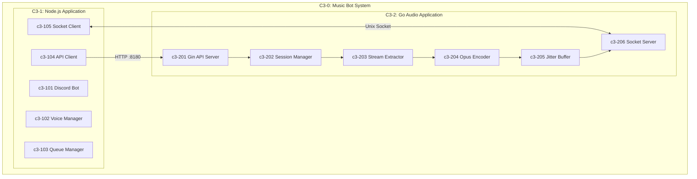
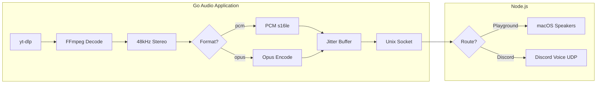
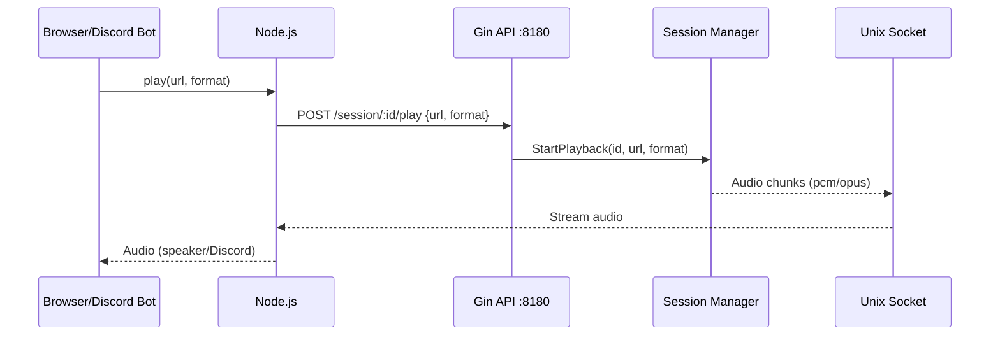

# Music Bot - Agent Knowledge Base

## What This Project Is

Discord music bot with **Lavalink-quality audio streaming**. Hybrid Node.js + Go architecture.

**Goal**: Stream YouTube audio to Discord voice channels with:
- No lagging
- Smooth transmission (jitter buffer)
- Opus encoding (Discord native)
- 48kHz stereo, 20ms frames

## Architecture (C3 Model)



## Audio Pipeline (Format Option)



## Control Flow



## API Endpoints (Gin :8180)

| Endpoint | Method | Body | Description |
|----------|--------|------|-------------|
| `/session/:id/play` | POST | `{url, format}` | Start playback (format: pcm/opus/webm) |
| `/session/:id/stop` | POST | - | Stop & kill FFmpeg |
| `/session/:id/pause` | POST | - | Pause (FFmpeg keeps running) |
| `/session/:id/resume` | POST | - | Resume streaming |
| `/session/:id/status` | GET | - | Get session state |
| `/health` | GET | - | Health check |

## Audio Formats

| Format | Use Case | Output |
|--------|----------|--------|
| `pcm` | Playground debug | Raw PCM s16le → macOS speakers |
| `opus` | Discord production | Opus frames → Discord voice UDP |
| `webm` | Browser (future) | WebM container |

## Current State

| Component | Status | Location |
|-----------|--------|----------|
| Gin API Server | ✅ Done | `internal/server/api.go` |
| Session Manager | ✅ Done | `internal/server/session.go` |
| Stream Extractor | ✅ Done | `internal/platform/youtube/` |
| FFmpeg Pipeline | ✅ Done | `internal/encoder/ffmpeg.go` |
| Socket Server | ✅ Done | `internal/server/socket.go` |
| Node.js Gateway | ✅ Done | `playground/src/` |
| React Playground | ✅ Done | `playground/client/` |

### TODO (for Lavalink quality)

| Component | Priority | Description |
|-----------|----------|-------------|
| **Jitter Buffer** | HIGH | Smooth frame delivery (3-5 frames) |
| **Worker Pool** | HIGH | Concurrent channel support (60+) |
| **Opus Tuning** | HIGH | Optimize encoding settings |
| Discord Bot | MEDIUM | discord.js integration |
| Voice Manager | MEDIUM | @discordjs/voice |

## Audio Quality Specs

| Spec | Value | Why |
|------|-------|-----|
| Sample Rate | 48000 Hz | Discord native |
| Channels | 2 (stereo) | Full quality |
| Frame Size | 20ms (960 samples) | Discord Opus requirement |
| Bitrate | 128 kbps VBR | Good quality |
| Jitter Buffer | 3-5 frames (60-100ms) | Smooth playback |

## How to Run

```bash
# Run playground (debug - audio plays to speakers)
task run:debug

# Run playground (no audio)
task run

# Build
task build

# Kill servers
task kill
```

**URLs:**
- React UI: http://localhost:5173
- Node.js: http://localhost:3000
- Go API: http://localhost:8180

## Directory Structure

```
natashi/
├── cmd/playground/main.go     # Entry point
├── internal/
│   ├── server/
│   │   ├── api.go             # Gin handlers
│   │   ├── router.go          # Gin routes
│   │   ├── session.go         # Session manager
│   │   └── socket.go          # Socket server
│   ├── encoder/
│   │   └── ffmpeg.go          # FFmpeg + format options
│   ├── buffer/                # Jitter buffer (TODO)
│   └── platform/youtube/      # yt-dlp extractor
├── playground/
│   ├── src/                   # Node.js gateway
│   │   ├── api-client.ts      # Gin API client
│   │   ├── socket-client.ts   # Audio receiver
│   │   └── websocket.ts       # Browser handler
│   └── client/                # React UI
├── .c3/                       # Architecture docs
└── Taskfile.yml
```

## Environment Variables

| Variable | Default | Description |
|----------|---------|-------------|
| `GO_API_PORT` | `8180` | Gin API port |
| `DEBUG_AUDIO` | `0` | Enable speaker output |

## Key Docs

| Path | What |
|------|------|
| `.c3/README.md` | C3 Architecture |
| `.c3/c3-2-go-audio/` | Go components |
| `docs/plans/` | Implementation plans |
