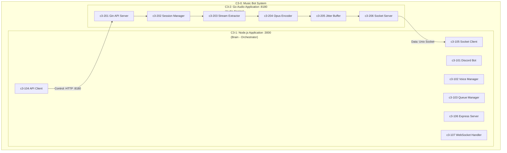
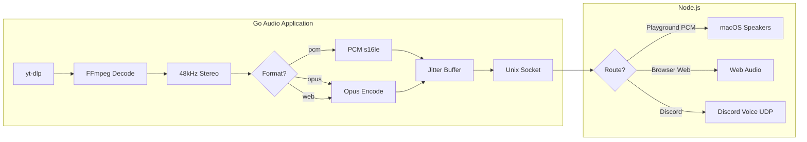
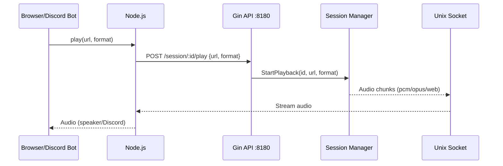

# Music Bot - Agent Knowledge Base

## What This Project Is

Discord music bot with **Lavalink-quality audio streaming**. Hybrid Node.js + Go architecture based on the [C4 Model](https://c4model.com/).

**Goal**: Stream YouTube audio to Discord voice channels with:
- No lagging
- Smooth transmission (jitter buffer)
- Opus encoding (Discord native)
- 48kHz stereo, 20ms frames

## Agent Rules (Read Before Any Code Changes)

- Always read `.c3/README.md` and relevant `.c3/*/README.md` docs before implementing changes.
- Keep the three flows working and isolated:
  - Discord bot stream (Opus) → Discord voice
  - Debug stream (PCM) → macOS speakers
  - Browser stream (Ogg Opus) → Web Audio
- When implementing, scope changes to the specific flow. Do not break or couple the other flows.

## Architecture (C3 Model)

> C3 = Context-Container-Component (first 3 levels of C4)



### Communication Pattern

| Channel | Direction | What | Protocol |
|---------|-----------|------|----------|
| **Control Plane** | Node.js → Go | Commands (play, stop, pause, resume) | HTTP REST :8180 |
| **Data Plane** | Go → Node.js | Audio chunks + events | Unix Socket |

> **Node.js is the brain**: It tells Go what to do. Go processes audio and streams it back.

## Audio Pipeline



## Control Flow



## Components

### C3-1: Node.js Application

| ID | Component | Responsibility | Code Location |
|----|-----------|----------------|---------------|
| c3-101 | Discord Bot | Slash commands, Discord.js | `app/src/commands/` |
| c3-102 | Voice Manager | @discordjs/voice | `app/src/voice/` |
| c3-103 | Queue Manager | Playlist state, track navigation | `app/src/queue-manager.ts` |
| c3-104 | API Client | HTTP client to Go | `app/src/api-client.ts` |
| c3-105 | Socket Client | Unix socket receiver | `app/src/socket-client.ts` |
| c3-106 | Express Server | HTTP API for browser | `app/src/server.ts` |
| c3-107 | WebSocket Handler | Real-time events, queue sync | `app/src/websocket.ts` |

### C3-2: Go Audio Application

| ID | Component | Responsibility | Code Location |
|----|-----------|----------------|---------------|
| c3-201 | Gin API Server | HTTP control endpoints | `internal/server/api.go` |
| c3-202 | Session Manager | Session lifecycle | `internal/server/session.go` |
| c3-203 | Stream Extractor | yt-dlp integration | `internal/platform/youtube/` |
| c3-204 | Opus Encoder | FFmpeg + libopus | `internal/encoder/ffmpeg.go` |
| c3-205 | Jitter Buffer | Smooth frame delivery | `internal/buffer/` (TODO) |
| c3-206 | Socket Server | Audio to Node.js | `internal/server/socket.go` |

## API Endpoints (Gin :8180)

| Endpoint | Method | Body | Description |
|----------|--------|------|-------------|
| `/session/:id/play` | POST | `{url, format}` | Start playback (format: pcm/opus/web) |
| `/session/:id/stop` | POST | - | Stop & kill FFmpeg |
| `/session/:id/pause` | POST | - | Pause (FFmpeg keeps running) |
| `/session/:id/resume` | POST | - | Resume streaming |
| `/session/:id/status` | GET | - | Get session state |
| `/health` | GET | - | Health check |

## Audio Formats

| Format | Use Case | Output |
|--------|----------|--------|
| `pcm` | Playground debug | Raw PCM s16le → macOS speakers |
| `opus` | Discord production | Opus frames → Discord voice UDP |
| `web` | Browser playback | Ogg Opus → Web Audio |

## Playground Features

The playground (`playground/`) is a React UI for testing the audio pipeline.

### UI Components

| Component | Description |
|-----------|-------------|
| **PlayerBar** | Spotify-style fixed bottom bar with album art, controls, progress |
| **QueueList** | Collapsible queue showing current track context, expand/collapse animation |
| **LogViewer** | Server logs with tabs (All/Go/Node.js) |

### Queue Features

- **YouTube Playlist Support**: Paste playlist URL to add all tracks
- **Track Navigation**: Previous/Next buttons, click-to-play from queue
- **State Sync**: Queue state persists across browser refresh (server-side state)
- **Collapsible View**: Shows 3 tracks around current, expands with animation

### WebSocket Actions

| Action | Description |
|--------|-------------|
| `play` | Play URL (single video or playlist) |
| `addToQueue` | Add URL to queue without playing |
| `playFromQueue` | Jump to specific track in queue |
| `skip` | Skip to next track |
| `previous` | Go to previous track |
| `clearQueue` | Clear all tracks and stop |
| `pause` / `resume` | Pause/resume playback |
| `stop` | Stop playback |

## Current State

| Component | Status | Location |
|-----------|--------|----------|
| c3-201 Gin API Server | Done | `internal/server/api.go` |
| c3-202 Session Manager | Done | `internal/server/session.go` |
| c3-203 Stream Extractor | Done | `internal/platform/youtube/` |
| c3-204 Opus Encoder | Done | `internal/encoder/ffmpeg.go` |
| c3-205 Jitter Buffer | TODO | `internal/buffer/` |
| c3-206 Socket Server | Done | `internal/server/socket.go` |
| c3-101 Discord Bot | Done | `app/src/commands/` |
| c3-102 Voice Manager | Done | `app/src/voice/` |
| c3-103 Queue Manager | Done | `app/src/queue-manager.ts` |
| c3-104 API Client | Done | `app/src/api-client.ts` |
| c3-105 Socket Client | Done | `app/src/socket-client.ts` |
| c3-106 Express Server | Done | `app/src/server.ts` |
| c3-107 WebSocket Handler | Done | `app/src/websocket.ts` |

### TODO (for Lavalink quality)

| Component | Priority | Description |
|-----------|----------|-------------|
| **c3-205 Jitter Buffer** | HIGH | Smooth frame delivery (3-5 frames) |
| **Worker Pool** | HIGH | Concurrent channel support (60+) |
| **Opus Tuning** | HIGH | Optimize encoding settings |

## Audio Quality Specs

| Spec | Value | Why |
|------|-------|-----|
| Sample Rate | 48000 Hz | Discord native |
| Channels | 2 (stereo) | Full quality |
| Frame Size | 20ms (960 samples) | Discord Opus requirement |
| Bitrate | 128 kbps VBR | Good quality |
| Jitter Buffer | 3-5 frames (60-100ms) | Smooth playback |

## How to Run

```bash
# Run playground (debug - audio plays to speakers)
task run:debug

# Run Discord bot
task run:bot

# Build
task build

# Kill servers
task kill
```

**URLs:**
- React UI: http://localhost:5173
- Node.js: http://localhost:3000
- Go API: http://localhost:8180

## Directory Structure

```
natashi/
├── cmd/playground/main.go     # Go entry point
├── internal/
│   ├── server/
│   │   ├── api.go             # c3-201: Gin handlers
│   │   ├── router.go          # c3-201: Gin routes
│   │   ├── session.go         # c3-202: Session manager
│   │   └── socket.go          # c3-206: Socket server
│   ├── encoder/
│   │   └── ffmpeg.go          # c3-204: FFmpeg + format options
│   ├── buffer/                # c3-205: Jitter buffer (TODO)
│   └── platform/youtube/      # c3-203: yt-dlp extractor
├── app/                       # Node.js server
│   └── src/
│       ├── index.ts           # Entry point
│       ├── config.ts          # Configuration
│       ├── api-client.ts      # c3-104: Gin API client
│       ├── socket-client.ts   # c3-105: Audio receiver
│       ├── server.ts          # c3-106: Express server
│       ├── websocket.ts       # c3-107: WebSocket handler
│       ├── queue-manager.ts   # c3-103: Queue/playlist manager
│       ├── audio-player.ts    # Debug audio output
│       ├── commands/          # c3-101: Discord bot commands
│       │   ├── index.ts
│       │   ├── play.ts
│       │   └── stop.ts
│       ├── voice/             # c3-102: Voice manager
│       │   └── manager.ts
│       └── tests/
├── playground/                # React UI (Vite)
│   └── src/
│       ├── App.tsx
│       ├── components/
│       │   ├── PlayerBar.tsx  # Spotify-style bottom player
│       │   ├── QueueList.tsx  # Collapsible queue view
│       │   └── LogViewer.tsx  # Server logs
│       └── hooks/
│           └── useWebSocket.ts
├── .c3/                       # Architecture docs (C4 model)
└── Taskfile.yml
```

## Environment Variables

| Variable | Default | Description |
|----------|---------|-------------|
| `GO_API_PORT` | `8180` | Gin API port |
| `DEBUG_AUDIO` | `0` | Enable speaker output |

## Key Docs

| Path | What |
|------|------|
| `.c3/README.md` | C3 Architecture (C4 model) |
| `.c3/c3-1-nodejs/` | Node.js container docs |
| `.c3/c3-2-go-audio/` | Go container docs |
| `docs/plans/` | Implementation plans |
