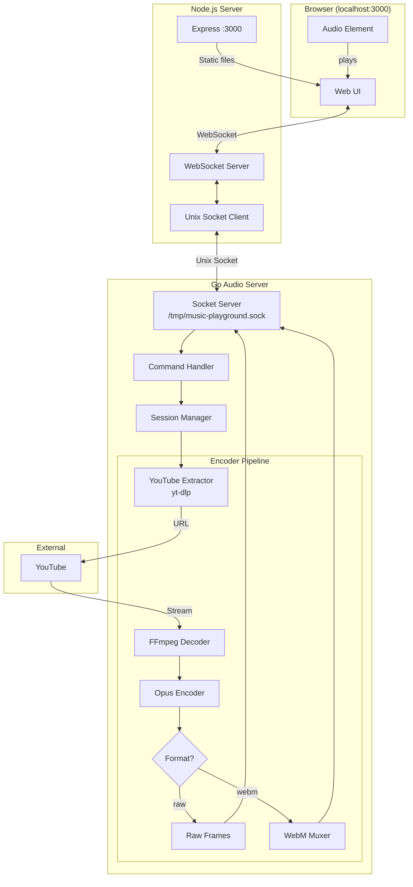
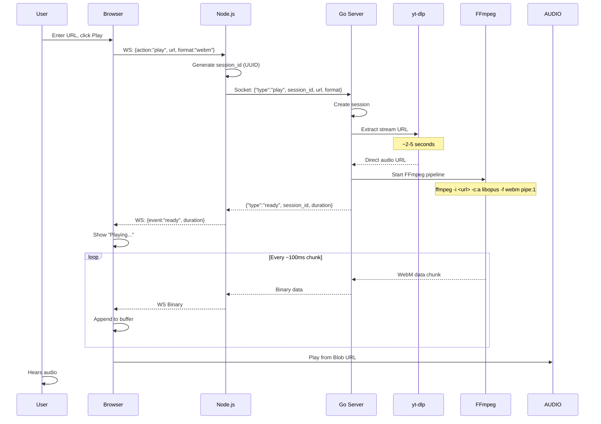
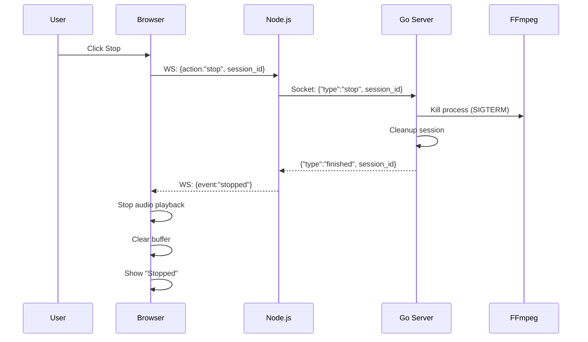
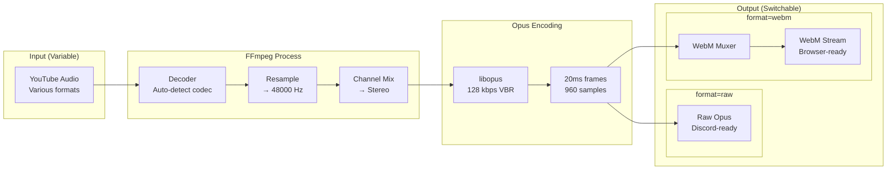
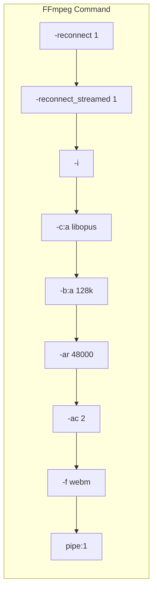
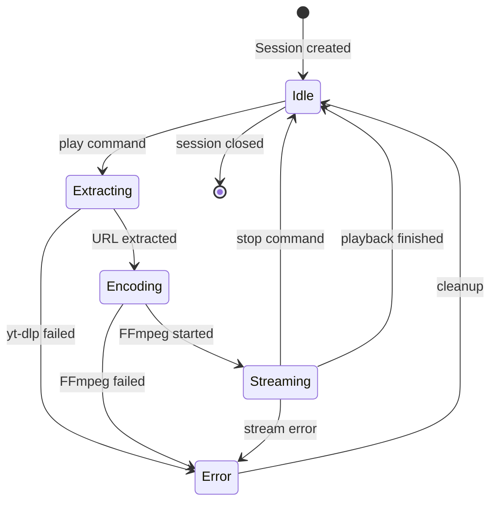
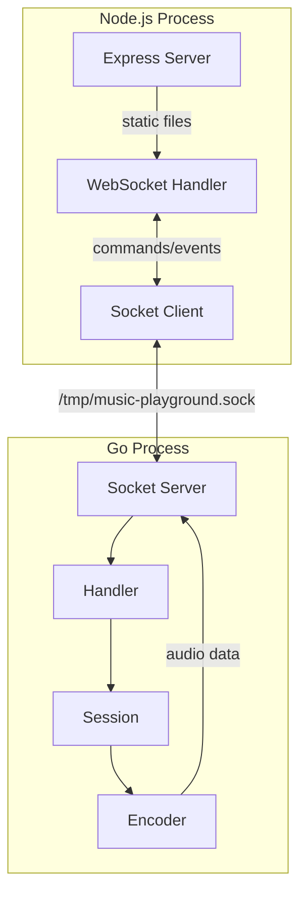
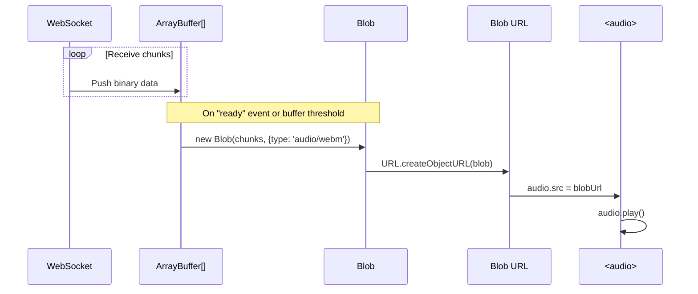
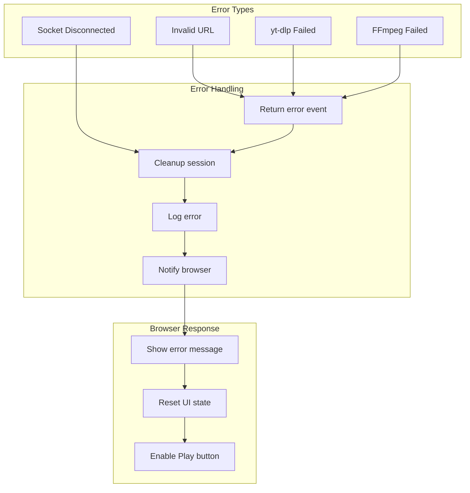
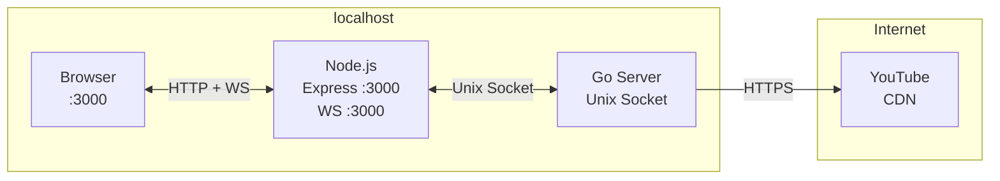

# Audio Test Playground - Diagrams

## System Overview



## Command Flow - Play



## Command Flow - Stop



## Audio Pipeline Detail



## FFmpeg Command



**Full command:**
```bash
ffmpeg \
  -reconnect 1 \
  -reconnect_streamed 1 \
  -reconnect_delay_max 5 \
  -i "$STREAM_URL" \
  -c:a libopus \
  -b:a 128k \
  -ar 48000 \
  -ac 2 \
  -f webm \
  -loglevel warning \
  pipe:1
```

## Session State Machine



## Component Interaction



## Data Format - Raw Opus Frame

```
┌────────────────────────────────────────────────────────┐
│                    Raw Opus Frame                       │
├──────────────┬──────────────┬─────────────────────────┤
│  session_id  │   sequence   │       opus_data         │
│  (16 bytes)  │  (4 bytes)   │     (variable)          │
│    UUID      │  uint32 BE   │   20ms Opus frame       │
├──────────────┼──────────────┼─────────────────────────┤
│ 550e8400-... │  0x00000001  │  [encoded audio data]   │
└──────────────┴──────────────┴─────────────────────────┘

Total: 20 + variable (typically 100-300 bytes per frame)
Frames per second: 50 (20ms each)
```

## Browser Audio Flow



## Error Handling Flow



## Network Topology


