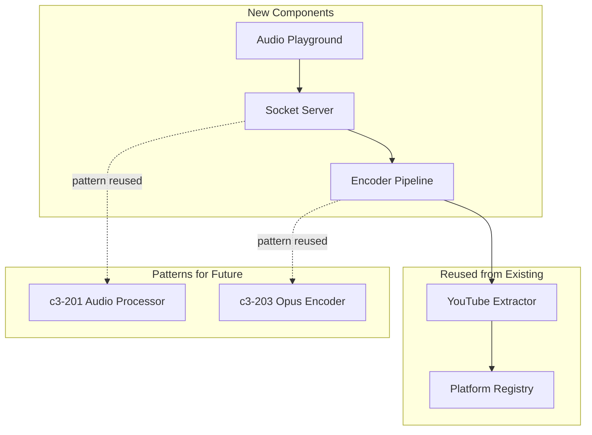

# Audio Test Playground - Impact Analysis

## Summary

| Category | Count | Risk |
|----------|-------|------|
| New Go Files | 9 | Low |
| New Node.js Files | 8 | Low |
| Modified Files | 0 | - |
| Reused Files | 2 | Low |

**Total new files**: 17
**Total modified files**: 0 (this is a new feature with no changes to existing code)

## New Files

### Go Layer

| File | Purpose | Lines (est.) |
|------|---------|--------------|
| `cmd/playground/main.go` | Server entry point | ~50 |
| `internal/encoder/encoder.go` | Pipeline interface & types | ~40 |
| `internal/encoder/ffmpeg.go` | FFmpeg process wrapper | ~100 |
| `internal/encoder/opus.go` | Opus encoding (via FFmpeg) | ~80 |
| `internal/encoder/webm.go` | WebM container muxer | ~60 |
| `internal/encoder/output.go` | Format switcher (raw/webm) | ~40 |
| `internal/server/socket.go` | Unix socket server | ~80 |
| `internal/server/types.go` | Command/Event JSON structs | ~50 |
| `internal/server/handler.go` | Command dispatcher | ~100 |
| `internal/server/session.go` | Session state manager | ~60 |

**Go Total**: ~660 lines

### Node.js Layer

| File | Purpose | Lines (est.) |
|------|---------|--------------|
| `playground/package.json` | Dependencies | ~25 |
| `playground/tsconfig.json` | TypeScript config | ~15 |
| `playground/src/index.ts` | Entry point | ~30 |
| `playground/src/server.ts` | Express server | ~40 |
| `playground/src/socket-client.ts` | Unix socket client | ~80 |
| `playground/src/websocket.ts` | WebSocket bridge | ~60 |
| `playground/public/index.html` | Web UI | ~50 |
| `playground/public/app.js` | Client-side logic | ~80 |

**Node.js Total**: ~380 lines

**Grand Total**: ~1040 lines of new code

## Reused Files

| File | How Used | Modifications |
|------|----------|---------------|
| `internal/platform/youtube/youtube.go` | Import and use `Extractor` | None |
| `internal/platform/platform.go` | Import `StreamExtractor` interface | None |

## Modified Files

None. This feature is additive - no existing code is changed.

## C3 Component Dependencies

| This Feature | Depends On | Reason |
|--------------|------------|--------|
| Encoder Pipeline | YouTube Extractor | Extract stream URLs |
| Encoder Pipeline | FFmpeg (external) | Audio decoding |
| Encoder Pipeline | FFmpeg libopus (external) | Opus encoding |
| Socket Server | Encoder Pipeline | Process audio |
| Node.js Server | Socket Server | Communicate with Go |
| Browser UI | Node.js Server | Serve UI & WebSocket |

## Risk Assessment

| Risk | Likelihood | Impact | Mitigation |
|------|------------|--------|------------|
| FFmpeg opus encoding differs from libopus | Low | Medium | Test against Discord requirements |
| WebM muxing complexity | Medium | Low | Use FFmpeg's WebM muxer, not manual |
| Browser MediaSource buffering issues | Medium | Low | Start with Blob URL approach |
| Unix socket permission errors | Low | Low | Use `/tmp/` with standard permissions |
| yt-dlp API changes | Low | Medium | Already handled in existing code |

## External Dependencies

### Go (no new deps)
- Uses standard library only
- FFmpeg called via `exec.Command` (already used)

### Node.js (new deps)

| Package | Version | Purpose |
|---------|---------|---------|
| express | ^4.18 | HTTP server |
| ws | ^8.14 | WebSocket server |
| typescript | ^5.3 | Development |
| @types/node | ^20 | Type definitions |
| @types/express | ^4 | Type definitions |
| @types/ws | ^8 | Type definitions |

### System (existing)
- FFmpeg with libopus support
- yt-dlp

## Performance Impact

| Metric | Expected | Notes |
|--------|----------|-------|
| Memory (Go) | ~50MB per stream | FFmpeg + buffers |
| Memory (Node.js) | ~30MB base | Plus audio buffer |
| CPU (Go) | ~5-10% single core | FFmpeg does heavy lifting |
| CPU (Node.js) | ~1-2% | Just proxying data |
| Latency | ~500ms startup | yt-dlp extraction time |
| Bandwidth | ~128kbps (Opus) | Plus WebM overhead |

## Backward Compatibility

**Not applicable** - this is a new development tool with no production usage.

## Rollback Plan

If issues arise:
1. Delete `playground/` directory
2. Delete `cmd/playground/` directory
3. Delete `internal/encoder/` directory
4. Delete `internal/server/` directory (if only used by playground)

No database migrations, no config changes, no external integrations affected.

## Security Considerations

| Concern | Assessment | Mitigation |
|---------|------------|------------|
| Arbitrary URL execution | Low (dev tool only) | Validate URL format |
| Command injection via URL | Low | yt-dlp handles escaping |
| Local file access | None | Only network URLs accepted |
| Network exposure | Low | Binds to localhost only |

**Note**: This is a development/testing tool, not production code. Security is lower priority but basic validation should be in place.

## Testing Impact

| Test Type | Files | Effort |
|-----------|-------|--------|
| Unit tests (Go) | `*_test.go` in encoder/server | Medium |
| Integration tests | Manual + scripts | Low |
| E2E tests | Manual browser testing | Low |

Recommended test files:
- `internal/encoder/opus_test.go` - Validate Opus output
- `internal/encoder/webm_test.go` - Validate WebM playability
- `internal/server/handler_test.go` - Command parsing
