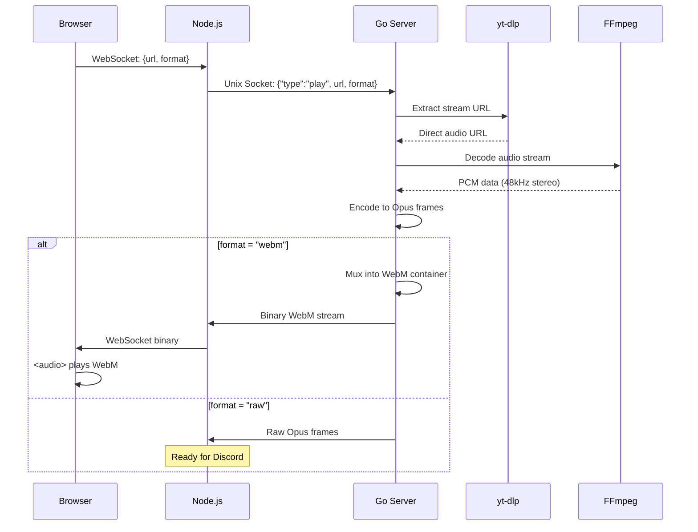
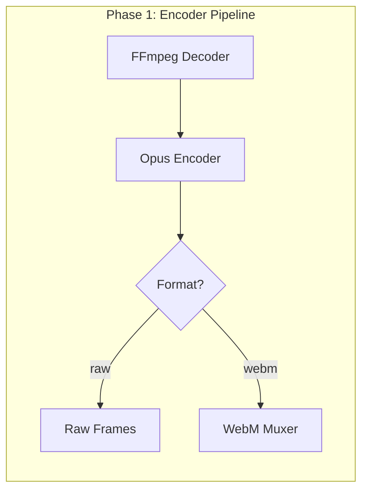
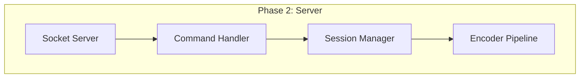
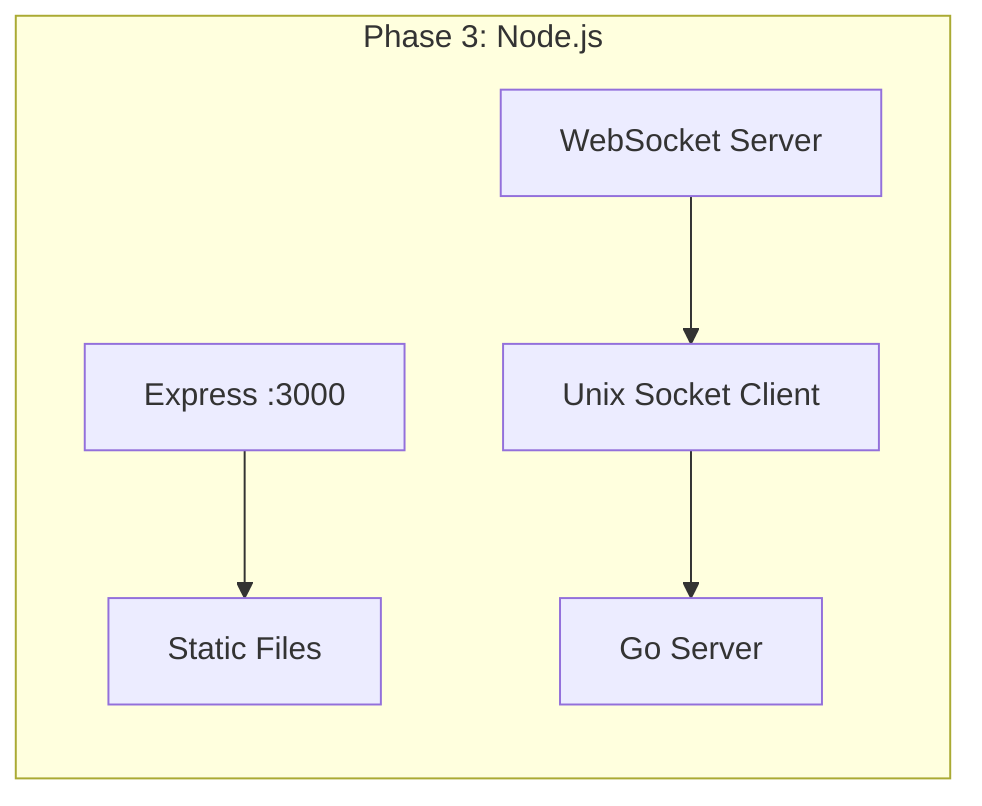
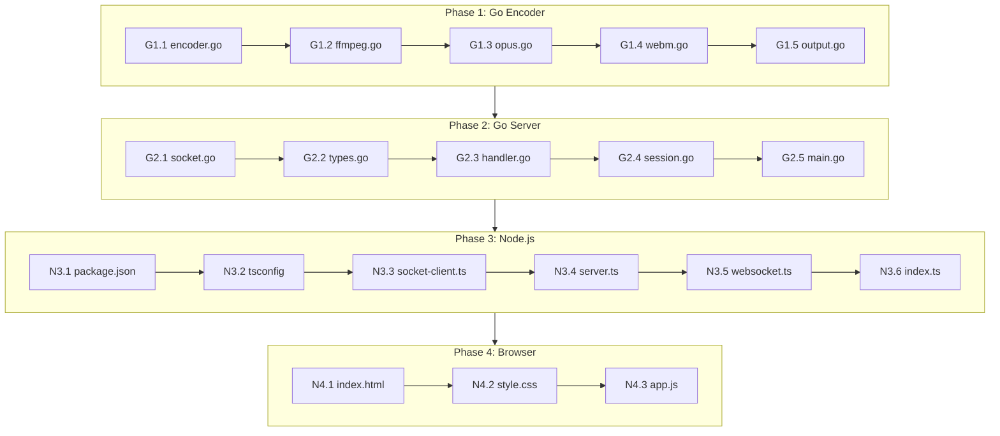

# Audio Test Playground - Implementation Plan

## Overview

- **Goal**: Build web-based audio testing tool to validate Opus encoding pipeline
- **Scope**: Go audio server + Node.js web server + Browser UI
- **Affected Layers**: Go (new), Node.js (new), Browser (new)

## Command Flow



## Implementation Phases

### Phase 1: Go Core - Opus Encoding Pipeline

This phase builds the reusable audio encoding core.

| Order | Task | File | Description |
|-------|------|------|-------------|
| G1.1 | Create encoder package | `internal/encoder/encoder.go` | Pipeline interface and types |
| G1.2 | Implement FFmpeg decoder | `internal/encoder/ffmpeg.go` | Spawn FFmpeg, read PCM from stdout |
| G1.3 | Implement Opus encoder | `internal/encoder/opus.go` | Use FFmpeg's libopus output OR cgo libopus |
| G1.4 | Implement WebM muxer | `internal/encoder/webm.go` | Wrap Opus frames in WebM container |
| G1.5 | Create output formatter | `internal/encoder/output.go` | Switch between raw/webm based on flag |

**Key Decision**: Use FFmpeg's `-c:a libopus` for encoding (simpler than cgo).



### Phase 2: Go Server - Socket & Session

| Order | Task | File | Description |
|-------|------|------|-------------|
| G2.1 | Create socket server | `internal/server/socket.go` | Listen on Unix socket, accept connections |
| G2.2 | Create command types | `internal/server/types.go` | Command/Event JSON structs |
| G2.3 | Create command handler | `internal/server/handler.go` | Parse JSON, dispatch to encoder |
| G2.4 | Create session manager | `internal/server/session.go` | Track active playback (single session for playground) |
| G2.5 | Wire up main | `cmd/playground/main.go` | Entry point, start server |



### Phase 3: Node.js - Web Server & Bridge

| Order | Task | File | Description |
|-------|------|------|-------------|
| N3.1 | Initialize project | `playground/package.json` | Dependencies: express, ws, typescript |
| N3.2 | Create tsconfig | `playground/tsconfig.json` | TypeScript configuration |
| N3.3 | Create socket client | `playground/src/socket-client.ts` | Connect to Go Unix socket |
| N3.4 | Create Express server | `playground/src/server.ts` | Serve static files on :3000 |
| N3.5 | Create WebSocket handler | `playground/src/websocket.ts` | Bridge browser ↔ Go |
| N3.6 | Create main entry | `playground/src/index.ts` | Wire everything together |



### Phase 4: Browser - Web UI

| Order | Task | File | Description |
|-------|------|------|-------------|
| N4.1 | Create HTML page | `playground/public/index.html` | URL input, Play/Stop, audio element |
| N4.2 | Add minimal CSS | `playground/public/style.css` | Basic styling (optional) |
| N4.3 | Add client JS | `playground/public/app.js` | WebSocket connection, controls |

```html
<!-- Minimal UI Structure -->
<input type="text" id="url" placeholder="YouTube URL">
<button id="play">Play</button>
<button id="stop">Stop</button>
<audio id="audio" controls></audio>
<div id="status"></div>
```

### Phase 5: Integration & Testing

| Order | Task | Description |
|-------|------|-------------|
| I5.1 | Test Go server standalone | Use `nc` or `socat` to send commands |
| I5.2 | Test Node.js socket client | Verify connection to Go |
| I5.3 | Test WebM playback | Verify browser plays output |
| I5.4 | Test raw Opus output | Verify frame format matches Discord spec |
| I5.5 | Audio quality check | Use `ffprobe` to verify 48kHz/stereo |

## Dependency Graph



## Protocol Specification

### Commands (Node.js → Go)

```typescript
// Play command
{
  "type": "play",
  "session_id": "uuid-v4",
  "url": "https://youtube.com/watch?v=...",
  "format": "webm" | "raw"
}

// Stop command
{
  "type": "stop",
  "session_id": "uuid-v4"
}
```

### Events (Go → Node.js)

```typescript
// Ready event (extraction complete, streaming starts)
{
  "type": "ready",
  "session_id": "uuid-v4",
  "duration": 240  // seconds, 0 if unknown
}

// Error event
{
  "type": "error",
  "session_id": "uuid-v4",
  "message": "extraction failed: ..."
}

// Finished event (playback complete)
{
  "type": "finished",
  "session_id": "uuid-v4"
}
```

### Audio Data (Go → Node.js)

**Format: webm**
- Binary WebM stream
- Can be played directly in `<audio>` via Blob URL

**Format: raw**
```
┌──────────────┬──────────────┬─────────────────┐
│ session_id   │ sequence     │ opus_data       │
│ (16 bytes)   │ (4 bytes)    │ (variable)      │
│ UUID         │ uint32 BE    │ Opus frame      │
└──────────────┴──────────────┴─────────────────┘
```

## Checklist

### Go
- [ ] Encoder pipeline compiles and runs
- [ ] FFmpeg spawns and outputs PCM
- [ ] Opus encoding produces valid frames
- [ ] WebM muxer produces playable output
- [ ] Socket server accepts connections
- [ ] Command handler parses JSON correctly
- [ ] Session manager tracks playback state
- [ ] Format flag switches output correctly

### Node.js
- [ ] Project initializes with `npm install`
- [ ] TypeScript compiles without errors
- [ ] Unix socket connects to Go
- [ ] Express serves static files
- [ ] WebSocket bridges browser ↔ Go
- [ ] Audio data streams to browser

### Browser
- [ ] UI renders correctly
- [ ] WebSocket connects
- [ ] Play button sends command
- [ ] Stop button sends command
- [ ] Audio element plays WebM stream
- [ ] Error messages display

### Quality
- [ ] Audio: 48000 Hz sample rate
- [ ] Audio: 2 channels (stereo)
- [ ] Audio: No crackling or dropouts
- [ ] Audio: Clear quality comparable to YouTube

## File Tree (Final)

```
music-bot/
├── cmd/
│   └── playground/
│       └── main.go              # Go server entry
├── internal/
│   ├── encoder/
│   │   ├── encoder.go           # Pipeline interface
│   │   ├── ffmpeg.go            # FFmpeg decoder
│   │   ├── opus.go              # Opus encoder
│   │   ├── webm.go              # WebM muxer
│   │   └── output.go            # Format switcher
│   ├── server/
│   │   ├── socket.go            # Unix socket server
│   │   ├── types.go             # Command/Event types
│   │   ├── handler.go           # Command handler
│   │   └── session.go           # Session manager
│   └── platform/                # (existing)
│       └── youtube/
│           └── youtube.go       # Reuse existing
└── playground/
    ├── package.json
    ├── tsconfig.json
    ├── src/
    │   ├── index.ts             # Entry point
    │   ├── server.ts            # Express server
    │   ├── socket-client.ts     # Go socket client
    │   └── websocket.ts         # Browser WebSocket
    └── public/
        ├── index.html           # Web UI
        ├── style.css            # Styling
        └── app.js               # Client logic
```
