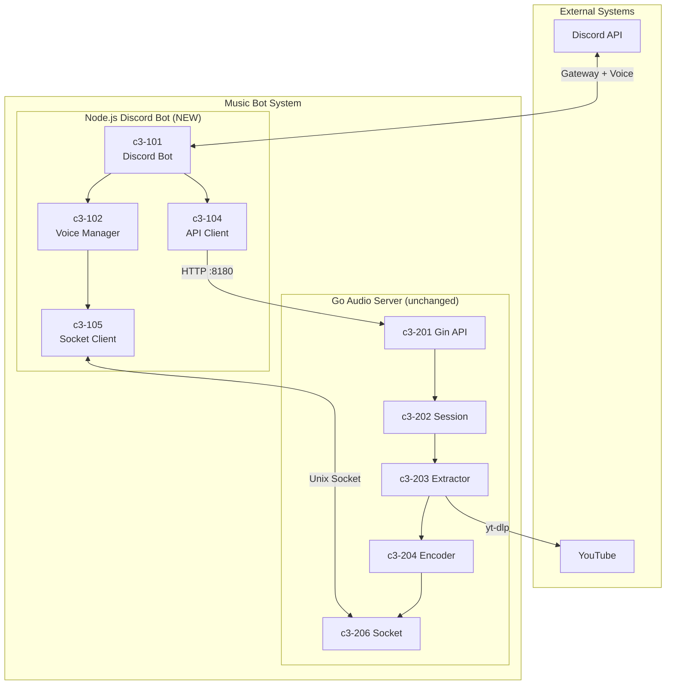
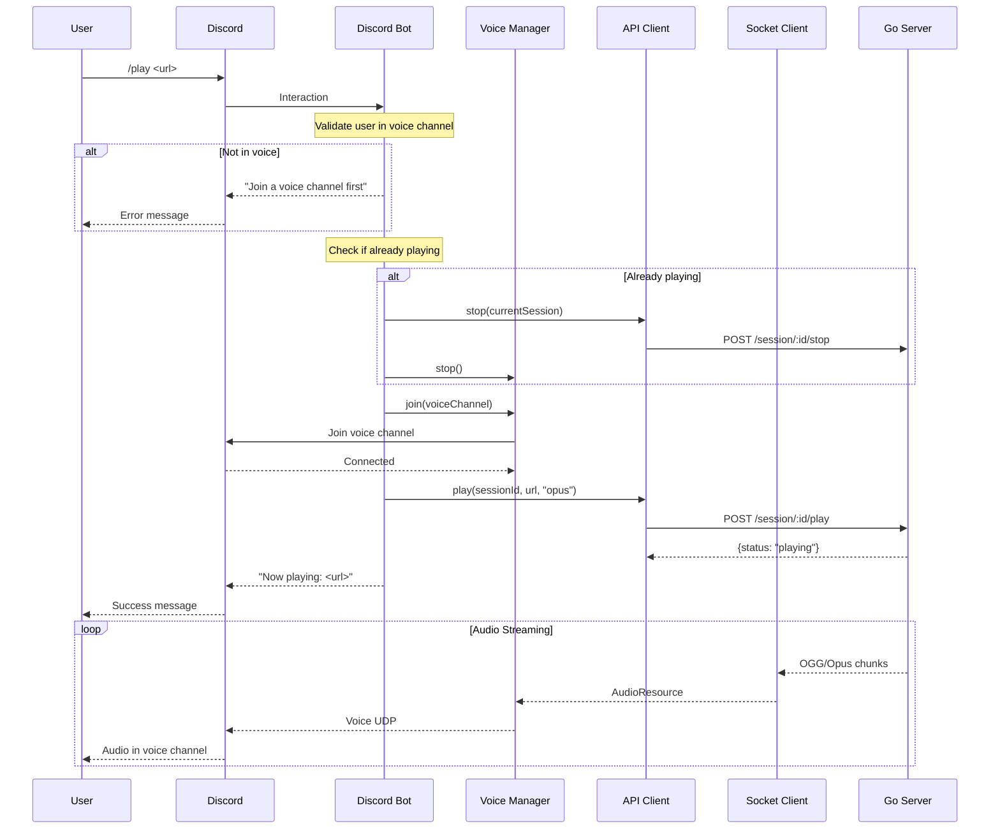
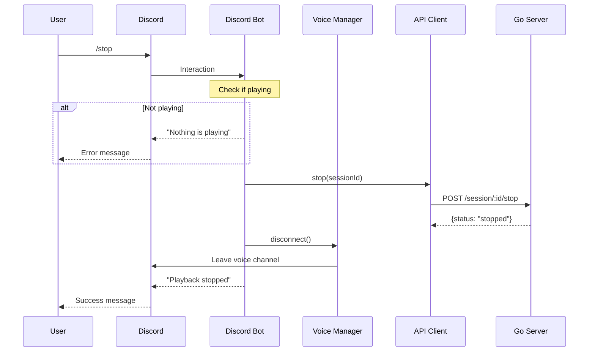
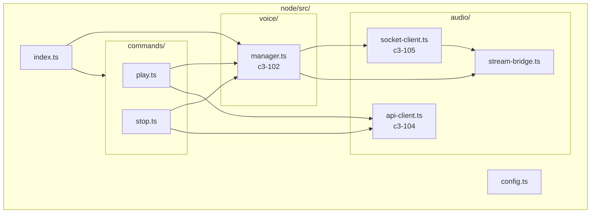
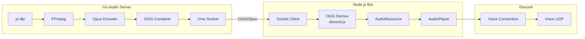
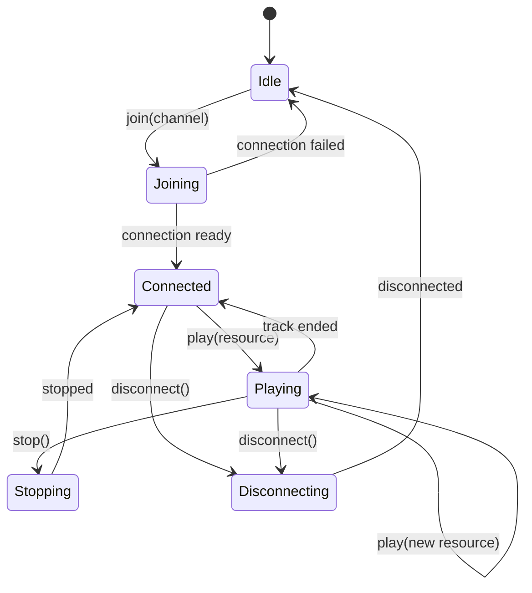
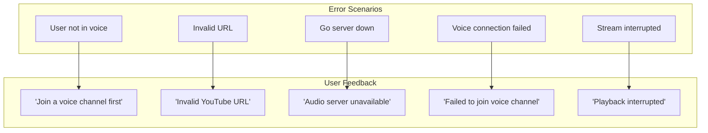
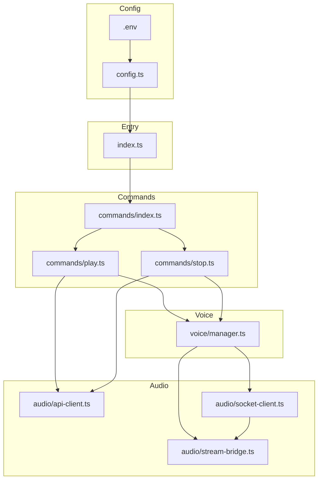

# Discord Bot /play and /stop Diagrams

## System Context

## /play Command Flow

## /stop Command Flow

## Component Architecture

## Audio Pipeline

## Voice Manager State

## Error Handling

## File Dependencies

