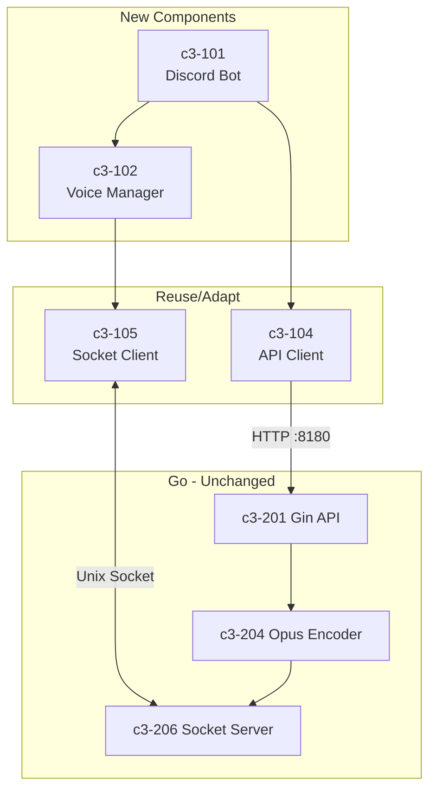

# Discord Bot /play and /stop Impact Analysis

## Summary

| Category | Count | Risk |
|----------|-------|------|
| New Node.js Files | 9 | Low |
| New Config Files | 3 | Low |
| Modified Files | 2 | Low |
| Go Changes | 0 | None |

**Overall Risk: LOW** - New isolated module, no changes to existing code.

## New Files

### Node.js Layer (`node/`)

| File | Purpose | Lines (est) |
|------|---------|-------------|
| `src/index.ts` | Bot entry point, login, event handlers | ~50 |
| `src/config.ts` | Environment config loader | ~30 |
| `src/deploy-commands.ts` | Slash command registration script | ~40 |
| `src/commands/index.ts` | Command router | ~30 |
| `src/commands/play.ts` | /play command handler | ~60 |
| `src/commands/stop.ts` | /stop command handler | ~30 |
| `src/voice/manager.ts` | Voice connection manager (c3-102) | ~100 |
| `src/audio/api-client.ts` | Go API client (c3-104, copied) | ~80 |
| `src/audio/socket-client.ts` | Socket client (c3-105, adapted) | ~100 |
| `src/audio/stream-bridge.ts` | Socket → AudioResource bridge | ~40 |

**Total: ~560 lines**

### Configuration Files

| File | Purpose |
|------|---------|
| `node/package.json` | Dependencies and scripts |
| `node/tsconfig.json` | TypeScript configuration |
| `node/.env.example` | Environment template |

## Modified Files

| File | Change | Risk |
|------|--------|------|
| `Taskfile.yml` | Add `bot:dev`, `bot:build` tasks | Low |
| `.gitignore` | Add `node/.env` | Low |

## Unchanged Files

### Go Layer (no changes needed)

| Component | Files | Reason |
|-----------|-------|--------|
| c3-201 Gin API | `internal/server/api.go` | Already supports Opus format |
| c3-202 Session | `internal/server/session.go` | Works with any client |
| c3-203 Extractor | `internal/platform/youtube/` | No changes |
| c3-204 Encoder | `internal/encoder/ffmpeg.go` | Opus output ready |
| c3-206 Socket | `internal/server/socket.go` | Protocol unchanged |

### Playground (preserved for testing)

| Files | Reason |
|-------|--------|
| `playground/src/*` | Stays as browser test UI |
| `playground/client/*` | React UI unchanged |

## C3 Component Dependencies

| This Feature | Depends On | Reason |
|--------------|------------|--------|
| c3-101 Discord Bot | c3-102 Voice Manager | Needs voice to play audio |
| c3-101 Discord Bot | c3-104 API Client | Control Go playback |
| c3-102 Voice Manager | c3-105 Socket Client | Receive audio stream |
| c3-102 Voice Manager | @discordjs/voice | Discord voice API |
| c3-104 API Client | c3-201 Gin API | HTTP control |
| c3-105 Socket Client | c3-206 Socket Server | Audio data |

## External Dependencies

| Package | Version | Purpose | Native? |
|---------|---------|---------|---------|
| discord.js | ^14.14.1 | Discord API | No |
| @discordjs/voice | ^0.17.0 | Voice connections | No |
| @discordjs/opus | ^0.9.0 | Opus encoding/decoding | **Yes** |
| sodium-native | ^4.0.0 | Encryption for voice | **Yes** |

**Note:** Native dependencies require build tools (python, gcc/clang).

## Risk Assessment

| Risk | Likelihood | Impact | Mitigation |
|------|------------|--------|------------|
| Native deps build failure | Medium | High | Document build requirements |
| Voice connection drops | Low | Medium | Implement reconnection (future) |
| Socket stream interruption | Low | Medium | Error handling, user feedback |
| OGG demux latency | Low | Low | Monitor, can switch to raw Opus later |
| Go server not running | Medium | High | Check health before play |

## Rollback Plan

If issues occur:
1. Delete `node/` directory
2. Revert Taskfile.yml changes
3. Revert .gitignore changes

No other code is affected.

## Performance Considerations

| Aspect | Expected | Monitoring |
|--------|----------|------------|
| Audio latency | <200ms | Manual testing |
| CPU (Node.js) | Low (OGG demux only) | `top` during playback |
| Memory | ~50-100MB | Process memory |
| Network | Opus bitrate (128kbps) | Discord voice stats |

## Security Considerations

| Concern | Mitigation |
|---------|------------|
| Bot token exposure | Store in .env, gitignore |
| Command abuse | Guild-only commands (no DM) |
| Invalid URLs | Validate before sending to Go |
