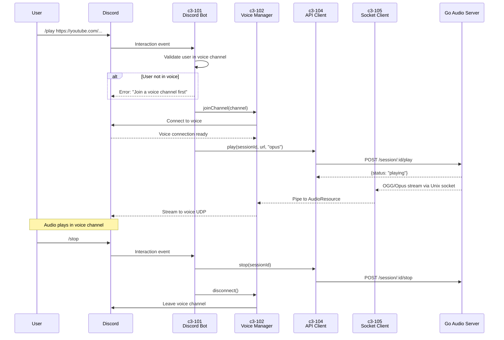

# Discord Bot /play and /stop Implementation Plan

## Overview

- **Goal**: Play YouTube audio in Discord voice channel via slash commands
- **Scope**: `/play <url>` and `/stop` only (no queue, no pause)
- **Affected Layers**: Node.js only (Go unchanged - already supports Opus)

## Command Flow



## Implementation Phases

### Phase 1: Project Setup

| Order | Task | File | Description |
|-------|------|------|-------------|
| 1.1 | Create node directory | `node/` | New directory for Discord bot |
| 1.2 | Initialize package.json | `node/package.json` | Dependencies: discord.js, @discordjs/voice, @discordjs/opus |
| 1.3 | Create tsconfig | `node/tsconfig.json` | TypeScript configuration |
| 1.4 | Create .env template | `node/.env.example` | BOT_TOKEN, CLIENT_ID, GUILD_ID |
| 1.5 | Add to .gitignore | `.gitignore` | Ignore node/.env |

### Phase 2: Core Infrastructure

| Order | Task | File | Description |
|-------|------|------|-------------|
| 2.1 | Config loader | `node/src/config.ts` | Load env vars, validate required values |
| 2.2 | Bot entry point | `node/src/index.ts` | Discord client login, command registration |
| 2.3 | Command handler | `node/src/commands/index.ts` | Slash command router |

### Phase 3: Audio Infrastructure (Reuse from Playground)

| Order | Task | File | Description |
|-------|------|------|-------------|
| 3.1 | API Client | `node/src/audio/api-client.ts` | Copy from playground, adapt for bot |
| 3.2 | Socket Client | `node/src/audio/socket-client.ts` | Copy from playground, adapt for Opus streaming |
| 3.3 | Stream Bridge | `node/src/audio/stream-bridge.ts` | Convert socket stream → AudioResource |

### Phase 4: Voice Manager (c3-102)

| Order | Task | File | Description |
|-------|------|------|-------------|
| 4.1 | Voice Manager | `node/src/voice/manager.ts` | Join/leave voice, manage AudioPlayer |
| 4.2 | Connection handling | `node/src/voice/manager.ts` | Handle disconnect, reconnect |

### Phase 5: Commands (c3-101)

| Order | Task | File | Description |
|-------|------|------|-------------|
| 5.1 | /play command | `node/src/commands/play.ts` | Validate, join voice, start playback |
| 5.2 | /stop command | `node/src/commands/stop.ts` | Stop playback, leave voice |

### Phase 6: Integration

| Order | Task | File | Description |
|-------|------|------|-------------|
| 6.1 | Wire components | `node/src/index.ts` | Connect bot → voice manager → audio |
| 6.2 | Add Taskfile commands | `Taskfile.yml` | `task bot:dev`, `task bot:build` |
| 6.3 | Register slash commands | `node/src/deploy-commands.ts` | One-time command registration script |

### Phase 7: Testing

| Order | Task | File | Description |
|-------|------|------|-------------|
| 7.1 | Manual test: /play | - | Play YouTube URL in voice channel |
| 7.2 | Manual test: /stop | - | Stop and disconnect |
| 7.3 | Manual test: /play while playing | - | Should stop current, play new |
| 7.4 | Audio quality check | - | No crackling, no lag, clear stereo |

## File Structure

```
node/
├── package.json
├── tsconfig.json
├── .env.example
├── src/
│   ├── index.ts              # Entry point, bot login
│   ├── config.ts             # Environment config
│   ├── deploy-commands.ts    # Slash command registration
│   ├── commands/
│   │   ├── index.ts          # Command router
│   │   ├── play.ts           # /play handler
│   │   └── stop.ts           # /stop handler
│   ├── voice/
│   │   └── manager.ts        # c3-102: Voice connection manager
│   └── audio/
│       ├── api-client.ts     # c3-104: Go API client
│       ├── socket-client.ts  # c3-105: Socket client
│       └── stream-bridge.ts  # Socket → AudioResource bridge
└── dist/                     # Compiled output
```

## Dependencies

```json
{
  "dependencies": {
    "discord.js": "^14.14.1",
    "@discordjs/voice": "^0.17.0",
    "@discordjs/opus": "^0.9.0",
    "sodium-native": "^4.0.0"
  },
  "devDependencies": {
    "@types/node": "^20.10.0",
    "typescript": "^5.3.2"
  }
}
```

## Key Implementation Details

### Audio Streaming (OGG/Opus)

```typescript
// stream-bridge.ts
import { createAudioResource, StreamType } from '@discordjs/voice';

export function createOpusResource(socketStream: Readable) {
  return createAudioResource(socketStream, {
    inputType: StreamType.OggOpus,  // Go outputs OGG/Opus container
    inlineVolume: false,            // No volume processing needed
  });
}
```

### Voice Manager

```typescript
// voice/manager.ts
import {
  joinVoiceChannel,
  createAudioPlayer,
  AudioPlayerStatus,
  VoiceConnectionStatus
} from '@discordjs/voice';

export class VoiceManager {
  private connection: VoiceConnection | null = null;
  private player: AudioPlayer;

  async join(channel: VoiceChannel): Promise<void> { ... }
  async play(resource: AudioResource): Promise<void> { ... }
  async stop(): Promise<void> { ... }
  async disconnect(): Promise<void> { ... }
}
```

### /play Command Flow

```typescript
// commands/play.ts
export async function execute(interaction: ChatInputCommandInteraction) {
  // 1. Check user in voice channel
  const voiceChannel = interaction.member.voice.channel;
  if (!voiceChannel) {
    return interaction.reply({ content: 'Join a voice channel first!', ephemeral: true });
  }

  // 2. If already playing, stop first
  if (voiceManager.isPlaying()) {
    await voiceManager.stop();
  }

  // 3. Join voice channel
  await voiceManager.join(voiceChannel);

  // 4. Start playback via Go API
  const sessionId = generateSessionId();
  await apiClient.play(sessionId, url, 'opus');

  // 5. Pipe socket stream to voice
  const stream = socketClient.getStream();
  const resource = createOpusResource(stream);
  await voiceManager.play(resource);

  return interaction.reply({ content: `Now playing: ${url}` });
}
```

## Checklist

- [ ] node/ directory created with package.json
- [ ] Discord.js and voice dependencies installed
- [ ] Bot can login and respond to commands
- [ ] /play joins voice channel
- [ ] /play calls Go API with format: opus
- [ ] OGG/Opus stream pipes to Discord voice
- [ ] Audio plays clearly (48kHz stereo, no lag)
- [ ] /stop stops playback and disconnects
- [ ] /play while playing stops current and plays new
- [ ] Error handling for invalid URLs
- [ ] Error handling for user not in voice channel
- [ ] Taskfile.yml updated with bot commands
