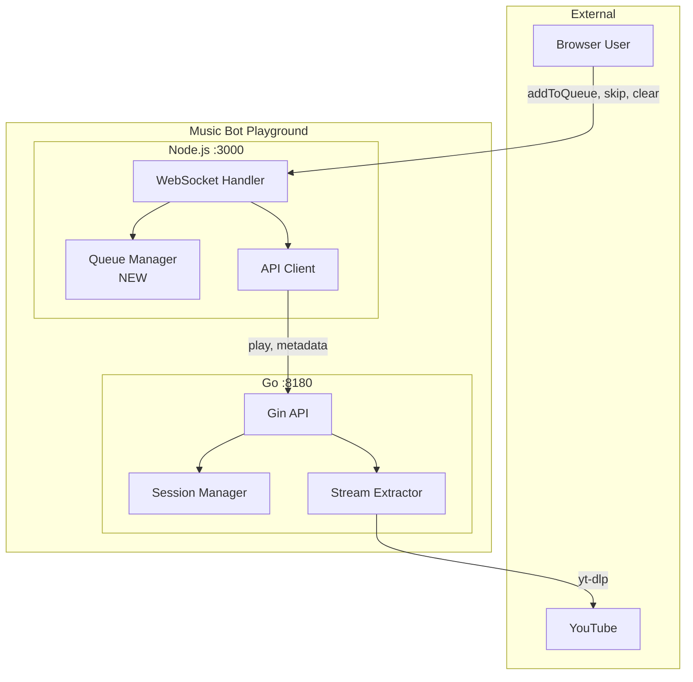
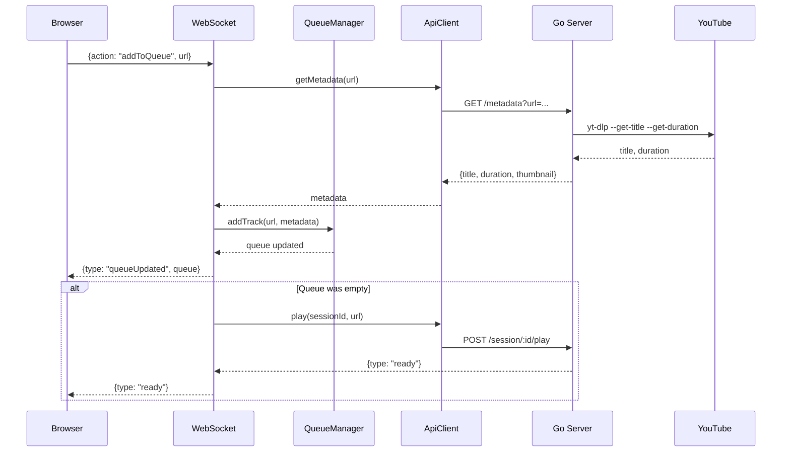
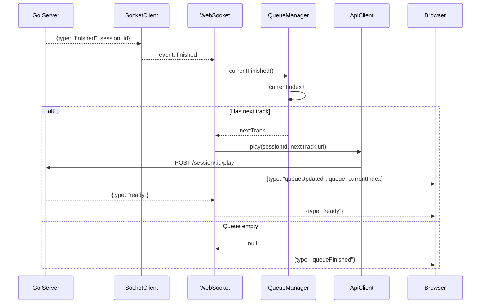
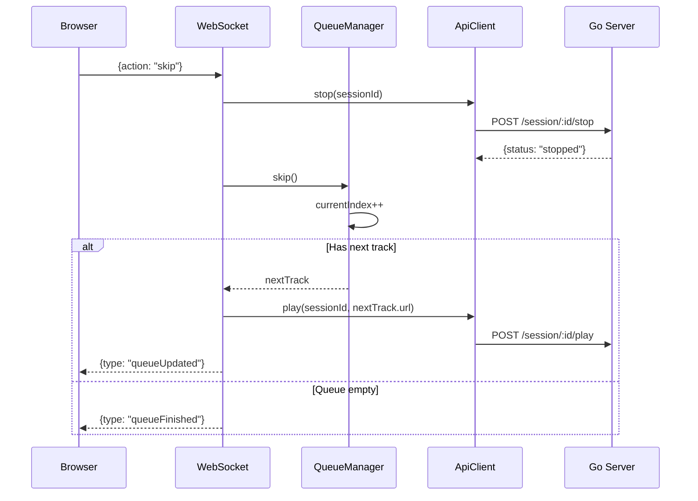
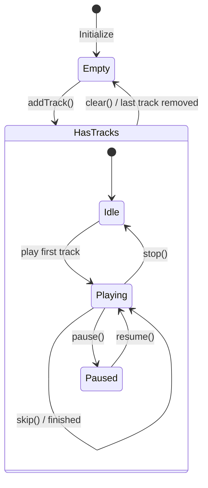
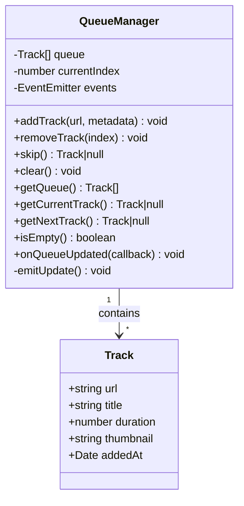
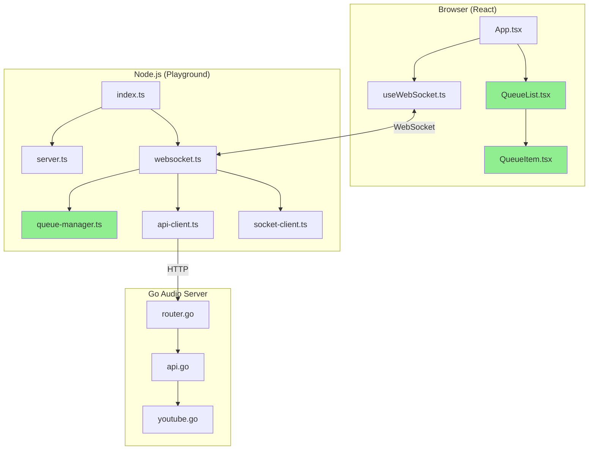
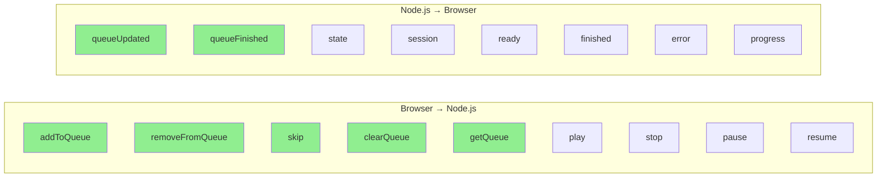
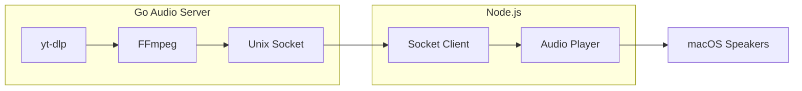

# Playlist Support Diagrams

## System Context with Queue



## Add to Queue Flow



## Auto-Advance Flow



## Skip Track Flow



## Queue State Machine



## Queue Manager Class Diagram



## Component Integration



## WebSocket Message Flow



## Audio Flow (Unchanged)



## File Structure After Implementation

```
playground/
├── src/
│   ├── index.ts
│   ├── server.ts
│   ├── api-client.ts          # +getMetadata()
│   ├── socket-client.ts
│   ├── websocket.ts           # +queue actions
│   ├── queue-manager.ts       # NEW
│   └── audio-player.ts
├── client/
│   └── src/
│       ├── App.tsx            # +queue UI
│       ├── hooks/
│       │   └── useWebSocket.ts # +queue state
│       └── components/
│           ├── QueueList.tsx  # NEW
│           ├── QueueItem.tsx  # NEW
│           └── ui/
```
