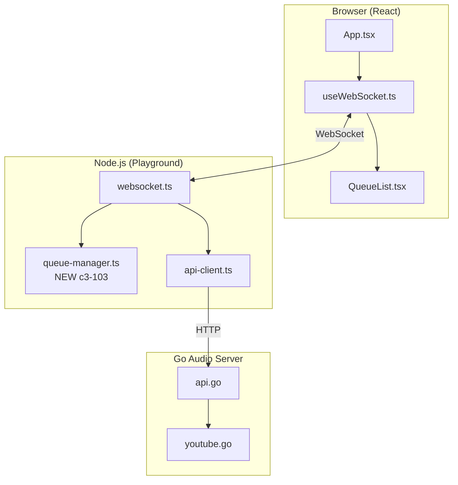

# Playlist Support Impact Analysis

## Summary

| Category | Count | Risk |
|----------|-------|------|
| New Go Files | 0 | - |
| Modified Go Files | 4 | Low |
| New Node.js Files | 1 | Low |
| Modified Node.js Files | 2 | Medium |
| New React Files | 2 | Low |
| Modified React Files | 2 | Medium |

## New Files

### Node.js Layer

| File | Purpose | Lines Est. |
|------|---------|------------|
| `playground/src/queue-manager.ts` | c3-103: Queue state and operations | ~150 |

### React Layer

| File | Purpose | Lines Est. |
|------|---------|------------|
| `playground/client/src/components/QueueList.tsx` | Queue display component | ~80 |
| `playground/client/src/components/QueueItem.tsx` | Single track row component | ~50 |

## Modified Files

### Go Layer

| File | Change | Risk | Lines Changed |
|------|--------|------|---------------|
| `internal/server/types.go` | Add `TrackMetadata` struct | Low | +10 |
| `internal/server/api.go` | Add `handleGetMetadata` handler | Low | +30 |
| `internal/server/router.go` | Add `/metadata` route | Low | +1 |
| `internal/platform/youtube/youtube.go` | Add `ExtractMetadata()` method | Low | +40 |

### Node.js Layer

| File | Change | Risk | Lines Changed |
|------|--------|------|---------------|
| `playground/src/api-client.ts` | Add `getMetadata()` method | Low | +15 |
| `playground/src/websocket.ts` | Integrate QueueManager, new actions | Medium | +100 |

### React Layer

| File | Change | Risk | Lines Changed |
|------|--------|------|---------------|
| `playground/client/src/hooks/useWebSocket.ts` | Queue state, handlers, actions | Medium | +80 |
| `playground/client/src/App.tsx` | Queue UI integration | Medium | +50 |

## C3 Component Dependencies

| This Feature | Component | Interaction | Reason |
|--------------|-----------|-------------|--------|
| Queue Manager (c3-103) | c3-104 API Client | Uses | Fetch metadata from Go |
| Queue Manager (c3-103) | c3-107 WebSocket Handler | Used by | Receives browser commands |
| Queue Manager (c3-103) | c3-202 Session Manager | Indirect | Controls playback via API |
| Metadata Endpoint | c3-203 Stream Extractor | Uses | Extract YouTube metadata |

## Component Interaction Diagram

## Risk Assessment

| Risk | Likelihood | Impact | Mitigation |
|------|------------|--------|------------|
| Queue state lost on refresh | High | Medium | Expected for playground; persist later for Discord |
| Metadata extraction slow | Medium | Low | Add loading state, cache in Go |
| Race condition on rapid skip | Low | Medium | Debounce skip, use mutex in QueueManager |
| Memory leak from queue | Low | Low | Limit queue size (e.g., 100 tracks) |
| WebSocket disconnect loses queue | Medium | Medium | Resend queue state on reconnect |

## Backward Compatibility

| Area | Impact | Notes |
|------|--------|-------|
| Existing `play` action | Compatible | Still works for immediate play |
| Existing UI | Compatible | Queue UI additive |
| Go API | Compatible | New endpoint, existing unchanged |
| Socket protocol | Compatible | No changes to audio streaming |

## Testing Requirements

| Test Type | Coverage |
|-----------|----------|
| Unit Tests | QueueManager operations |
| Integration | WebSocket → Queue → Go flow |
| E2E | Browser queue interactions |
| Manual | Audio quality, auto-advance timing |

## Performance Considerations

| Concern | Mitigation |
|---------|------------|
| Metadata fetch per track | Cache in Go (5 min TTL) |
| Large queue rendering | Virtualize list if >50 items |
| Frequent queue updates | Throttle broadcasts (100ms) |

## Future Extensions (Out of Scope)

| Feature | Notes |
|---------|-------|
| Loop modes | Track loop, queue loop |
| Shuffle | Randomize queue order |
| Drag-drop reorder | Browser UI enhancement |
| Persist queue | Save/restore queue state |
| YouTube playlist import | Extract all videos from playlist URL |
