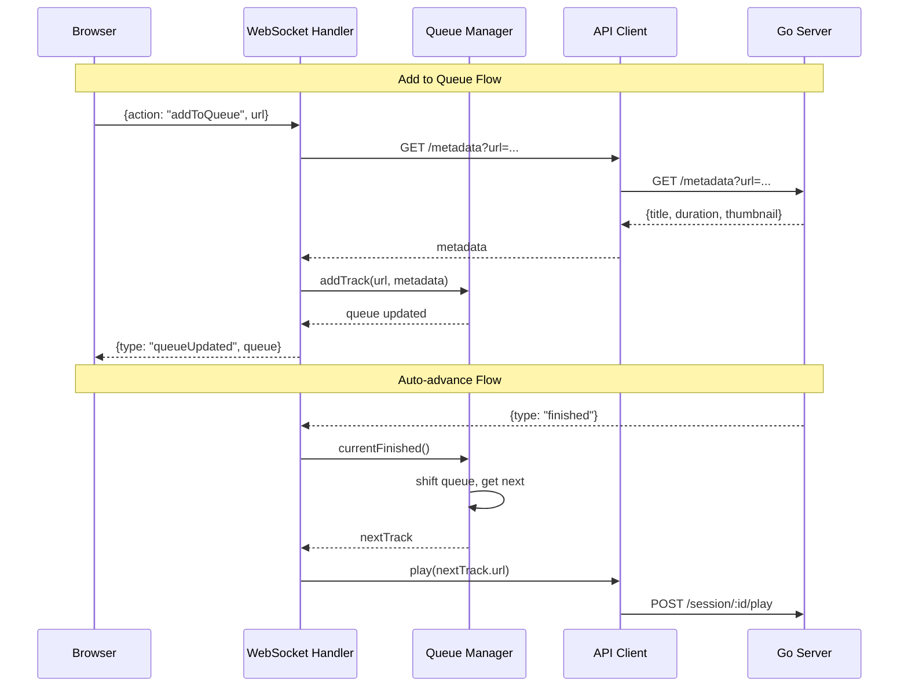

# Playlist Support Implementation Plan

## Overview

- **Goal**: Add playlist/queue functionality to the playground for testing before Discord integration
- **Scope**: Queue management in Node.js, browser UI for queue display and controls
- **Affected Layers**: Node.js (primary), Browser UI (secondary), Go (minimal)

## Requirements

| Requirement | Description |
|-------------|-------------|
| Add to queue | User can add YouTube URLs to a queue |
| Play queue | Tracks play sequentially, auto-advance on finish |
| Skip track | Skip current track, play next in queue |
| Remove track | Remove specific track from queue |
| View queue | Display current queue with track info |
| Clear queue | Remove all tracks from queue |
| Reorder queue | Move tracks up/down (optional v2) |

## Design Decisions

### Where should the queue live?

**Decision: Node.js (c3-103 Queue Manager)**

Rationale:
- Node.js is the "brain" that orchestrates Go
- Go should remain stateless regarding queue (just plays what it's told)
- Aligns with future Discord integration (queue per guild)
- Easier state management with TypeScript

### Track metadata extraction

**Decision: Go extracts metadata via new `/metadata` endpoint**

Rationale:
- Go already has yt-dlp integration
- Avoids duplicating yt-dlp logic in Node.js
- Can cache metadata in Go for performance

## Command Flow



## Implementation Phases

### Phase 1: Go Metadata Endpoint

Add endpoint to extract track metadata without starting playback.

| Order | Task | File | Description |
|-------|------|------|-------------|
| 1.1 | Add metadata types | `internal/server/types.go` | `TrackMetadata` struct |
| 1.2 | Add metadata handler | `internal/server/api.go` | `GET /metadata?url=` handler |
| 1.3 | Add route | `internal/server/router.go` | Register `/metadata` route |
| 1.4 | Extract metadata | `internal/platform/youtube/youtube.go` | `ExtractMetadata()` method |

### Phase 2: Node.js Queue Manager (c3-103)

Implement the queue manager component.

| Order | Task | File | Description |
|-------|------|------|-------------|
| 2.1 | Create Track interface | `playground/src/queue-manager.ts` | Track type with metadata |
| 2.2 | Create QueueManager class | `playground/src/queue-manager.ts` | Queue operations |
| 2.3 | Implement addTrack | `playground/src/queue-manager.ts` | Add to end of queue |
| 2.4 | Implement removeTrack | `playground/src/queue-manager.ts` | Remove by index |
| 2.5 | Implement skip | `playground/src/queue-manager.ts` | Move to next track |
| 2.6 | Implement clear | `playground/src/queue-manager.ts` | Empty the queue |
| 2.7 | Implement getQueue | `playground/src/queue-manager.ts` | Return queue state |
| 2.8 | Implement getCurrentTrack | `playground/src/queue-manager.ts` | Return now playing |

### Phase 3: API Client Updates

Add metadata fetching to API client.

| Order | Task | File | Description |
|-------|------|------|-------------|
| 3.1 | Add getMetadata method | `playground/src/api-client.ts` | Fetch track metadata from Go |

### Phase 4: WebSocket Handler Updates

Integrate queue manager with WebSocket messages.

| Order | Task | File | Description |
|-------|------|------|-------------|
| 4.1 | Import QueueManager | `playground/src/websocket.ts` | Add dependency |
| 4.2 | Handle addToQueue action | `playground/src/websocket.ts` | Fetch metadata, add to queue |
| 4.3 | Handle removeFromQueue action | `playground/src/websocket.ts` | Remove track by index |
| 4.4 | Handle skip action | `playground/src/websocket.ts` | Skip to next track |
| 4.5 | Handle clearQueue action | `playground/src/websocket.ts` | Clear all tracks |
| 4.6 | Handle getQueue action | `playground/src/websocket.ts` | Return current queue |
| 4.7 | Auto-advance on finish | `playground/src/websocket.ts` | Play next when current ends |
| 4.8 | Broadcast queue updates | `playground/src/websocket.ts` | Send queueUpdated events |

### Phase 5: Browser UI Updates

Add queue display and controls to React UI.

| Order | Task | File | Description |
|-------|------|------|-------------|
| 5.1 | Add queue state | `playground/client/src/hooks/useWebSocket.ts` | Track queue in state |
| 5.2 | Add queue message handlers | `playground/client/src/hooks/useWebSocket.ts` | Handle queueUpdated |
| 5.3 | Add queue actions | `playground/client/src/hooks/useWebSocket.ts` | addToQueue, skip, etc. |
| 5.4 | Create QueueList component | `playground/client/src/components/QueueList.tsx` | Display queue |
| 5.5 | Create QueueItem component | `playground/client/src/components/QueueItem.tsx` | Single track display |
| 5.6 | Add queue controls | `playground/client/src/App.tsx` | Skip, clear buttons |
| 5.7 | Show now playing | `playground/client/src/App.tsx` | Current track info |

### Phase 6: Integration Testing

| Order | Task | Description |
|-------|------|-------------|
| 6.1 | Test add to queue | Add multiple URLs, verify order |
| 6.2 | Test auto-advance | Let track finish, verify next plays |
| 6.3 | Test skip | Skip current, verify next plays |
| 6.4 | Test remove | Remove middle track, verify queue updates |
| 6.5 | Test clear | Clear queue, verify playback stops |
| 6.6 | Test pause/resume with queue | Pause, resume, verify queue intact |

## Message Types

### New Browser → Node.js Messages

```typescript
{ action: 'addToQueue', url: string }
{ action: 'removeFromQueue', index: number }
{ action: 'skip' }
{ action: 'clearQueue' }
{ action: 'getQueue' }
```

### New Node.js → Browser Messages

```typescript
{
  type: 'queueUpdated',
  queue: Track[],
  currentIndex: number,
  nowPlaying: Track | null
}

interface Track {
  url: string;
  title: string;
  duration: number;  // seconds
  thumbnail?: string;
  addedAt: Date;
}
```

## Queue Manager Interface

```typescript
interface QueueManager {
  // State
  queue: Track[];
  currentIndex: number;

  // Operations
  addTrack(url: string, metadata: TrackMetadata): void;
  removeTrack(index: number): void;
  skip(): Track | null;  // Returns next track or null
  clear(): void;

  // Queries
  getQueue(): Track[];
  getCurrentTrack(): Track | null;
  getNextTrack(): Track | null;
  isEmpty(): boolean;

  // Events
  onQueueUpdated(callback: (queue: Track[]) => void): void;
}
```

## Checklist

- [ ] Go `/metadata` endpoint implemented
- [ ] QueueManager class created
- [ ] WebSocket handles queue actions
- [ ] Auto-advance on track finish
- [ ] Browser displays queue
- [ ] Skip/clear/remove working
- [ ] Queue state persists during pause/resume
- [ ] Error handling (invalid URLs, extraction failures)
- [ ] Queue updates broadcast to all connected browsers
