# Web Opus Streaming - Diagrams

## Task Modes Overview

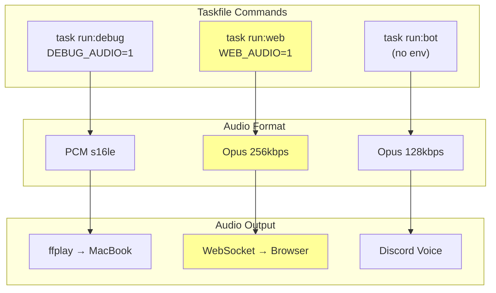

## System Context - Web Mode

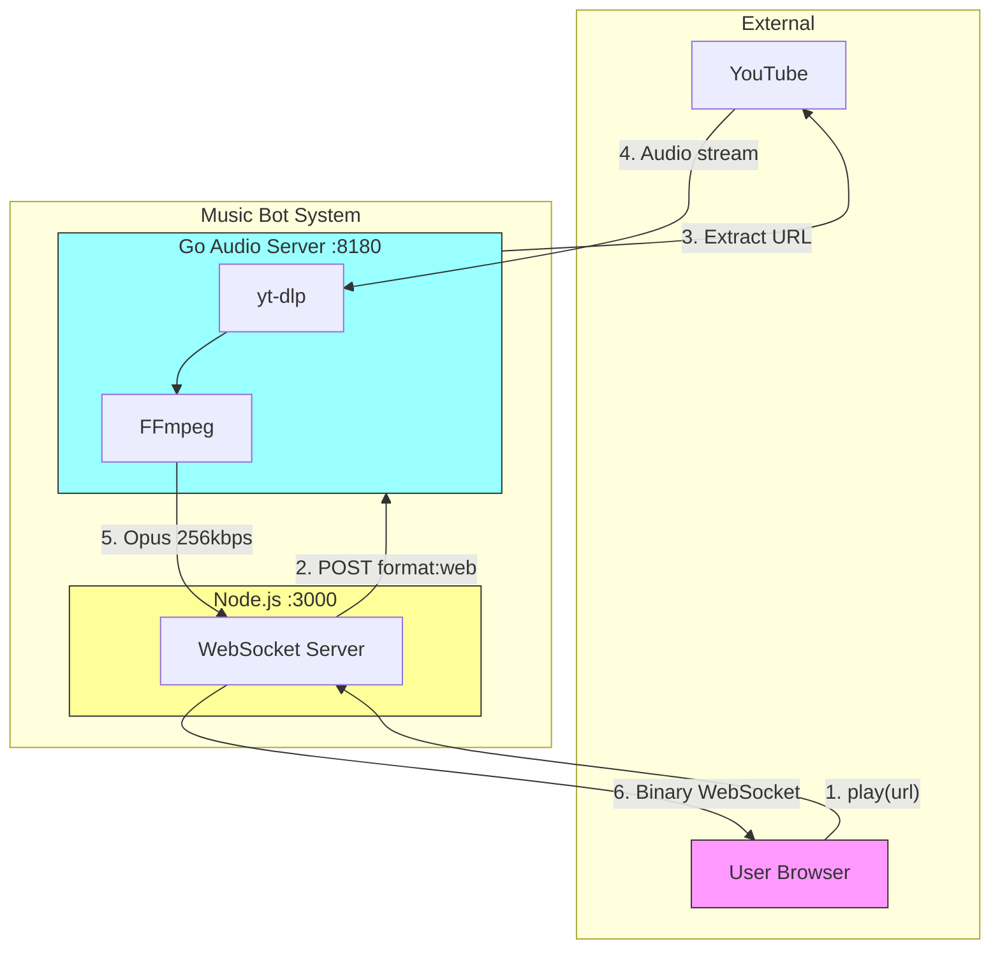

## Audio Pipeline Comparison

### Debug Mode (`task run:debug`)

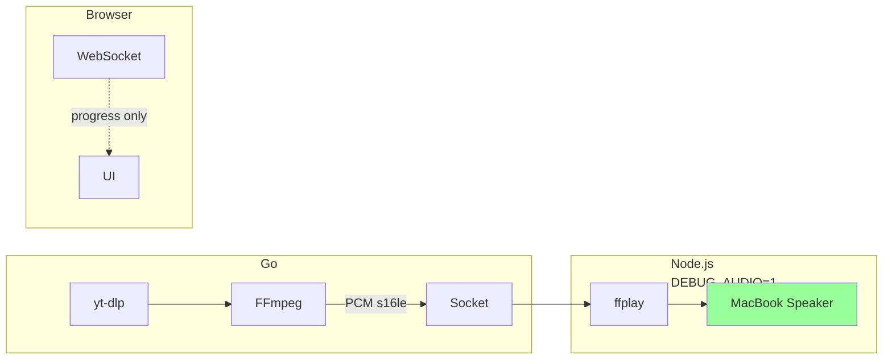

### Web Mode (`task run:web`) - NEW

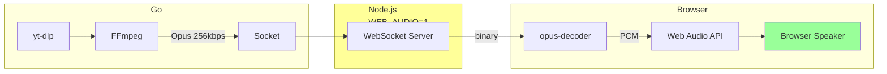

### Bot Mode (`task run:bot`)

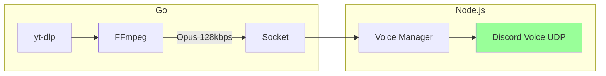

## Sequence Diagram - Web Mode Startup

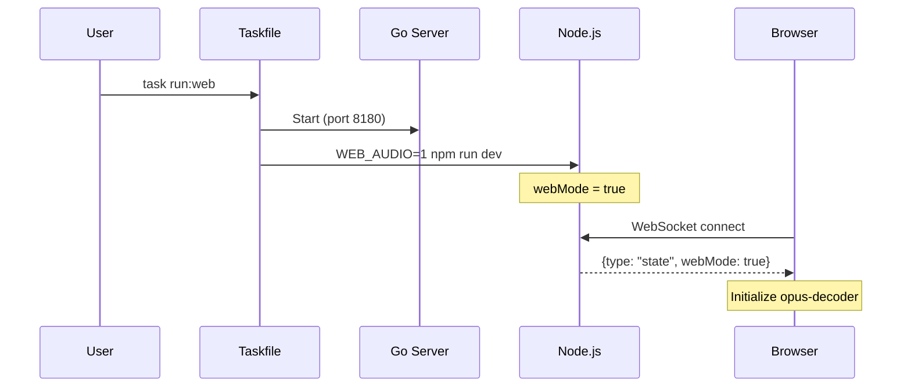

## Sequence Diagram - Web Mode Playback

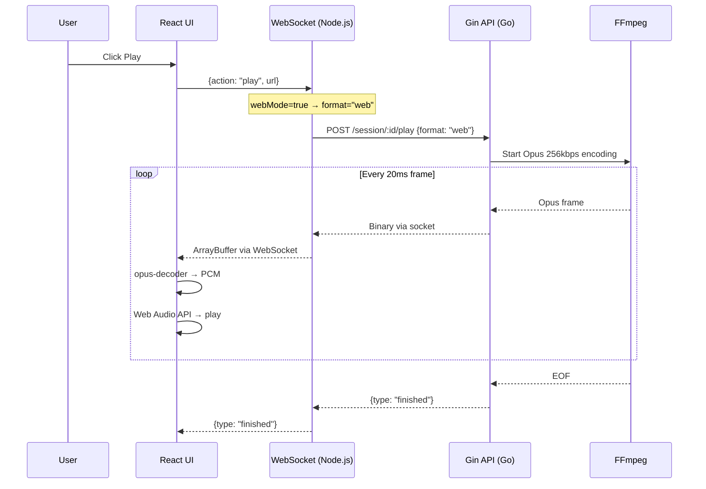

## Component Integration

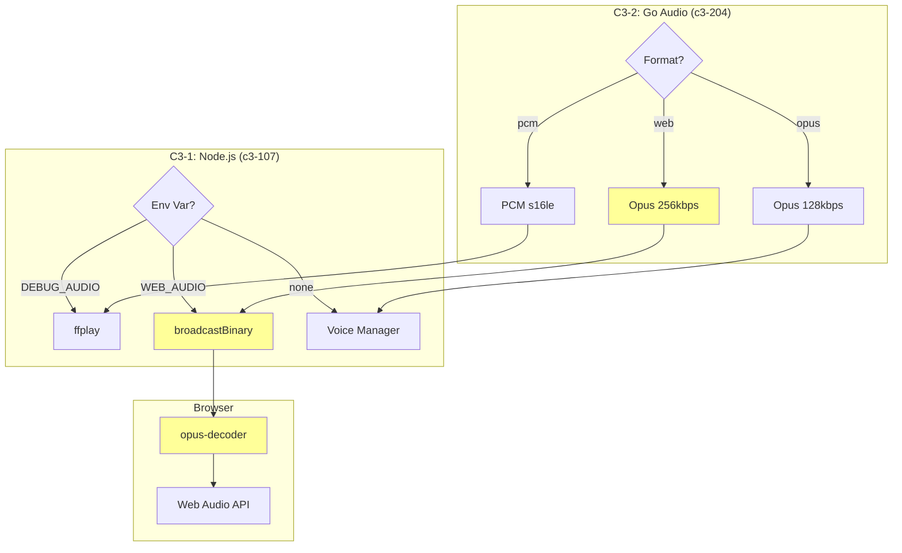

## State Machine - Node.js Mode Selection

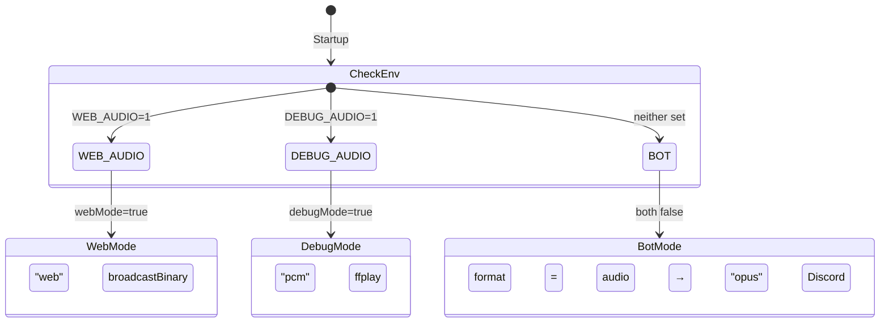

## Data Flow - Binary WebSocket

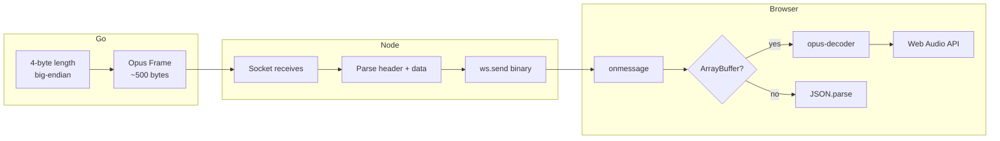

## Class Diagram - Browser Audio

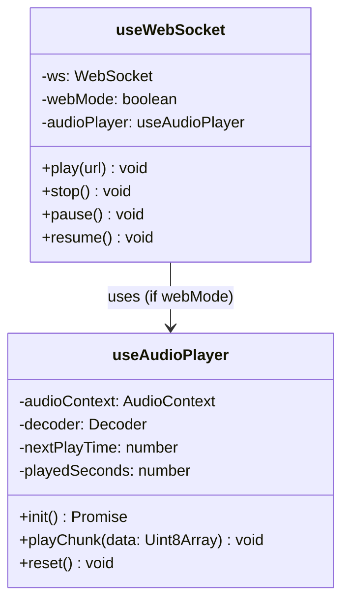

## FFmpeg Args Comparison

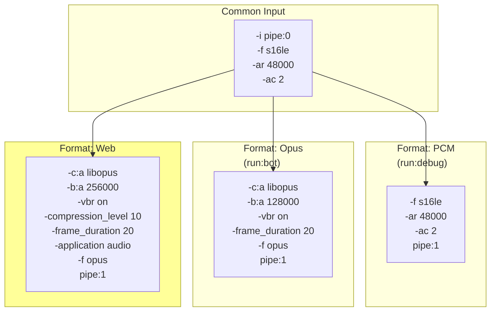

## Error Handling Flow

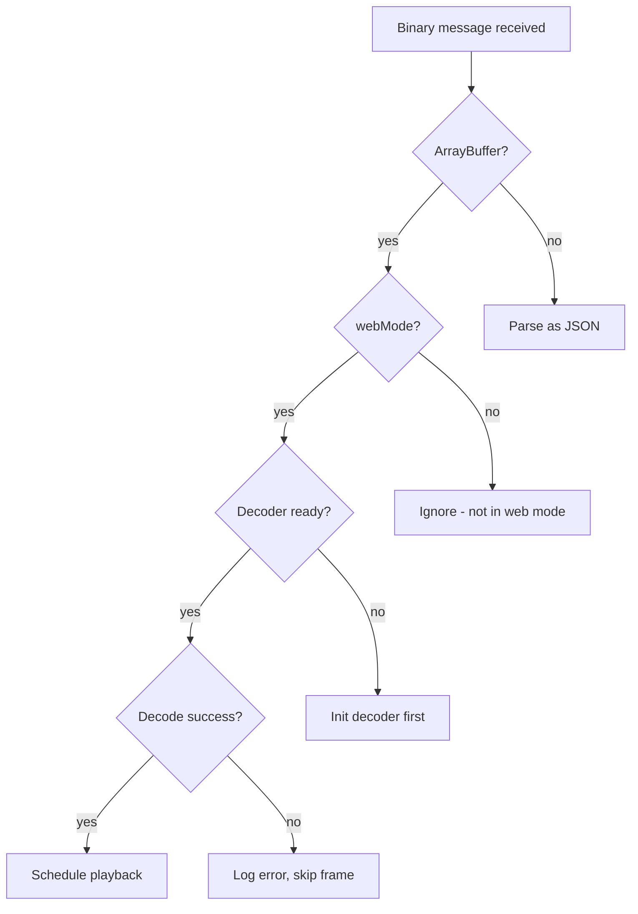

## Taskfile Structure

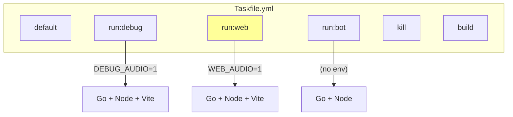
