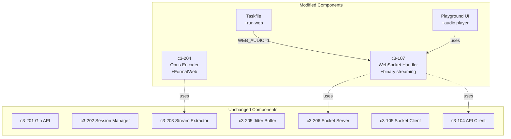

# Web Opus Streaming - Impact Analysis

## Summary

| Category | Count | Risk |
|----------|-------|------|
| New Go Files | 0 | - |
| New Node.js Files | 0 | - |
| New Browser Files | 1 | Low |
| Modified Go Files | 2 | Low |
| Modified Node.js Files | 1 | Medium |
| Modified Browser Files | 1 | Medium |
| Modified Config Files | 1 | Low |
| New Dependencies | 1 | Low |

## New Files

### Browser Layer (playground/)

| File | Purpose |
|------|---------|
| `playground/src/hooks/useAudioPlayer.ts` | Web Audio API integration with opus-decoder |

## Modified Files

### Go Layer (c3-204 Opus Encoder)

| File | Change | Risk |
|------|--------|------|
| `internal/encoder/types.go` | Add `FormatWeb` constant | Low - additive only |
| `internal/encoder/ffmpeg.go` | Add case for web format FFmpeg args | Low - new switch case |

### Node.js Layer (c3-107 WebSocket Handler)

| File | Change | Risk |
|------|--------|------|
| `app/src/websocket.ts` | Add webMode, broadcastBinary, route audio by mode | Medium - core audio path |

### Browser Layer (Playground)

| File | Change | Risk |
|------|--------|------|
| `playground/src/hooks/useWebSocket.ts` | Handle binary messages, integrate audio player | Medium - WebSocket handling |

### Config Layer

| File | Change | Risk |
|------|--------|------|
| `Taskfile.yml` | Add `run:web` task | Low - new task only |

## C3 Component Dependencies

| This Feature | Depends On | Reason |
|--------------|------------|--------|
| c3-204 Web Format | c3-203 Stream Extractor | Needs stream URL from yt-dlp |
| c3-107 Binary Streaming | c3-206 Socket Server | Receives audio chunks |
| c3-107 Binary Streaming | c3-104 API Client | Sends format to Go API |
| Browser Audio | c3-107 Binary Streaming | Receives Opus over WebSocket |

## Impact Matrix

## New Dependencies

### Browser (playground/package.json)

| Package | Version | Purpose | Size |
|---------|---------|---------|------|
| `opus-decoder` | ^0.7.x | WASM-based Opus decoder | ~300KB |

## Task Modes Comparison

| Task | Env Var | Format | Audio Path | Use Case |
|------|---------|--------|------------|----------|
| `run:debug` | `DEBUG_AUDIO=1` | PCM | Go → Node → ffplay → MacBook | Local testing |
| `run:web` | `WEB_AUDIO=1` | Opus 256k | Go → Node → WebSocket → Browser | Browser playback |
| `run:bot` | (none) | Opus 128k | Go → Node → Discord | Production |

## Risk Assessment

| Risk | Likelihood | Impact | Mitigation |
|------|------------|--------|------------|
| AudioContext requires user gesture | High | Medium | Initialize on first play click |
| Opus decoder WASM load failure | Low | High | Show error, suggest debug mode |
| WebSocket binary handling issues | Low | Medium | Add type checking for ArrayBuffer |
| Audio scheduling jitter | Medium | Low | Use nextPlayTime pattern |
| Wrong mode started | Low | Low | Clear startup banner shows mode |

## Backward Compatibility

| Scenario | Impact | Action |
|----------|--------|--------|
| Existing `run:debug` | None | Unchanged |
| Existing `run:bot` | None | Unchanged |
| Old browser without WASM | Breaks web mode | Users must use debug mode |

## Testing Requirements

### Manual Tests

| Test | Command | Expected |
|------|---------|----------|
| Web mode | `task run:web` | Audio plays in browser |
| Debug mode | `task run:debug` | Audio plays via MacBook |
| Bot mode | `task run:bot` | Audio plays in Discord |

### Integration Tests

| Test | Description |
|------|-------------|
| E2E web mode | Browser → Go → Browser audio plays |
| Mode isolation | Each mode uses correct format |
| Regression | Existing modes unchanged |

## Rollback Plan

If issues arise:

1. **Quick fix**: Remove `run:web` task, users use `run:debug`
2. **Full rollback**: Revert websocket.ts changes, remove FormatWeb

## Performance Considerations

| Metric | Debug Mode | Web Mode | Notes |
|--------|------------|----------|-------|
| Latency | ~100ms | ~300-500ms | Web Audio buffering |
| Bandwidth | ~192KB/s (PCM) | ~32KB/s (Opus) | Web mode more efficient |
| CPU (browser) | N/A | Low | WASM decoder is efficient |
| Memory (browser) | N/A | ~10MB | AudioContext + decoder |

## Security Considerations

| Concern | Assessment |
|---------|------------|
| WebSocket binary injection | Low - server validates sessions |
| WASM execution | Low - sandboxed by browser |
| Cross-origin | N/A - same origin WebSocket |
| Env var injection | N/A - set by Taskfile, not user |
