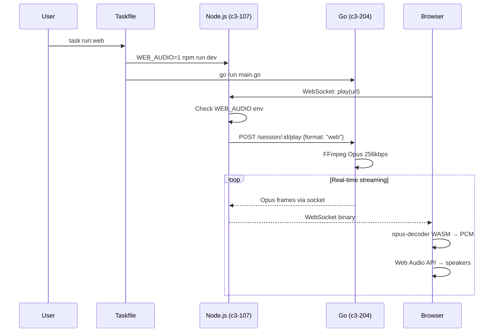
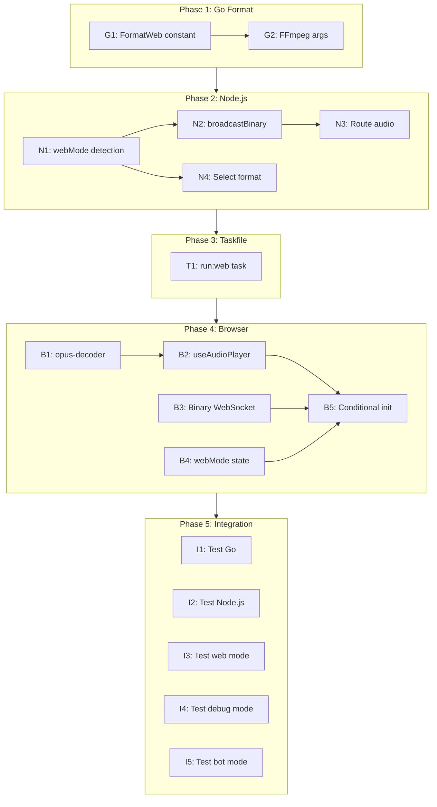

# Web Opus Streaming - Implementation Plan

## Overview

- **Goal**: Add `task run:web` mode to stream high-quality Opus audio to web browser via WebSocket
- **Scope**: Go encoder format + Node.js binary streaming + Browser Web Audio API + Taskfile
- **Affected Layers**: Go (c3-204), Node.js (c3-107), Browser (Playground UI), Taskfile

## Architecture Decision

Mode is determined at **startup via Taskfile**, not UI toggle:

| Task Command | Env Var | Format | Audio Output |
|--------------|---------|--------|--------------|
| `task run:debug` | `DEBUG_AUDIO=1` | PCM | MacBook speakers (ffplay) |
| `task run:web` | `WEB_AUDIO=1` | Opus 256kbps | Browser speakers (Web Audio) |
| `task run:bot` | (none) | Opus 128kbps | Discord voice channel |

## Command Flow



## Implementation Phases

### Phase 1: Go - Add Web Format (c3-204)

| Order | Task | File | Description |
|-------|------|------|-------------|
| G1 | Add FormatWeb constant | `internal/encoder/types.go` | New format type for browser streaming |
| G2 | Add web format FFmpeg args | `internal/encoder/ffmpeg.go` | 256kbps Opus with high quality settings |

**Details:**

```go
// G1: internal/encoder/types.go
const (
    FormatPCM  Format = "pcm"
    FormatOpus Format = "opus"  // Discord: 128kbps
    FormatWeb  Format = "web"   // Browser: 256kbps high quality
)

// G2: internal/encoder/ffmpeg.go - Add case in buildFFmpegArgs()
case FormatWeb:
    args = append(args,
        "-c:a", "libopus",
        "-b:a", "256000",           // 256kbps YouTube Premium quality
        "-vbr", "on",
        "-compression_level", "10",
        "-frame_duration", "20",
        "-application", "audio",
        "-f", "opus",
        "pipe:1",
    )
```

### Phase 2: Node.js - Mode Detection & Binary Streaming (c3-107)

| Order | Task | File | Description |
|-------|------|------|-------------|
| N1 | Add webMode detection | `app/src/websocket.ts` | Check `WEB_AUDIO` env at startup |
| N2 | Add broadcastBinary method | `app/src/websocket.ts` | Send binary data to WebSocket clients |
| N3 | Route audio by mode | `app/src/websocket.ts` | ffplay (debug) vs WebSocket (web) |
| N4 | Select format based on mode | `app/src/websocket.ts` | pcm (debug) vs web (web mode) |

**Details:**

```typescript
// N1: Add at class level
private webMode: boolean;

constructor(server: HttpServer) {
    // ...
    this.webMode = process.env.WEB_AUDIO === '1';
    if (this.webMode) {
        console.log('[WebSocket] Web audio mode enabled via WEB_AUDIO=1');
    }
}

// N2: Add method
private broadcastBinary(data: Buffer): void {
    for (const client of this.clients) {
        if (client.readyState === WebSocket.OPEN) {
            client.send(data, { binary: true });
        }
    }
}

// N3: Modify audio handler
this.socketClient.on('audio', (data: Buffer) => {
    if (this.isPaused || !this.currentSessionId) return;

    if (this.webMode) {
        // Opus to browser
        this.broadcastBinary(data);
    } else if (this.debugMode && this.isStreamReady) {
        // PCM to ffplay
        this.audioPlayer.write(data);
    }
});

// N4: Modify playTrack method
private async playTrack(url: string): Promise<void> {
    // ...
    const format = this.webMode ? 'web' : 'pcm';
    const result = await this.apiClient.play(sessionId, url, format);
}
```

### Phase 3: Taskfile - Add run:web Task

| Order | Task | File | Description |
|-------|------|------|-------------|
| T1 | Add run:web task | `Taskfile.yml` | New task with WEB_AUDIO=1 env |

**Details:**

```yaml
run:web:
  desc: Start all servers with WEB mode (audio streams to browser)
  cmds:
    - task: kill
    - |
      echo "=== Audio Playground (WEB MODE) ==="
      echo "Audio: Opus 256kbps -> WebSocket -> Browser speakers"
      echo ""
      echo "Go:      http://localhost:8180"
      echo "Node.js: http://localhost:3000"
      echo "Vite:    http://localhost:5173"
      echo ""
      echo "Press Ctrl+C to stop all servers"
      echo "=========================================="
      echo ""
    - |
      set -a
      [ -f app/.env ] && source app/.env
      set +a
      npx concurrently --kill-others --names "Go,Node,Vite" \
        --prefix-colors "cyan,green,magenta" --prefix "[{name}]" \
        "go run cmd/playground/main.go" \
        "cd app && WEB_AUDIO=1 npm run dev" \
        "cd playground && npx vite --clearScreen false"
```

### Phase 4: Browser - Opus Decoder + Web Audio API

| Order | Task | File | Description |
|-------|------|------|-------------|
| B1 | Add opus-decoder dependency | `playground/package.json` | WASM-based Opus decoder |
| B2 | Create useAudioPlayer hook | `playground/src/hooks/useAudioPlayer.ts` | Web Audio API + progress tracking |
| B3 | Handle binary WebSocket messages | `playground/src/hooks/useWebSocket.ts` | Route ArrayBuffer to audio player |
| B4 | Update state broadcast | `app/src/websocket.ts` | Send webMode in initial state |
| B5 | Conditional audio init | `playground/src/hooks/useWebSocket.ts` | Init audio player only in web mode |

**Details:**

```typescript
// B2: useAudioPlayer.ts
import { Decoder } from 'opus-decoder';

export function useAudioPlayer({ onProgress }: { onProgress?: (secs: number) => void } = {}) {
    const audioContext = useRef<AudioContext>();
    const decoder = useRef<Decoder>();
    const nextPlayTime = useRef(0);
    const playedSeconds = useRef(0);

    const init = async () => {
        audioContext.current = new AudioContext({ sampleRate: 48000 });
        decoder.current = new Decoder({ sampleRate: 48000, channels: 2 });
        await decoder.current.ready;
    };

    const playChunk = (opusData: Uint8Array) => {
        if (!decoder.current || !audioContext.current) return;

        const { channelData, samplesDecoded } = decoder.current.decode(opusData);
        if (samplesDecoded > 0) {
            const buffer = audioContext.current.createBuffer(2, samplesDecoded, 48000);
            buffer.copyToChannel(channelData[0], 0);
            buffer.copyToChannel(channelData[1], 1);

            const source = audioContext.current.createBufferSource();
            source.buffer = buffer;
            source.connect(audioContext.current.destination);

            const now = audioContext.current.currentTime;
            if (nextPlayTime.current < now) {
                nextPlayTime.current = now;
            }
            source.start(nextPlayTime.current);
            nextPlayTime.current += samplesDecoded / 48000;

            playedSeconds.current += samplesDecoded / 48000;
            onProgress?.(playedSeconds.current);
        }
    };

    const reset = () => {
        playedSeconds.current = 0;
        nextPlayTime.current = 0;
    };

    return { init, playChunk, reset };
}

// B3: useWebSocket.ts - handle binary
ws.binaryType = 'arraybuffer';

ws.onmessage = (event) => {
    if (event.data instanceof ArrayBuffer) {
        // Binary Opus data (only in web mode)
        audioPlayer.playChunk(new Uint8Array(event.data));
    } else {
        // JSON control message
        const message = JSON.parse(event.data);
        handleMessage(message);
    }
};
```

### Phase 5: Integration & Testing

| Order | Task | Description |
|-------|------|-------------|
| I1 | Test Go format | Verify Opus 256kbps output via ffprobe |
| I2 | Test Node.js binary forwarding | Verify WebSocket sends ArrayBuffer |
| I3 | Test browser playback | Full e2e: `task run:web` → browser audio |
| I4 | Test debug mode | Verify `task run:debug` still works |
| I5 | Test bot mode | Verify `task run:bot` still works (128kbps) |

## Dependency Graph



## Environment Variables

| Variable | Values | Used By | Description |
|----------|--------|---------|-------------|
| `DEBUG_AUDIO` | `1` / unset | Node.js | Enable PCM → ffplay |
| `WEB_AUDIO` | `1` / unset | Node.js | Enable Opus → WebSocket → browser |

**Priority**: `WEB_AUDIO` takes precedence over `DEBUG_AUDIO`

## Initial State Broadcast

Node.js sends mode info to browser on connect:

```typescript
// Before
ws.send(JSON.stringify({
    type: 'state',
    debugMode: this.debugMode,
    // ...
}));

// After
ws.send(JSON.stringify({
    type: 'state',
    debugMode: this.debugMode,
    webMode: this.webMode,  // NEW
    // ...
}));
```

Browser uses this to:
1. Show correct audio output indicator (MacBook vs Browser)
2. Initialize audio player only if `webMode === true`

## Checklist

### Go (c3-204)
- [ ] FormatWeb constant added
- [ ] FFmpeg args produce valid Opus 256kbps
- [ ] No regression in FormatOpus (Discord 128kbps)
- [ ] No regression in FormatPCM (debug mode)

### Node.js (c3-107)
- [ ] webMode detected from WEB_AUDIO env
- [ ] broadcastBinary sends ArrayBuffer to clients
- [ ] Audio routed correctly by mode
- [ ] Format selected correctly (web vs pcm)
- [ ] webMode sent in initial state

### Taskfile
- [ ] run:web task added
- [ ] WEB_AUDIO=1 passed to Node.js
- [ ] Help text shows correct audio output

### Browser (Playground)
- [ ] opus-decoder installed
- [ ] AudioContext initializes on user interaction
- [ ] Opus frames decoded correctly
- [ ] Web Audio API plays decoded PCM
- [ ] Progress bar tracks playedSeconds
- [ ] Audio player only inits in web mode
- [ ] Pause/Resume works in web mode
- [ ] Skip/Previous works in web mode

### Quality
- [ ] Audio: 256kbps Opus (verify via ffprobe)
- [ ] Audio: 48kHz stereo
- [ ] Audio: No crackling or dropouts
- [ ] Audio: Low latency (<500ms)

### Regression
- [ ] `task run:debug` still works (MacBook speaker)
- [ ] `task run:bot` still works (Discord 128kbps)
