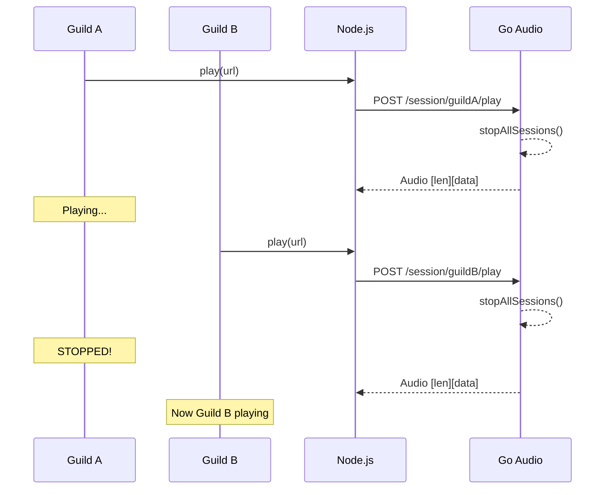
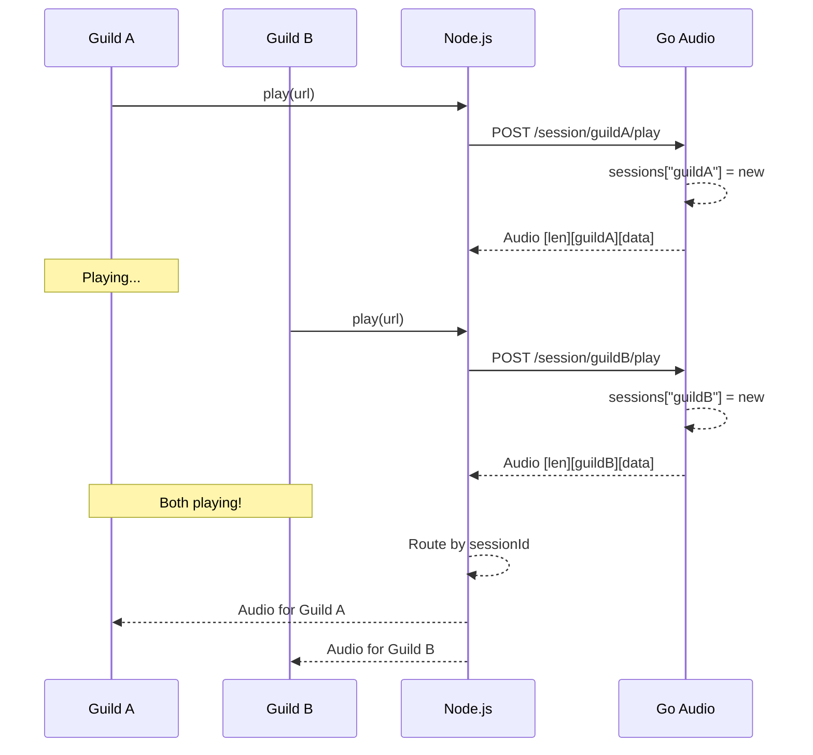
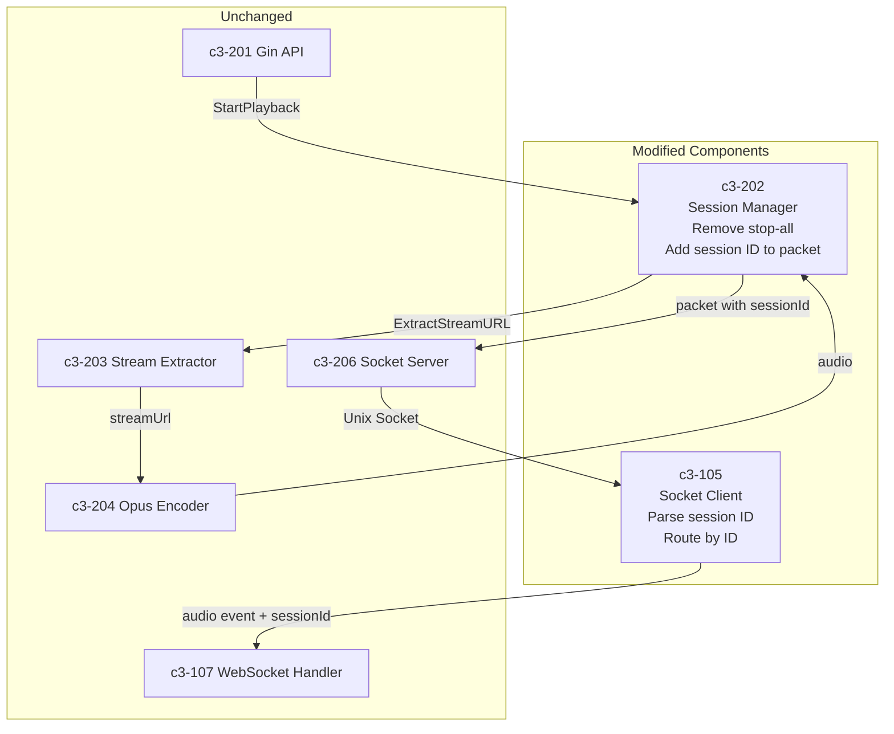
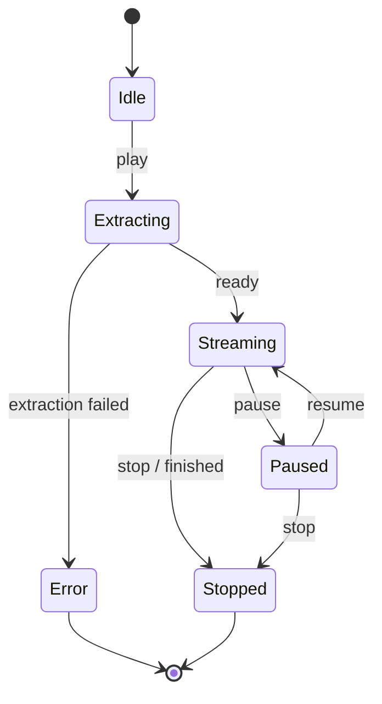
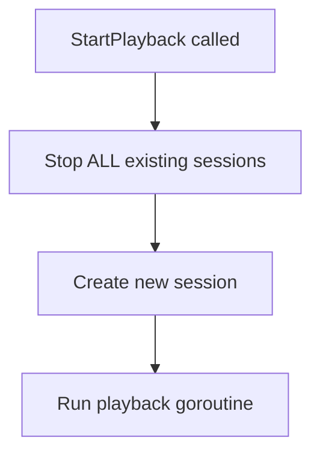
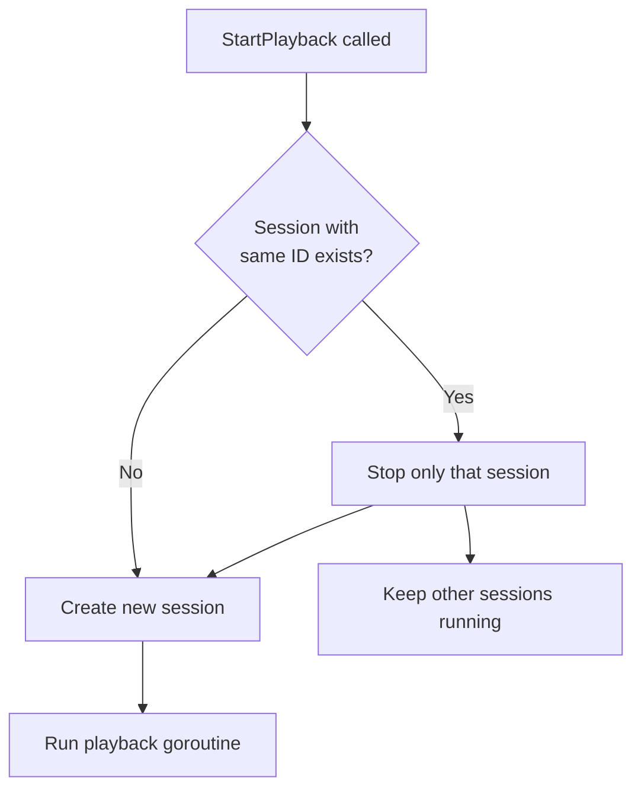
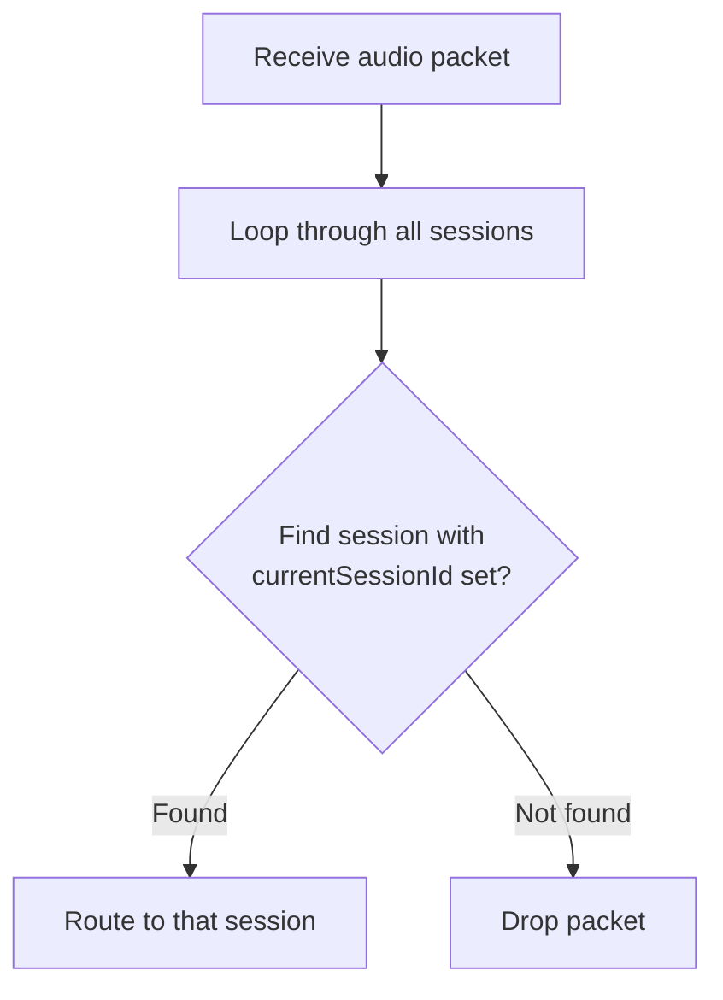
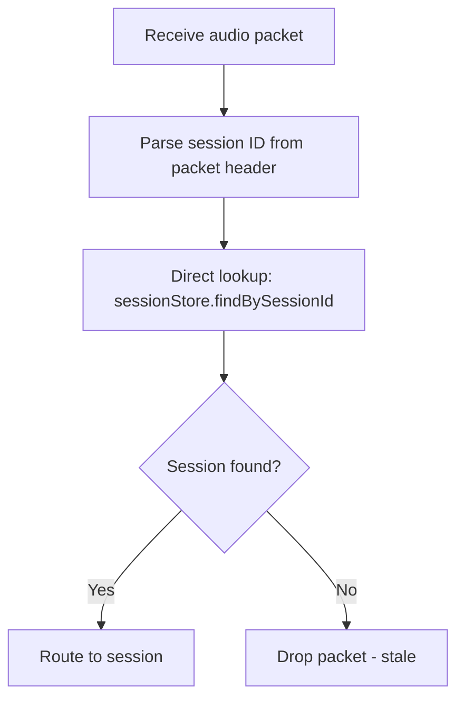
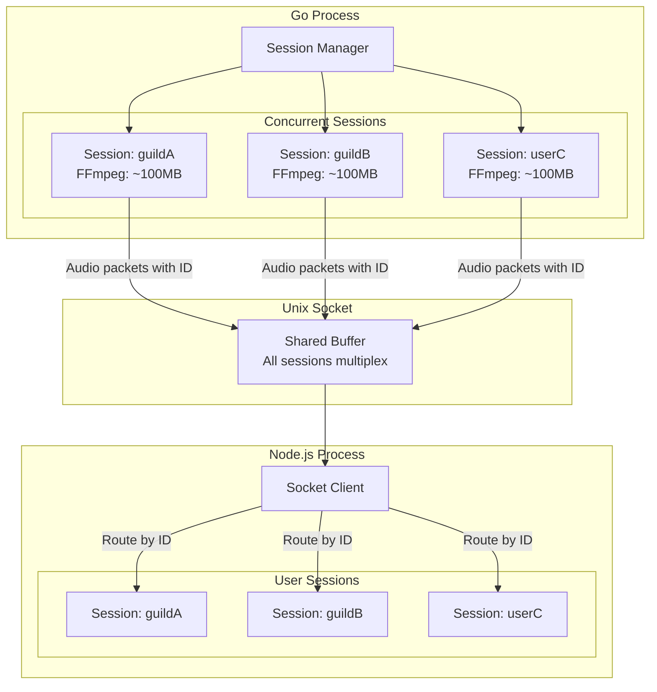

# Concurrent Audio Sessions - Diagrams

## Current Flow (Single Session)



## New Flow (Concurrent Sessions)



## Component Integration



## Packet Format Change

### Current Format
```
┌────────────────────────────┬────────────────────────────┐
│    Length (4 bytes)        │      Audio Data            │
│    Big-endian uint32       │      Variable length       │
│    = audio_length          │                            │
└────────────────────────────┴────────────────────────────┘
```

### New Format
```
┌────────────────────────────┬────────────────────────────┬────────────────────────────┐
│    Length (4 bytes)        │    Session ID (24 bytes)   │      Audio Data            │
│    Big-endian uint32       │    Padded snowflake        │      Variable length       │
│    = 24 + audio_length     │    "1234567890123456789   "│                            │
└────────────────────────────┴────────────────────────────┴────────────────────────────┘
```

## Session State Machine (Unchanged)



## Go Session Manager - Before/After

### Before: Stop All Sessions


### After: Stop Only Same Session


## Node.js Audio Routing - Before/After

### Before: Loop Through Sessions


### After: Direct Lookup by Session ID


## Concurrent Sessions Memory Model


