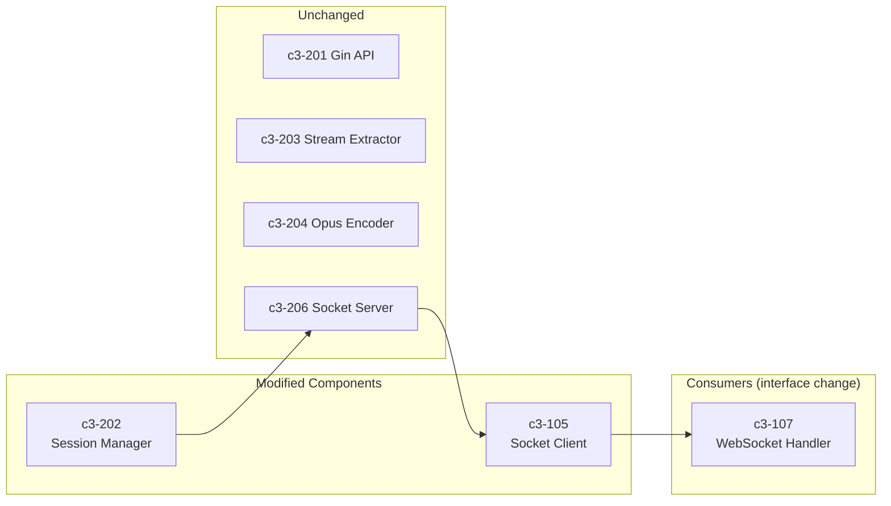

# Concurrent Audio Sessions - Impact Analysis

## Summary

| Category | Count | Risk |
|----------|-------|------|
| New Go Files | 0 | - |
| New Node.js Files | 0 | - |
| Modified Go Files | 1 | Medium |
| Modified Node.js Files | 2 | Medium |
| Modified Doc Files | 2 | Low |

## Modified Files

### Go Layer

| File | Change | Risk | Lines Affected |
|------|--------|------|----------------|
| `internal/server/session.go` | Remove stop-all logic, add session ID to packets | Medium | ~104-110, ~275-284 |

**Risk Explanation**: The stop-all removal is behavior change. Packet format change is breaking.

### Node.js Layer

| File | Change | Risk | Lines Affected |
|------|--------|------|----------------|
| `app/src/socket-client.ts` | Parse 24-byte session ID from packets, change audio event signature | Medium | ~141-150, ~196-206 |
| `app/src/websocket.ts` | Update audio handler to use sessionId for routing | Medium | ~159-161, ~182-211 |

**Risk Explanation**: Protocol change requires both Go and Node.js to update together.

### Documentation

| File | Change | Risk |
|------|--------|------|
| `.c3/c3-2-go-audio/README.md` | Update socket protocol docs | Low |
| `.c3/README.md` | Remove "stops all sessions" note | Low |

## C3 Component Dependencies

| Component Modified | Depends On | Reason |
|--------------------|------------|--------|
| c3-202 Session Manager | c3-204 Opus Encoder | Session creates encoding pipeline |
| c3-202 Session Manager | c3-206 Socket Server | Session writes to socket connection |
| c3-105 Socket Client | c3-202 Session Manager | Receives packets from Go |
| c3-107 WebSocket Handler | c3-105 Socket Client | Consumes audio events |

## Risk Assessment

| Risk | Likelihood | Impact | Mitigation |
|------|------------|--------|------------|
| Breaking protocol change | Certain | High | Deploy Go + Node.js together, no rolling update |
| Memory increase (concurrent FFmpeg) | Medium | Medium | Monitor memory, add max session limit if needed |
| Audio routing to wrong session | Low | High | Session ID in packet makes routing deterministic |
| Socket buffer overflow with many streams | Low | Medium | Monitor socket buffer, add backpressure if needed |
| Regression in pause/resume | Low | Medium | Test pause/resume with concurrent sessions |

## Deployment Considerations

1. **Breaking Change**: This is a breaking change to the socket protocol. Go and Node.js must be deployed together.

2. **No Rollback Without Both**: If you need to rollback, rollback both Go and Node.js together.

3. **Memory Planning**: Each concurrent session runs an FFmpeg process (~50-100MB). Plan for increased memory usage.

4. **Testing Required**: Must test concurrent sessions before production deployment.

## Backward Compatibility

| Aspect | Compatible? | Notes |
|--------|-------------|-------|
| HTTP API | Yes | No changes to endpoints |
| WebSocket API | Yes | No changes to browser protocol |
| Socket Protocol | **No** | Packet format changed |
| Session Identity | Yes | Still uses guildId/userId |

## Files NOT Changed

These files were considered but don't need changes:

| File | Reason |
|------|--------|
| `internal/server/api.go` | API unchanged, just passes through to SessionManager |
| `internal/server/socket.go` | Socket server unchanged, just accepts connections |
| `app/src/api-client.ts` | HTTP client unchanged |
| `app/src/session-store.ts` | Already supports multiple sessions by design |
| `app/src/queue-manager.ts` | Per-session queues already work |
