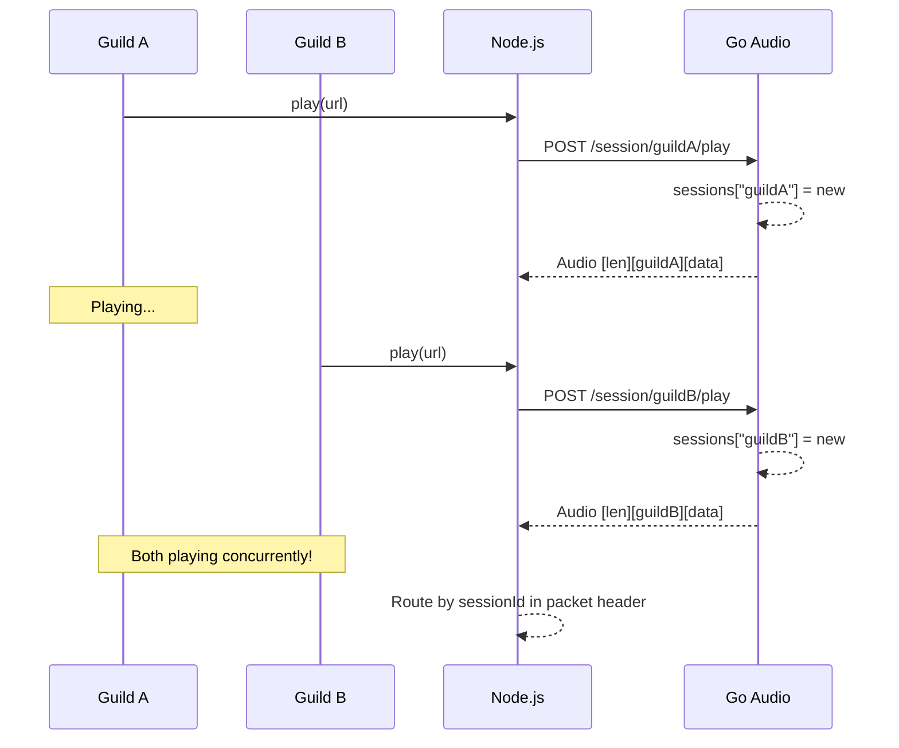

# Concurrent Audio Sessions - Implementation Plan

## Overview

- **Goal**: Enable multiple concurrent audio streams (one per guildId/userId) so different Discord servers or playground users can play simultaneously
- **Scope**: Modify Go session manager + socket protocol + Node.js socket client
- **Affected Layers**: Go (c3-202, c3-206) + Node.js (c3-105)
- **Breaking Change**: Yes - packet format changes, Go + Node.js must upgrade together

## Command Flow (New)



## Protocol Change

### Current Packet Format
```
┌─────────────────────┬─────────────────────┐
│ Length (4 bytes)    │ Audio Data          │
│ Big-endian uint32   │ Variable length     │
└─────────────────────┴─────────────────────┘
```

### New Packet Format
```
┌─────────────────────┬─────────────────────┬─────────────────────┐
│ Length (4 bytes)    │ Session ID (24 b)   │ Audio Data          │
│ Big-endian uint32   │ Padded snowflake    │ Variable length     │
└─────────────────────┴─────────────────────┴─────────────────────┘
```

**Session ID Format**: Discord snowflake (guildId or userId), right-padded with spaces to 24 bytes.
- Example: `"1234567890123456789     "` (19 digits + 5 spaces)
- Length field = 24 + audio_data_length

## Implementation Phases

### Phase 1: Go Changes (c3-202 Session Manager)

| Order | Task | File | Description |
|-------|------|------|-------------|
| G1 | Remove stop-all logic | `internal/server/session.go:104-110` | Change: only stop session with same ID, not all sessions |
| G2 | Add session ID to packet | `internal/server/session.go:275-284` | Insert 24-byte padded session ID before audio data |
| G3 | Verify events have session_id | `internal/server/session.go:300-314` | Already implemented, just verify |

### Phase 2: Node.js Changes (c3-105 Socket Client)

| Order | Task | File | Description |
|-------|------|------|-------------|
| N1 | Parse session ID from packets | `app/src/socket-client.ts:196-206` | Read 24-byte session ID after length header |
| N2 | Emit audio with session ID | `app/src/socket-client.ts:147` | Change `emit('audio', data)` to `emit('audio', {sessionId, data})` |
| N3 | Update audio handler signature | `app/src/websocket.ts:159-161` | Update handler to receive `{sessionId, data}` |
| N4 | Route by session ID | `app/src/websocket.ts:182-211` | Use sessionId from packet to find correct session directly |

### Phase 3: Documentation

| Order | Task | File | Description |
|-------|------|------|-------------|
| D1 | Update socket protocol docs | `.c3/c3-2-go-audio/README.md:183-190` | Document new packet format with session ID |
| D2 | Update C3 README | `.c3/README.md:180` | Remove "stops all sessions" note |

### Phase 4: Testing

| Order | Task | Description |
|-------|------|-------------|
| T1 | Manual test: two browser tabs | Open two incognito tabs (different users), play different songs |
| T2 | Verify audio routing | Confirm each tab receives only its own audio |
| T3 | Stop one, other continues | Stop Tab A, verify Tab B continues uninterrupted |
| T4 | Same session restart | Play new song in same session, verify old stops |

## Detailed Code Changes

### G1: Remove Stop-All Logic

**File**: `internal/server/session.go`
**Lines**: 104-110

**Current code**:
```go
// Stop ALL existing sessions - only one session should play at a time
for existingID, existing := range m.sessions {
    fmt.Printf("[Session] Stopping existing session %s for new playback\n", existingID[:8])
    existing.Stop()
    delete(m.sessions, existingID)
}
```

**New code**:
```go
// Stop only the session with the same ID (if exists)
if existing, ok := m.sessions[id]; ok {
    fmt.Printf("[Session] Stopping existing session %s for new playback\n", id[:8])
    existing.Stop()
    delete(m.sessions, id)
}
```

### G2: Add Session ID to Packet

**File**: `internal/server/session.go`
**Lines**: 275-284

**Current code**:
```go
// Header: 4 bytes big-endian length
length := uint32(len(chunk))
packet := make([]byte, 4+len(chunk))
packet[0] = byte(length >> 24)
packet[1] = byte(length >> 16)
packet[2] = byte(length >> 8)
packet[3] = byte(length)
copy(packet[4:], chunk)
```

**New code**:
```go
// Header: 4 bytes length + 24 bytes session ID
const sessionIDLen = 24
paddedID := fmt.Sprintf("%-24s", session.ID) // Right-pad with spaces to 24 bytes

length := uint32(sessionIDLen + len(chunk))
packet := make([]byte, 4+sessionIDLen+len(chunk))
packet[0] = byte(length >> 24)
packet[1] = byte(length >> 16)
packet[2] = byte(length >> 8)
packet[3] = byte(length)
copy(packet[4:4+sessionIDLen], paddedID)
copy(packet[4+sessionIDLen:], chunk)
```

### N1: Parse Session ID from Packets

**File**: `app/src/socket-client.ts`
**Lines**: 196-206

**Current code**:
```typescript
} else if (this.buffer.length >= 4) {
  // Binary audio header (4 bytes big-endian length)
  this.audioLength = (this.buffer[0] << 24) | (this.buffer[1] << 16) |
                    (this.buffer[2] << 8) | this.buffer[3];
  this.buffer = this.buffer.subarray(4);
  this.readingAudio = true;
}
```

**New code**:
```typescript
} else if (this.buffer.length >= 4) {
  // Binary audio header (4 bytes big-endian length)
  this.audioLength = (this.buffer[0] << 24) | (this.buffer[1] << 16) |
                    (this.buffer[2] << 8) | this.buffer[3];
  this.buffer = this.buffer.subarray(4);
  this.readingAudio = true;
  this.currentSessionId = null; // Will be read with audio data
}
```

**Also add** around line 141-147:
```typescript
if (this.readingAudio) {
  // Reading binary audio data (24-byte session ID + audio)
  if (this.buffer.length >= this.audioLength) {
    const SESSION_ID_LEN = 24;
    const sessionId = this.buffer.subarray(0, SESSION_ID_LEN).toString('utf8').trim();
    const audioData = this.buffer.subarray(SESSION_ID_LEN, this.audioLength);
    this.buffer = this.buffer.subarray(this.audioLength);
    this.readingAudio = false;
    this.emit('audio', { sessionId, data: audioData });
  } else {
    break; // Need more data
  }
}
```

### N2-N4: Update WebSocket Handler

**File**: `app/src/websocket.ts`
**Lines**: 159-161, 182-211

**Current handler**:
```typescript
this.socketClient.on('audio', (data: Buffer) => {
  this.handleAudioData(data);
});
```

**New handler**:
```typescript
this.socketClient.on('audio', ({ sessionId, data }: { sessionId: string; data: Buffer }) => {
  this.handleAudioData(sessionId, data);
});
```

**Update handleAudioData signature and logic**:
```typescript
private handleAudioData(sessionId: string, data: Buffer): void {
  // Find session by session ID directly (no loop)
  const session = this.sessionStore.findBySessionId(sessionId);
  if (!session) {
    // Unknown session - might be stale, drop packet
    return;
  }

  if (session.isPaused) return;

  session.bytesReceived += data.length;

  // Route audio based on mode
  if (this.webMode && session.isStreamReady) {
    this.broadcastBinaryToUser(session.userId, data);
  } else if (this.debugMode && session.isStreamReady) {
    this.audioPlayer.write(data);
  }

  // ... rest of progress logging
}
```

## Checklist

- [ ] G1: Remove stop-all sessions logic in Go
- [ ] G2: Add 24-byte session ID to audio packets in Go
- [ ] G3: Verify JSON events include session_id (already done)
- [ ] N1: Parse 24-byte session ID in Node.js socket client
- [ ] N2: Update audio event to include sessionId
- [ ] N3: Update WebSocketHandler audio handler signature
- [ ] N4: Route audio by sessionId directly (no loop)
- [ ] D1: Update socket protocol documentation
- [ ] D2: Update C3 README to remove single-session note
- [ ] T1: Test two browser tabs playing simultaneously
- [ ] T2: Test stopping one doesn't affect the other
- [ ] T3: Test same session restart stops previous
- [ ] Audio quality maintained (48kHz, 20ms frames)
