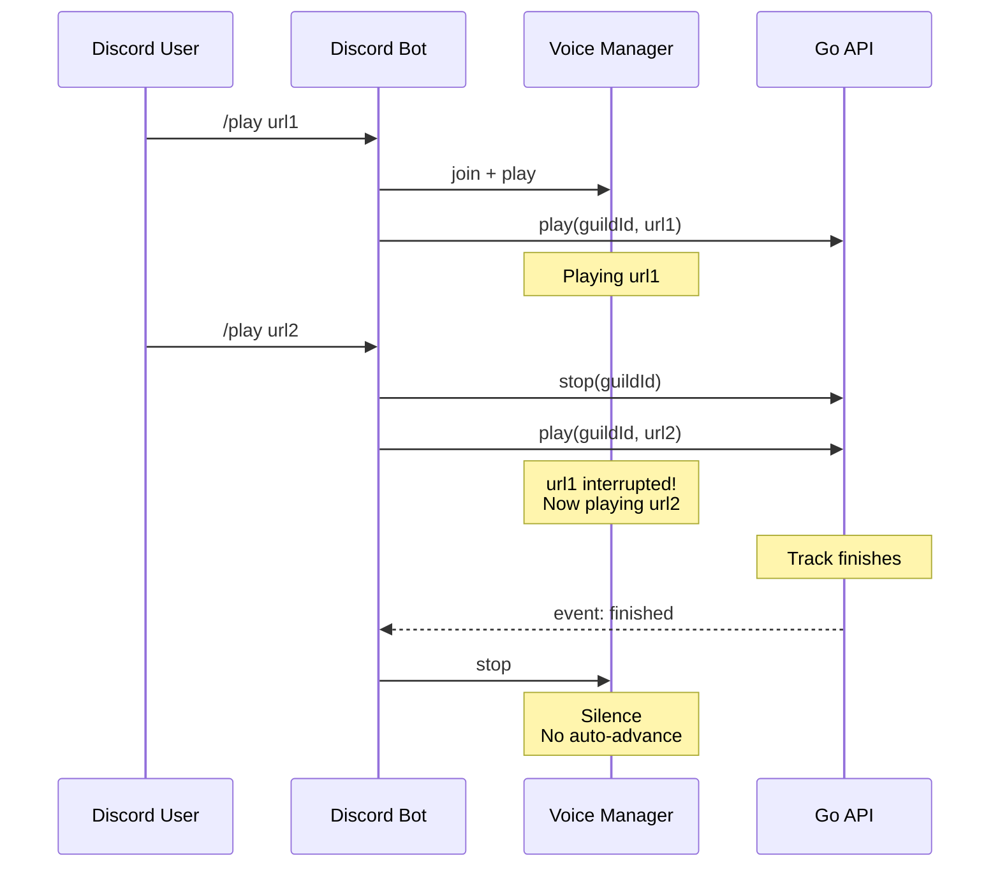
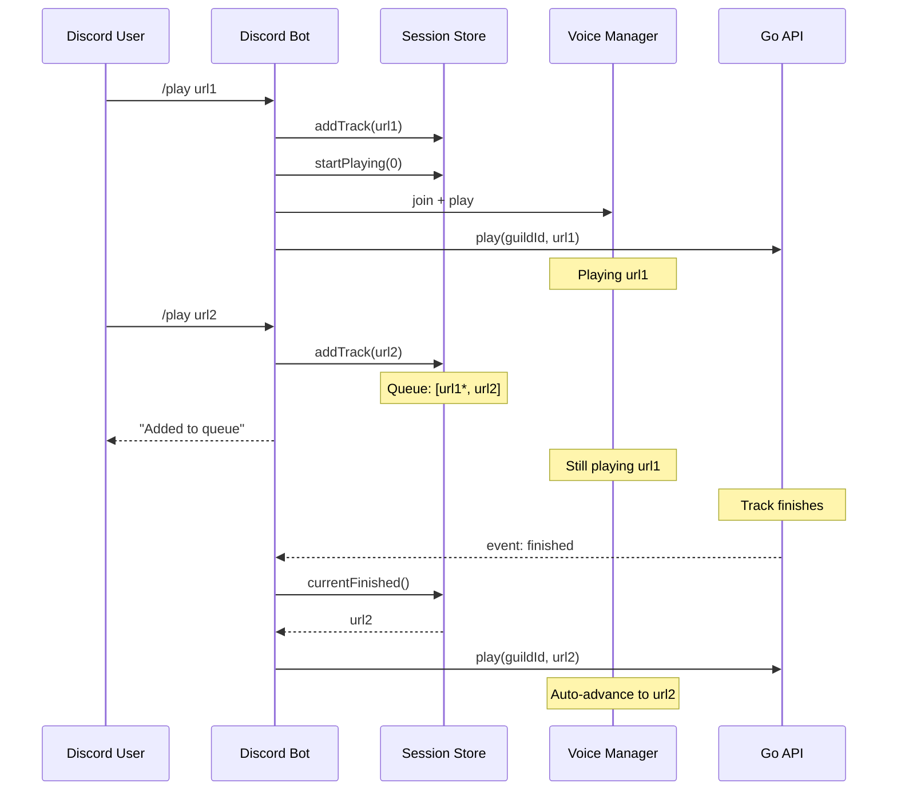
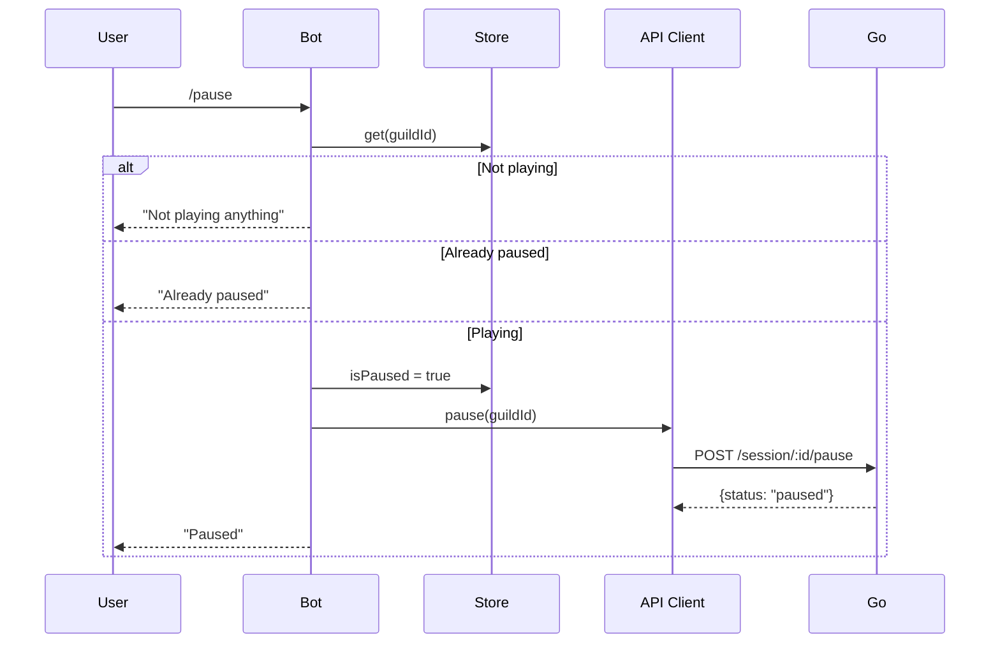
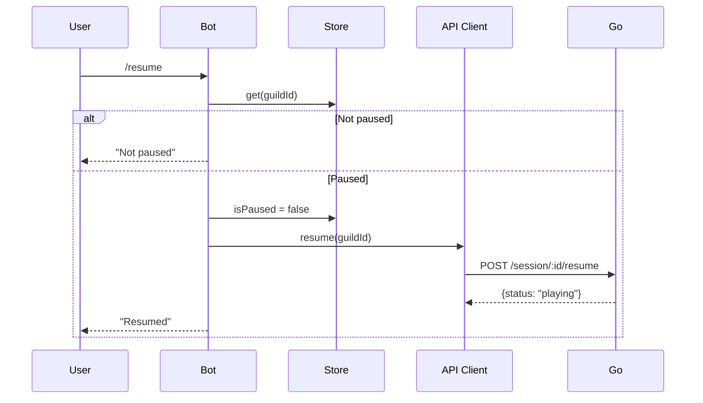
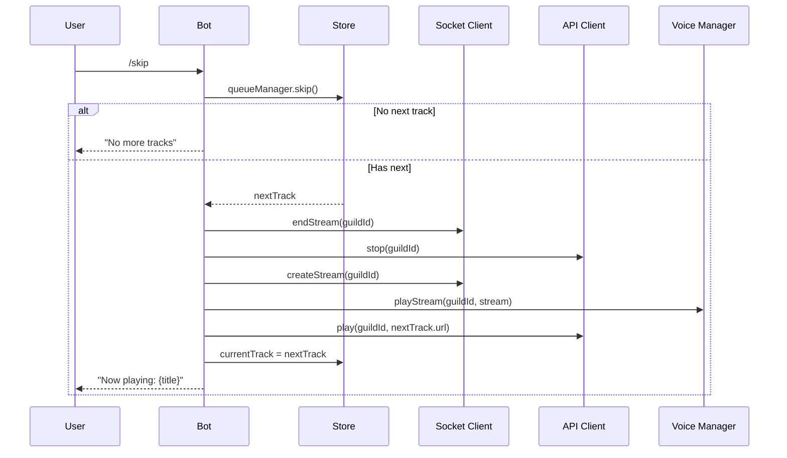
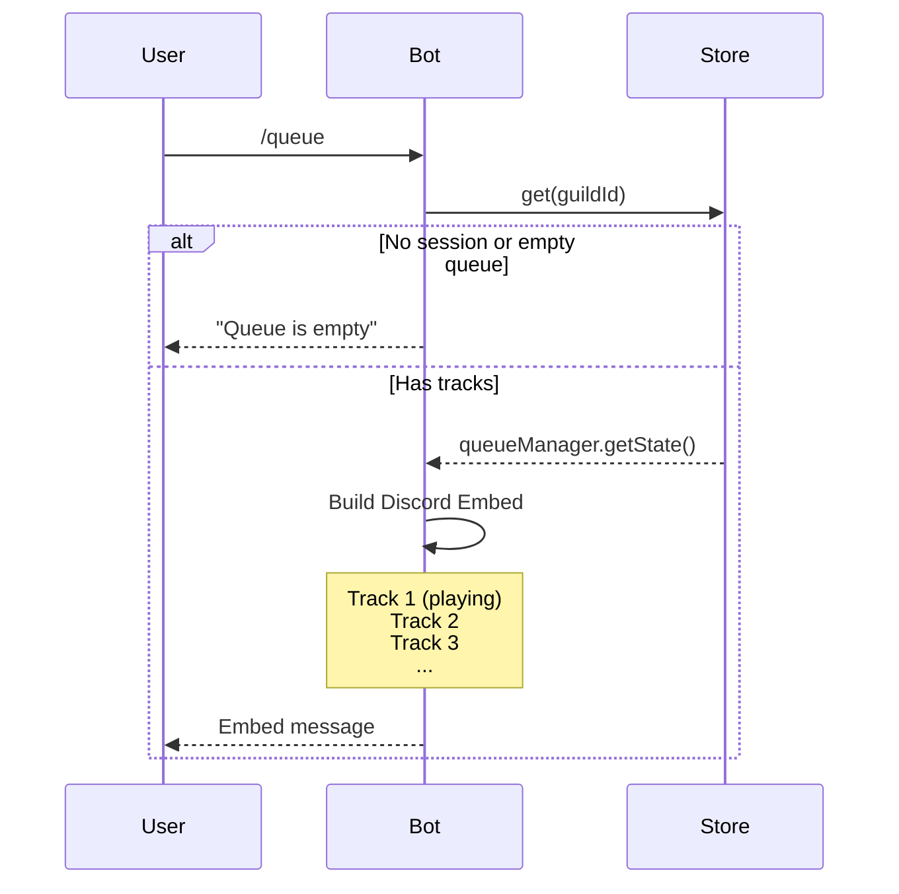
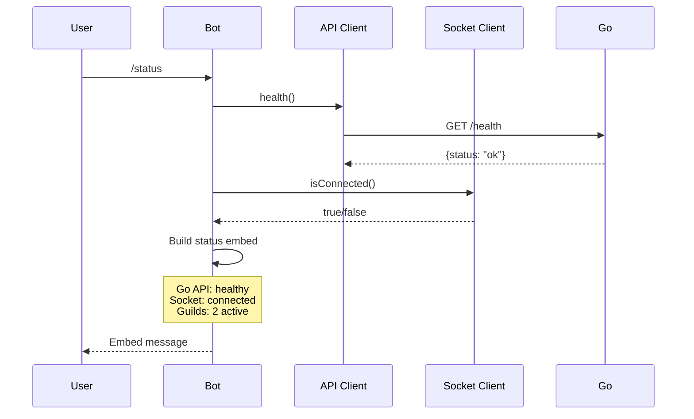
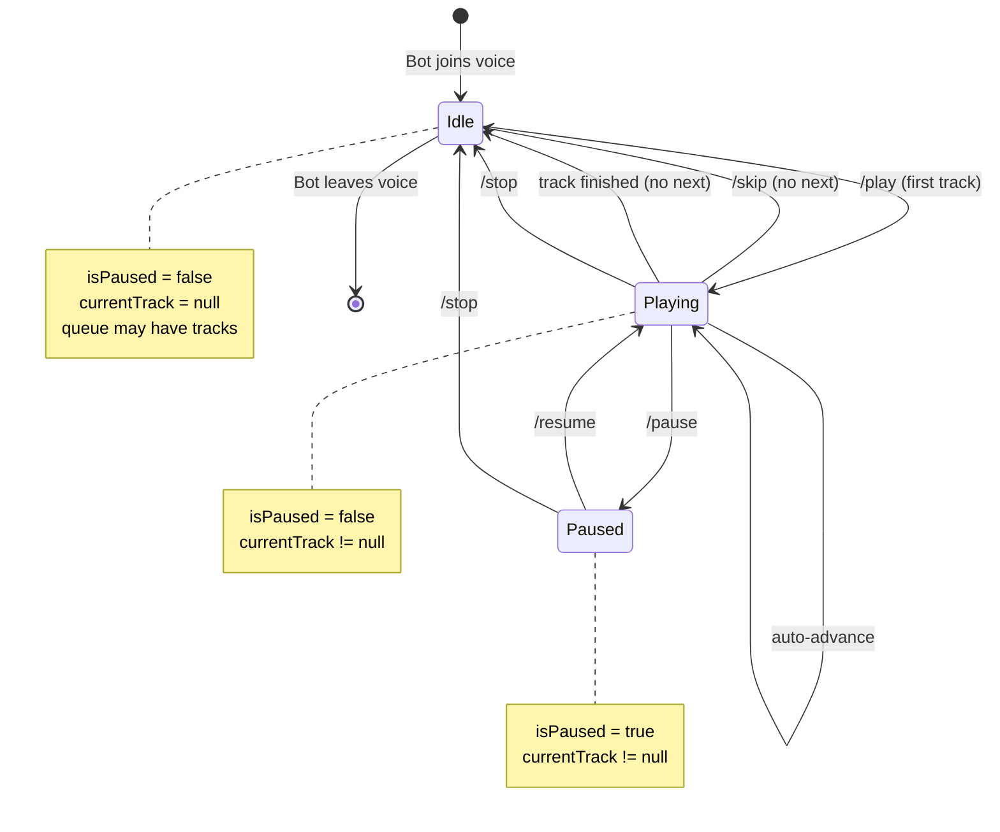
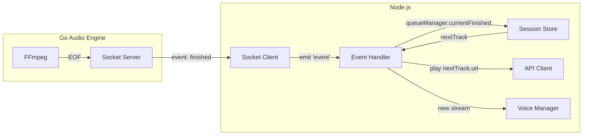

# Discord Bot Commands Diagrams

## 1. Current vs New Architecture

### Current (No Queue)



### New (With Queue)



## 2. Command Flows

### /pause Flow



### /resume Flow



### /skip Flow



### /queue Flow



### /status Flow



## 3. State Machine

### Guild Session States



## 4. Component Integration

```mermaid
flowchart TB
    subgraph Commands["Slash Commands"]
        PLAY[/play]
        STOP[/stop]
        PAUSE[/pause]
        RESUME[/resume]
        SKIP[/skip]
        QUEUE[/queue]
        NP[/nowplaying]
        PREV[/previous]
        STATUS[/status]
    end

    subgraph NewStore["New: Discord Session Store"]
        SESSIONS[Map guildId → GuildSession]
        GSESSION[GuildSession]
        QM[QueueManager instance]
    end

    subgraph Existing["Existing Components"]
        VOICE[c3-102 Voice Manager]
        API[c3-104 API Client]
        SOCKET[c3-105 Socket Client]
    end

    subgraph Go["Go API :8180"]
        HEALTH[GET /health]
        PLAY_EP[POST /session/:id/play]
        PAUSE_EP[POST /session/:id/pause]
        RESUME_EP[POST /session/:id/resume]
        STOP_EP[POST /session/:id/stop]
    end

    PLAY --> SESSIONS
    STOP --> SESSIONS
    PAUSE --> SESSIONS
    RESUME --> SESSIONS
    SKIP --> SESSIONS
    QUEUE --> SESSIONS
    NP --> SESSIONS
    PREV --> SESSIONS

    SESSIONS --> GSESSION
    GSESSION --> QM

    PLAY --> VOICE
    PLAY --> API
    PLAY --> SOCKET
    STOP --> VOICE
    STOP --> API
    PAUSE --> API
    RESUME --> API
    SKIP --> API
    SKIP --> SOCKET
    SKIP --> VOICE
    PREV --> API
    PREV --> SOCKET
    PREV --> VOICE
    STATUS --> API

    API --> HEALTH
    API --> PLAY_EP
    API --> PAUSE_EP
    API --> RESUME_EP
    API --> STOP_EP
```

## 5. Data Flow for Auto-Advance



## 6. Queue Embed Layout

```
┌─────────────────────────────────────────┐
│  🎵 Queue (3 tracks)                    │
├─────────────────────────────────────────┤
│                                         │
│  ▶️ 1. Current Song Title               │
│     3:45 • Added by @user               │
│                                         │
│  2. Next Song Title                     │
│     4:20 • Added by @user               │
│                                         │
│  3. Another Song                        │
│     2:55 • Added by @user               │
│                                         │
├─────────────────────────────────────────┤
│  Total: 11:00 • 3 tracks                │
└─────────────────────────────────────────┘
```

## 7. Now Playing Embed Layout

```
┌─────────────────────────────────────────┐
│  🎵 Now Playing                         │
├─────────────────────────────────────────┤
│  ┌─────────┐                            │
│  │ thumb   │  Song Title                │
│  │  nail   │  Duration: 3:45            │
│  └─────────┘  Position: 1/5 in queue    │
│                                         │
│  ▶️ Playing | 🔊 Volume: 100%           │
├─────────────────────────────────────────┤
│  Next: Another Song Title               │
└─────────────────────────────────────────┘
```

## 8. Status Embed Layout

```
┌─────────────────────────────────────────┐
│  📊 Bot Status                          │
├─────────────────────────────────────────┤
│                                         │
│  Go API:     ✅ Healthy                 │
│  Socket:     ✅ Connected               │
│  Uptime:     2h 34m                     │
│                                         │
│  Active Sessions: 2                     │
│  Total Guilds: 5                        │
│                                         │
└─────────────────────────────────────────┘
```
