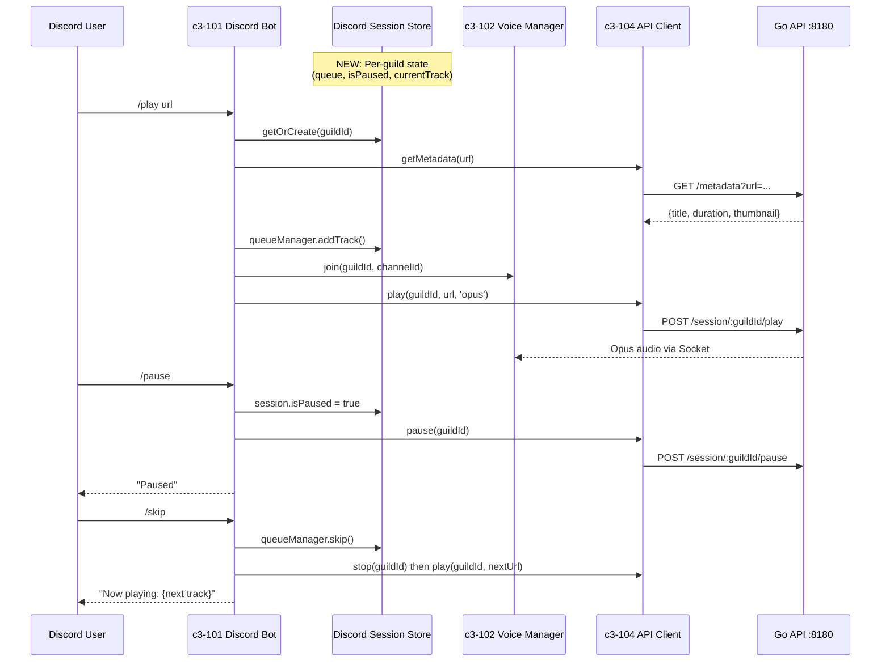

# Discord Bot Commands Implementation Plan

## Overview

- **Goal**: Add essential playback control commands to Discord bot
- **Scope**: `/pause`, `/resume`, `/skip`, `/queue`, `/nowplaying`, `/previous`, `/status`
- **Affected Layers**: Node.js only (Go API already has all required endpoints)
- **Flow**: Discord bot flow (NOT web/playground flow)

## Command Flow



## Implementation Phases

### Phase 1: Create Discord Session Store (Foundation)

| Order | Task | File | Description |
|-------|------|------|-------------|
| 1.1 | Create session store | `app/src/discord/session-store.ts` | `DiscordSessionStore` class with `Map<guildId, GuildSession>` |
| 1.2 | Define GuildSession interface | `app/src/discord/session-store.ts` | `{ guildId, isPaused, currentTrack, queueManager }` |
| 1.3 | Export singleton instance | `app/src/discord/session-store.ts` | `export const discordSessions` |

**GuildSession interface:**
```typescript
interface GuildSession {
  guildId: string;
  isPaused: boolean;
  currentTrack: Track | null;
  queueManager: QueueManager;
  // For auto-advance
  activePlayRequestId: number;
}
```

### Phase 2: Update /play Command (Enable Queue)

| Order | Task | File | Description |
|-------|------|------|-------------|
| 2.1 | Import session store | `app/src/commands/play.ts` | `import { discordSessions }` |
| 2.2 | Get/create guild session | `app/src/commands/play.ts` | `const session = discordSessions.getOrCreate(guildId)` |
| 2.3 | Fetch metadata before play | `app/src/commands/play.ts` | `const meta = await apiClient.getMetadata(url)` |
| 2.4 | Add track to queue | `app/src/commands/play.ts` | `session.queueManager.addTrack(...)` |
| 2.5 | Setup auto-advance | `app/src/commands/play.ts` | Handle 'finished' event to play next track |
| 2.6 | Support playlist URLs | `app/src/commands/play.ts` | Check `is_playlist`, call `getPlaylist()` |

### Phase 3: Create Essential Commands

| Order | Task | File | Description |
|-------|------|------|-------------|
| 3.1 | Create /pause | `app/src/commands/pause.ts` | Check playing, call `apiClient.pause()`, set `isPaused=true` |
| 3.2 | Create /resume | `app/src/commands/resume.ts` | Check paused, call `apiClient.resume()`, set `isPaused=false` |
| 3.3 | Create /skip | `app/src/commands/skip.ts` | `queueManager.skip()`, stop current, play next |

### Phase 4: Create Queue Commands

| Order | Task | File | Description |
|-------|------|------|-------------|
| 4.1 | Create /queue | `app/src/commands/queue.ts` | Build embed with track list (max 10) |
| 4.2 | Create /nowplaying | `app/src/commands/nowplaying.ts` | Show current track embed with thumbnail |
| 4.3 | Create /previous | `app/src/commands/previous.ts` | `queueManager.previous()`, stop, play prev |

### Phase 5: Create Status Command

| Order | Task | File | Description |
|-------|------|------|-------------|
| 5.1 | Create /status | `app/src/commands/status.ts` | Call `apiClient.health()`, show socket state |

### Phase 6: Register Commands

| Order | Task | File | Description |
|-------|------|------|-------------|
| 6.1 | Export all commands | `app/src/commands/index.ts` | Add imports and exports for all new commands |

## Detailed Implementation

### 1. Discord Session Store (`app/src/discord/session-store.ts`)

```typescript
// Discord-specific session management (separate from web SessionStore)
// Key difference: uses guildId, not userId

import { QueueManager, Track } from '../queue-manager';

export interface GuildSession {
  guildId: string;
  isPaused: boolean;
  currentTrack: Track | null;
  queueManager: QueueManager;
  playRequestId: number;
  activePlayRequestId: number;
}

export class DiscordSessionStore {
  private sessions = new Map<string, GuildSession>();

  getOrCreate(guildId: string): GuildSession {
    let session = this.sessions.get(guildId);
    if (!session) {
      session = {
        guildId,
        isPaused: false,
        currentTrack: null,
        queueManager: new QueueManager(),
        playRequestId: 0,
        activePlayRequestId: 0,
      };
      this.sessions.set(guildId, session);
    }
    return session;
  }

  get(guildId: string): GuildSession | undefined {
    return this.sessions.get(guildId);
  }

  reset(guildId: string): void {
    const session = this.sessions.get(guildId);
    if (session) {
      session.isPaused = false;
      session.currentTrack = null;
      session.queueManager.clear();
    }
  }

  delete(guildId: string): void {
    this.sessions.delete(guildId);
  }
}

export const discordSessions = new DiscordSessionStore();
```

### 2. Command Templates

**pause.ts pattern:**
```typescript
export async function execute(interaction: ChatInputCommandInteraction): Promise<void> {
  const guildId = interaction.guildId;
  if (!guildId) { /* error */ }

  const session = discordSessions.get(guildId);
  if (!session || !voiceManager.isConnected(guildId)) {
    await interaction.reply({ content: 'Not playing anything.', ephemeral: true });
    return;
  }

  if (session.isPaused) {
    await interaction.reply({ content: 'Already paused.', ephemeral: true });
    return;
  }

  session.isPaused = true;
  await apiClient.pause(guildId);
  await interaction.reply('Paused.');
}
```

**skip.ts pattern:**
```typescript
export async function execute(interaction: ChatInputCommandInteraction): Promise<void> {
  const guildId = interaction.guildId;
  const session = discordSessions.get(guildId);

  if (!session || !voiceManager.isConnected(guildId)) {
    await interaction.reply({ content: 'Not playing anything.', ephemeral: true });
    return;
  }

  const nextTrack = session.queueManager.skip();
  if (!nextTrack) {
    await interaction.reply('No more tracks in queue.');
    return;
  }

  await interaction.deferReply();

  // Stop current
  socketClient.endAudioStreamForSession(guildId);
  await apiClient.stop(guildId);

  // Play next
  const audioStream = socketClient.createDirectStreamForSession(guildId);
  voiceManager.playStream(guildId, audioStream);
  await apiClient.play(guildId, nextTrack.url, 'opus');

  session.currentTrack = nextTrack;
  session.isPaused = false;

  await interaction.editReply(`Now playing: **${nextTrack.title}**`);
}
```

## Auto-Advance Logic

The key change to `/play` command is handling the 'finished' event to auto-advance:

```typescript
socketClient.on('event', async (event) => {
  if (event.type === 'finished') {
    const session = discordSessions.get(event.session_id);
    if (!session) return;

    const nextTrack = session.queueManager.currentFinished();
    if (nextTrack) {
      // Auto-play next track
      const audioStream = socketClient.createDirectStreamForSession(event.session_id);
      voiceManager.playStream(event.session_id, audioStream);
      await apiClient.play(event.session_id, nextTrack.url, 'opus');
      session.currentTrack = nextTrack;
    } else {
      // Queue finished
      socketClient.endAudioStreamForSession(event.session_id);
      voiceManager.stop(event.session_id);
      session.currentTrack = null;
    }
  }
});
```

## Checklist

- [ ] `app/src/discord/session-store.ts` created
- [ ] `/play` updated to use session store and queue
- [ ] `/play` handles playlist URLs
- [ ] Auto-advance on track finish works
- [ ] `/pause` command works
- [ ] `/resume` command works
- [ ] `/skip` command works
- [ ] `/queue` shows embed with track list
- [ ] `/nowplaying` shows current track
- [ ] `/previous` goes back in queue
- [ ] `/status` shows bot health
- [ ] All commands registered in index.ts
- [ ] Commands registered with Discord API on bot start
