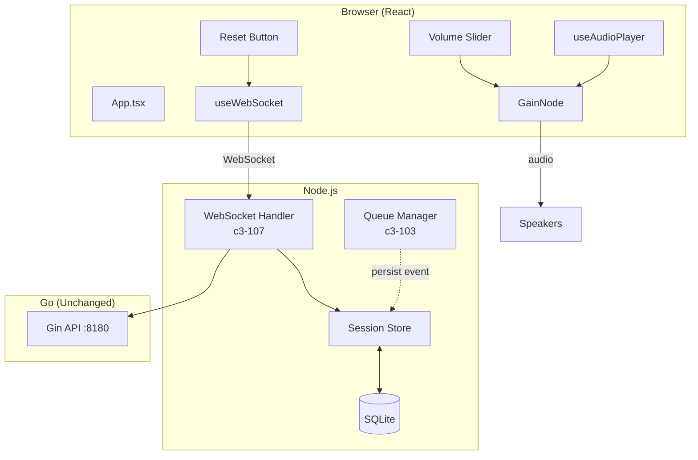
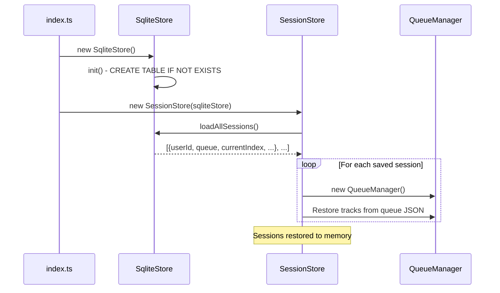
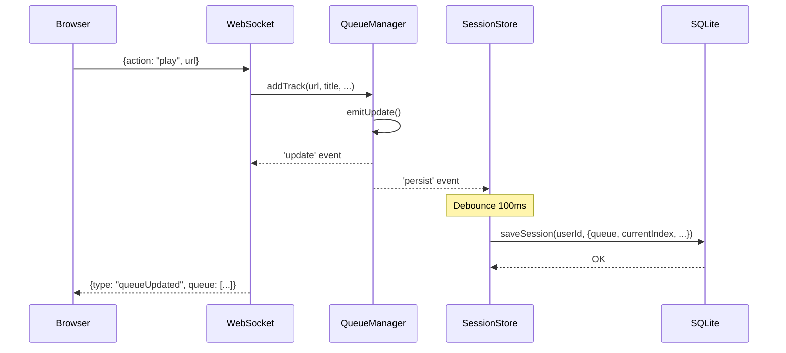
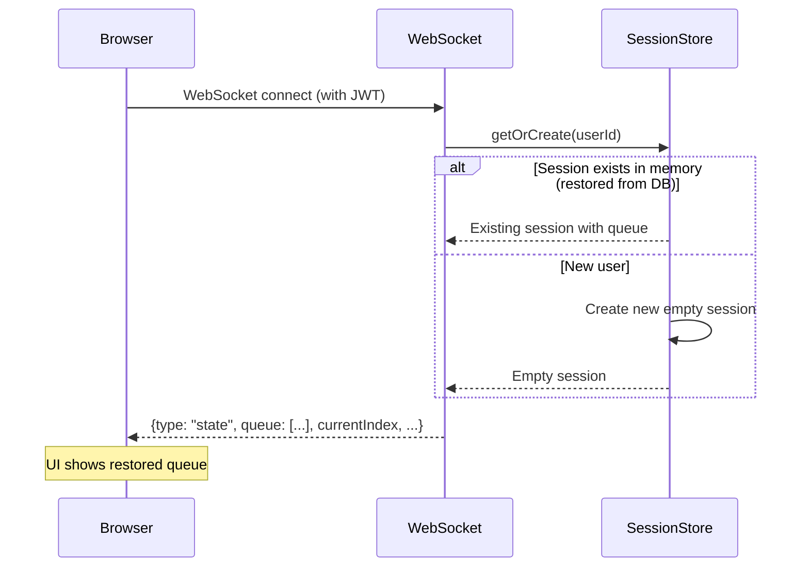
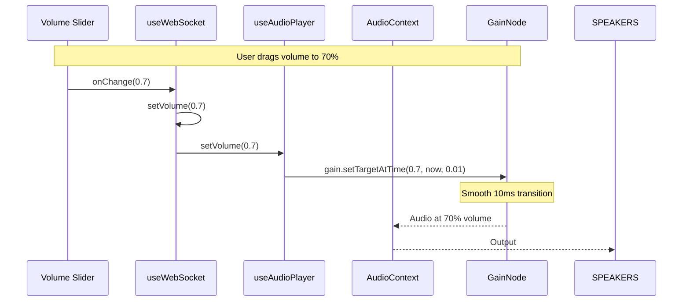
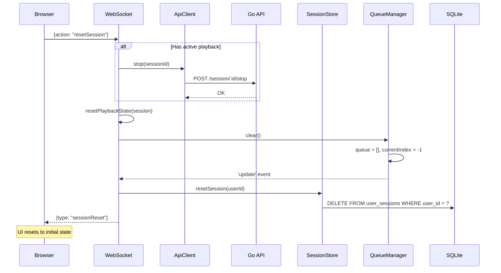
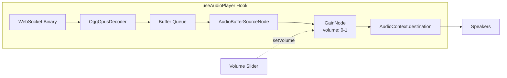
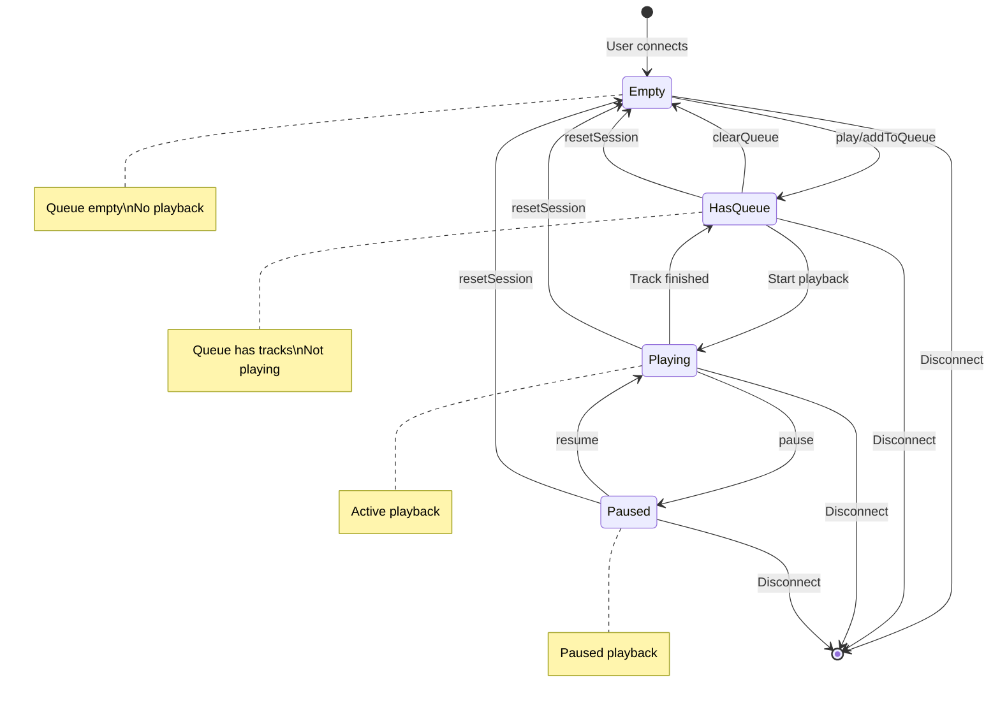
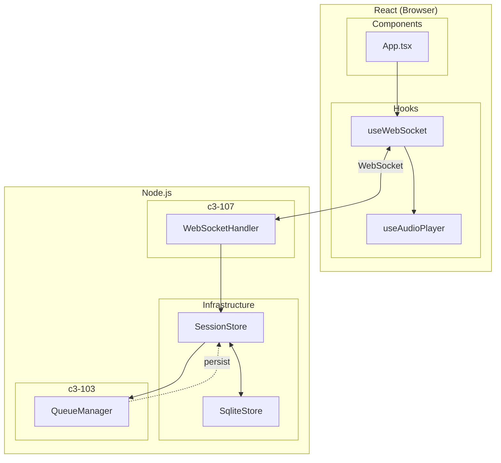

# Web Player Polish - Diagrams

## System Overview (After Changes)



## Persistence Flow

### Server Startup



### Queue Change Persistence



### User Reconnect (Restore)



## Volume Control Flow



## Reset Session Flow



## Audio Pipeline (with GainNode)



## State Machine: Session Lifecycle



## Component Integration



## UI Layout (Volume + Reset)

```
+----------------------------------------------------------+
| [Wifi] CONNECTED    [URL input...          ] [Play]  [WEB] |
+----------------------------------------------------------+
|                                                          |
|   +--------------------------------------------------+   |
|   |                                                  |   |
|   |              [Album Art / Thumbnail]             |   |
|   |                                                  |   |
|   +--------------------------------------------------+   |
|                                                          |
|              Track Title                                  |
|              0:45 ─────●───────────────── 3:21           |
|                                                          |
|      [⏮] [⏸] [⏭] [⏹]   🔊 ═══════●═══  <── Volume      |
|                                                          |
+----------------------------------------------------------+
|                                                          |
|   Play Queue                    [3] [🔄] [🗑] <── Reset  |
|   ┌────────────────────────────────────────────────┐     |
|   │ ▶ Track 1 - Now Playing                   [×]  │     |
|   │   Track 2                                 [×]  │     |
|   │   Track 3                                 [×]  │     |
|   └────────────────────────────────────────────────┘     |
|                                                          |
+----------------------------------------------------------+
```
