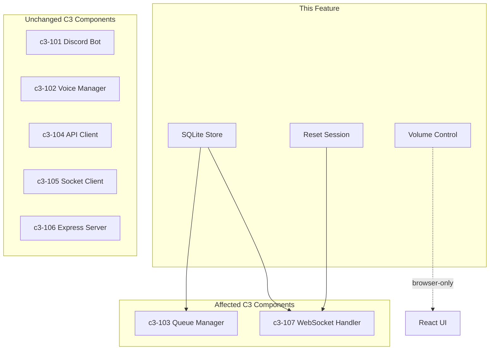

# Web Player Polish - Impact Analysis

## Summary

| Category | Count | Risk |
|----------|-------|------|
| New Node.js Files | 1 | Low |
| New React Files | 0 | - |
| Modified Node.js Files | 4 | Medium |
| Modified React Files | 3 | Low |
| New Dependencies | 1 | Low |

## New Files

### Node.js Layer

| File | Purpose | Lines (est.) |
|------|---------|--------------|
| `app/src/sqlite-store.ts` | SQLite database wrapper for session persistence | ~80 |

## Modified Files

### Node.js Layer

| File | Change | Risk | Reason |
|------|--------|------|--------|
| `app/package.json` | Add `better-sqlite3` + types | Low | Standard dependency |
| `app/src/index.ts` | Initialize SqliteStore before WebSocket | Low | Simple initialization |
| `app/src/session-store.ts` | Add persistence layer, restore, reset | Medium | Core state management |
| `app/src/queue-manager.ts` | Emit 'persist' event | Low | 1 line change |
| `app/src/websocket.ts` | Add resetSession action | Low | Follow existing patterns |

### React Layer

| File | Change | Risk | Reason |
|------|--------|------|--------|
| `playground/src/hooks/useAudioPlayer.ts` | Add GainNode + setVolume | Low | Isolated change, no jitter logic touched |
| `playground/src/hooks/useWebSocket.ts` | Add volume state + resetSession | Low | Follow existing patterns |
| `playground/src/App.tsx` | Add volume slider + reset button | Low | UI only |

## C3 Component Dependencies

| This Feature | Depends On | Reason |
|--------------|------------|--------|
| SQLite Store | c3-103 Queue Manager | Persists queue state |
| SQLite Store | c3-107 WebSocket Handler | SessionStore integration |
| Reset Session | c3-107 WebSocket Handler | New action handler |
| Volume Control | useAudioPlayer | GainNode routing |

## Dependency Changes

### New npm Dependencies

| Package | Version | Purpose | Size |
|---------|---------|---------|------|
| `better-sqlite3` | `^11.x` | SQLite3 binding for Node.js | ~2MB native |
| `@types/better-sqlite3` | `^7.x` | TypeScript types | Dev only |

**Note**: `better-sqlite3` requires native compilation. Build will need:
- Node.js build tools (node-gyp)
- On macOS: Xcode command line tools
- On Linux: build-essential, python3

## Risk Assessment

| Risk | Likelihood | Impact | Mitigation |
|------|------------|--------|------------|
| SQLite write contention | Low | Low | Debounce writes (100ms) |
| GainNode audio clicks | Low | Low | Use setTargetAtTime for smooth transitions |
| DB corruption on crash | Very Low | Medium | SQLite WAL mode, atomic writes |
| better-sqlite3 build failure | Low | High | Document build requirements |
| Session restore wrong queue | Low | Medium | Validate JSON on load, fallback to empty |
| Volume persisted wrongly | N/A | N/A | Volume is browser-only, not persisted |

## Isolation Analysis

### What CAN be affected

- Web player queue persistence
- Web player volume
- Web player reset functionality
- Node.js startup time (DB init)

### What CANNOT be affected

| Area | Why Isolated |
|------|--------------|
| Discord bot playback | Uses guildId sessions, not web userId |
| Go audio pipeline | No Go changes |
| Audio quality (48kHz/20ms) | useAudioPlayer buffering untouched |
| Socket communication | No protocol changes |
| Authentication | JWT flow unchanged |

## Rollback Plan

If issues arise:

1. **Revert npm dependency**: Remove `better-sqlite3` from package.json
2. **Revert SessionStore**: Remove SqliteStore injection, restore in-memory only
3. **Revert QueueManager**: Remove 'persist' event emit
4. **Revert WebSocket**: Remove resetSession action
5. **Revert useAudioPlayer**: Remove GainNode, direct connect to destination
6. **Revert UI**: Remove volume slider and reset button

**Data**: SQLite database file can be safely deleted - users just lose persistence.
